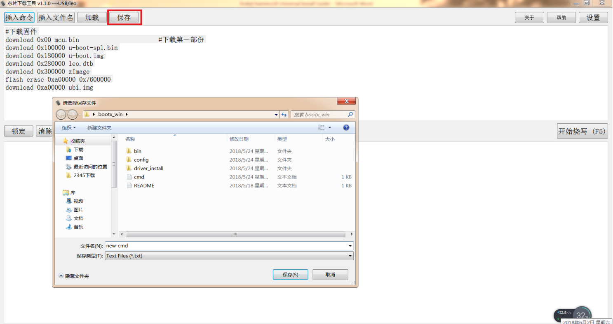

## Image Burning Tool Utilization for Factory {#image-burning-tool-utilization-for-factory}

The factory image burning tool is a windows tool with GUI. For a new PC, we need install usb driver. The driver install file and illustration document are located in leo-k18-universal-glibc/bootx_win/driver_install folder. At the same time, the images need be copy to bootx_win folder as the below picture：

This tool supports image burning for at most 8 K18 devices. Running NCDownloader, the GUI shows as below：

The top window is the command window. The bottom window is the log output window. We can input image burning command in command window and also can download command list file. Furthermore, we also can save the commands written in the command window into a command list file. Referring to the below two pictures：

Similar with the procedure of image burning on Linux PC, press BOOT_KEY then connect USB cable to PC. Click the button“开始烧写”，then finish the image burning process as below：

Note：

The image download offset in burning command bar need be coherent with the partition start offset in uboot.