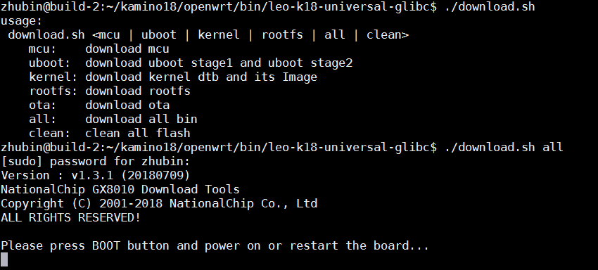
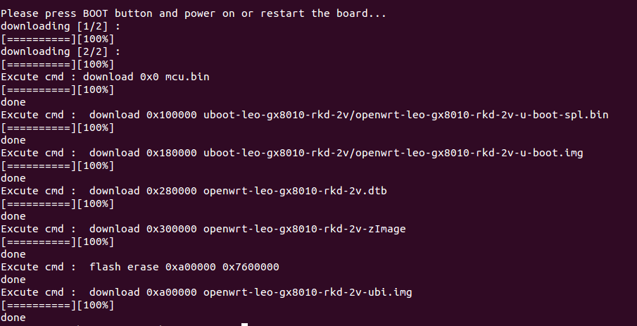

## Image Burning Tool Utilization for Linux PC {#image-burning-tool-utilization-for-linux-pc}

The procedure for image burning on Linux PC is as below：

*   cd $(K18DIR)/openwrt/bin/ leo-k18-universal-glibc /full_images
*   ./download.sh all

Press the BOOT_KEY，then connect USB cable to PC，the download procedure is as below：
