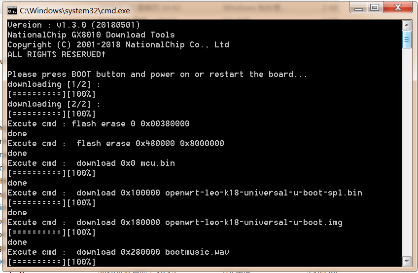

## Image Burning Tool Utilization for Windows PC {#image-burning-tool-utilization-for-windows-pc}

For a new Windows PC, we need install usb driver on it（The driver install file and illustration document are located in leo-k18-universal-glibc/bootx_win/driver_install folder）. The procedure for image burning on Windows PC is as below：

*   Enter $(K18DIR)/openwrt/bin/ leo-k18-universal-glibc /full_images
*   Double click download.bat
*   Press BOOT_KEY on board and connect USB cable to PC
