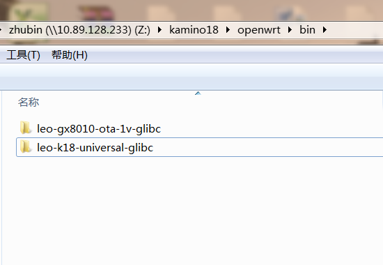

## Image Location {#image-location}

We use build.sh in root directory to compile full images. After compiling, the full images are located in $(K18DIR)/openwrt/bin/ folder as the below picture：

leo-k18-universal-glibc/full_images folder contains all the images and the image burning tool for Linux or Windows PC. leo-gx8010-ota-1v-glibc folder contains recovery image and ota full package image. Finally recovery image and ota full package image will be contained in leo-k18-universal-glibc/full_images.

The files in leo-k18-universal-glibc/full_images folder are illustrated as below：

| **Image name** | **Image use** |
| --- | --- |
| bootmusic.wav | Booting music file |
| bootx | Image burning execute file for Linux PC |
| bootx.exe | Image burning execute file for Windows PC |
| download.bat | Image burning bat file for Windows PC |
| download.sh | Image burning script file for Linux PC |
| mcu.bin | MCU image |
| openwrt-leo-k18-universal.dtb | Kernel device tree blob image |
| openwrt-leo-k18-universal-app.img | Data partition app image |
| openwrt-leo-k18-universal-squashfs.img | No use |
| openwrt-leo-k18-universal-ubi.img | Rootfs partition ubi image |
| openwrt-leo-k18-universal-u-boot.img | Uboot partition image |
| openwrt-leo-k18-universal-u-boot-spl.bin | Spl partition image |
| openwrt-leo-k18-universal-zImage | Kernel partition image |
| openwrt-leo-ota-fit-uImage-initramfs.itb | Recovery partition image |
| rokid-openwrt-leo-k18-universal-7.26.0-20181024-121845-ota.img | Ota full package image |
| md5sum.txt | Ota full package MD5 file |
| rokid-openwrt-leo-k18-universal-7.26.0-20181024-121845-upgrade.img | No use |