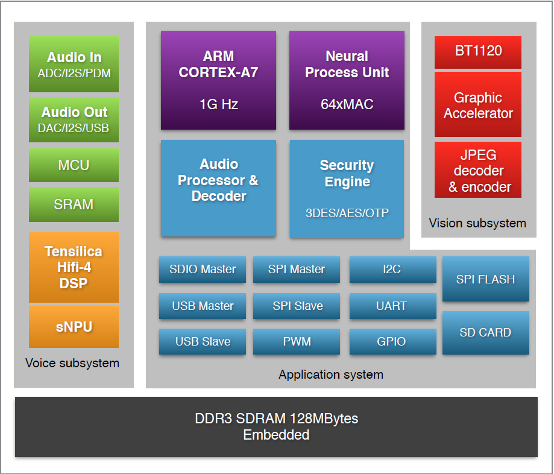

## K18 Chip Diagram {#k18-chip-diagram}

*   Support 2/4/6/8 mic array;
*   Integrate 8 channels ADC, 4 channels PDM; support both digital mic and analog mic;
*   Integrate both I2S and Line-out audio out interface; Support both internal audio codec through Line-out interface and external audio codec through I2S interface;
*   Use heterogeneous SOC architecture which contains one MCU and one Cortex-A7; This architecture is designed for low power voice wakeup realization;
*   Integrate DSP which supports noise cancellation, AEC, Beam-forming and echo cancellation;
*   Integrate NPU and SNPU; Main NPU is controlled by Cortex-A7core; SNPU is controlled by MCU;
*   Integrate BT1120 interface which support camera data input with YUV format;
*   Integrate SPI/I2C/USB/UART/PWM/SDIO interfaces which can connect WIFI/BT/LED peripheral components;
*   Packaged with 128MB DDR RAM; Use 128MB SPI NAND Flash typically;