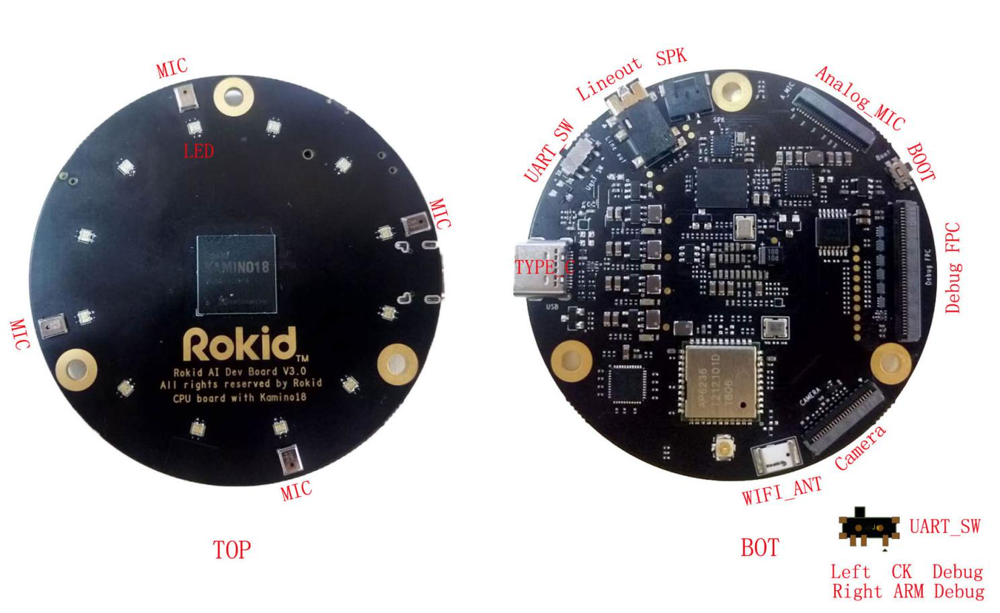
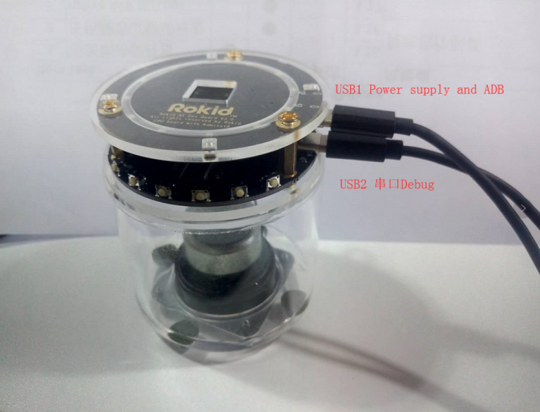

## K18 Dev3.0 Board Introduction {#k18-dev3-0-board-introduction}

Kamino18 Dev3.0 is a reference solution for smart speaker products. It contains main board and sub board two parts. As the below picture:

**Main Board Diagram**

*   Lineout: Stereo headset
*   SPK: Speaker 3.2w
*   Analog_MIC: socket which can connect analog MIC daughter board
*   BOOT: Boot key
*   Debug FPC: socket which can connect Debug daughter board
*   Camera: socket which can connect 2M Camera(OV2640)
*   WIFI ANT: socket which can connect external antenna
*   TYPE_C: ADB debug interface and usb power supply
*   UART_SW: SW switch; switch to left, mcu uart output; switch to right, arm uart output;
*   LED: 12PCS RGB LEDs
*   MIC: 4 DMICs

****

**Debug sub board Diagram**

*   IR: Infrared ray receiver
*   USB HOST: Usb host interface
*   DEBUG: USB UART converter for MCU and ARM debug
*   UPGRADE(BOOT): The key for Image burning
*   PWR(NC): Reserved key
*   VOL-: Volume minus key
*   VOL+: Volume plus key
*   MUTE: MIC Mute key
*   RST: System reset key
*   GPIO: GPIO extension
 
**USB Cable Connection Diagram**

*   USB1 power supply and ADB,
*   USB2 UART Debug, need install FT232 driver on PC, which can’t provide power supply for K18 DEV3.0
*   UART SW, Left for CK Debug, Right for ARM Debug.