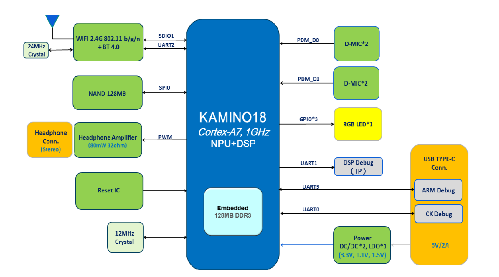

## Smart Speaker Solution Introduction {#smart-speaker-solution-introduction}

s

*   Power supply：Battery; 5V/2A,5V/1A AC/DC powers adapter or PC USB power supply
*   Storage：128MB SPI NAND Flash;
*   Audio out：Audio Right/Left; PWM analog audio output;
*   MIC array：4 channels PDM interface support 8 DMIC audio inputs at most; There is one BIAS power supply for every PDM;
*   Connectivity：Use SDIO interface to connect WIFI module and use UART interface connect BT module;
*   USB：One USB2.0 HOST interface and one USB2.0 Slave interface;
*   OS：YodaOS based on Linux kernel;
*   Cloud platform：Access Rokid voice service cloud platform by default; The 3rd cloud platform also can be accessed.
*   Low power design：Through Voice subsystem(MCU+DSP), low power voice wakeup modules can be supported on K18;