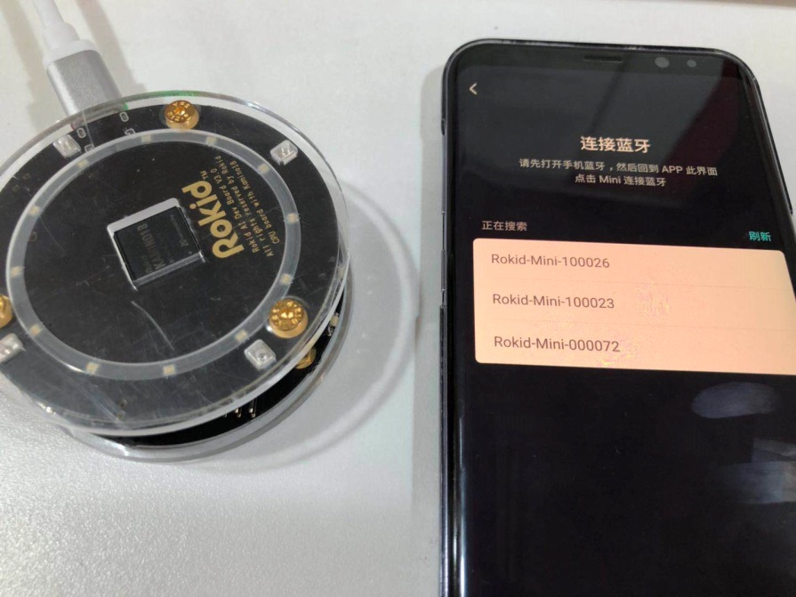
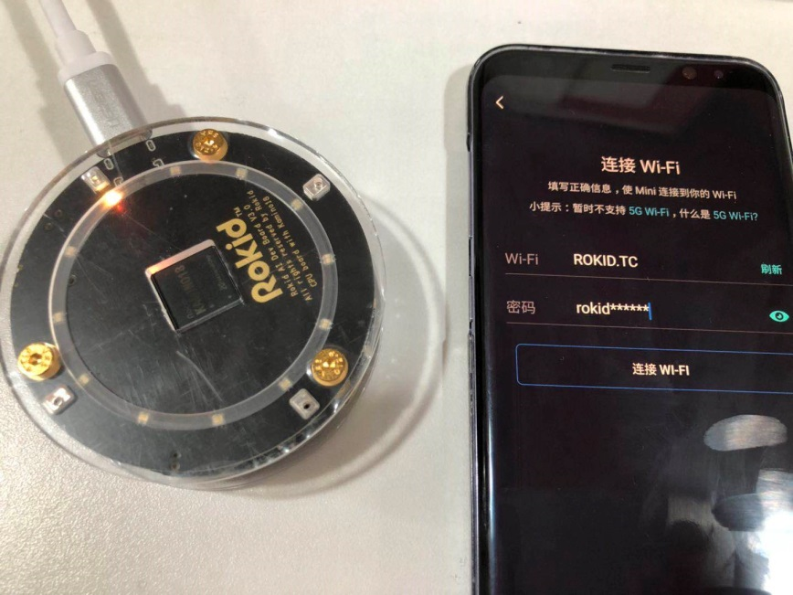
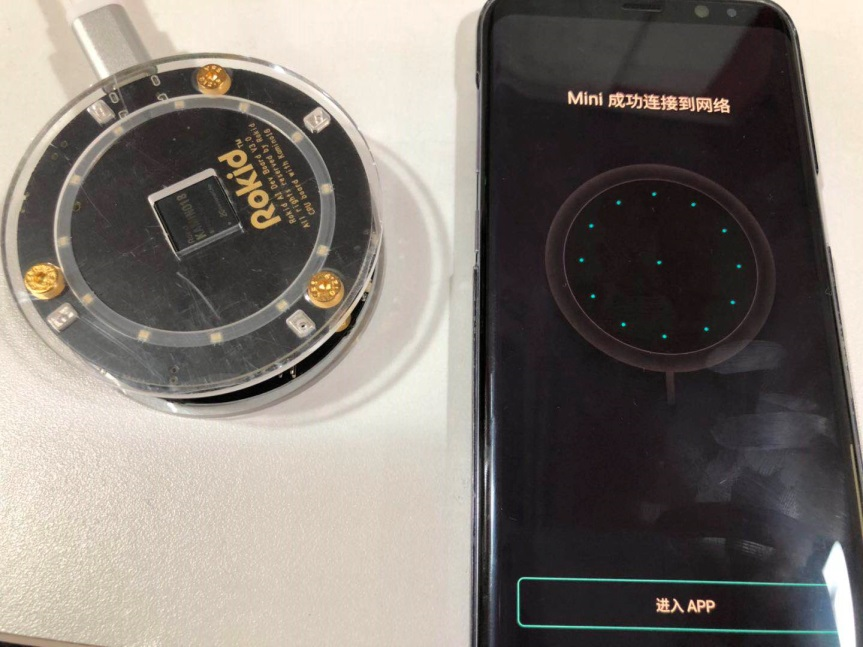

## Network Setup through BT {#network-setup-through-bt}

After install Rokid APP in smart phone, through bluetooth BLE channel, user can transfer SSID and password to K18 platform for the corresponding WIFI AP. After network setup successfully, user can use K18 smart speaker platform for voice interaction.

**Bluetooth Connecting**

**Input SSID and password for WIFI AP**

**Setup Network Success**