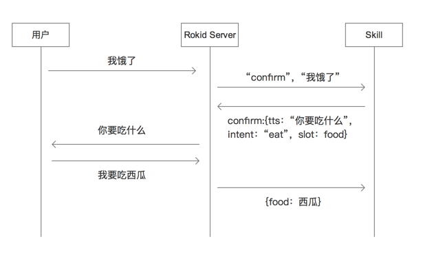

## 为技能定义语音交互
在创建自定义技能的过程中，您需要为此技能定义语音交互，以覆盖用户的语音交互场景，做出合理的响应。

**Tips**：预定义技能不需要您定义语音交互。

### 概述

- [理解语音交互的逻辑](#理解语音交互的逻辑)
- [意图定义](#意图定义（intent）)
- [用户输入的数据](#用户输入的数据)
- [Confirm用法指南](#confirm用法指南)
- [Session用法指南](#session用法指南)
- [其他参考](#其他参考)

### 理解语音交互的逻辑
为自定义技能定义语音交互，实际上是将`用户语句` `词表`等**用户输入**和您的后端服务能够处理的`意图`进行映射关联的过程。

要处理好这个映射关系，你需要弄清楚以下几个主要概念：

1. **意图定义**：一个能够声明您后端服务可以处理的意图合集的JSON结构。
2. **用户输入数据**：
    - **用户语句**：意图中表达用户输入的部分。可以将用户可能的交互语句和您的意图关联起来。您可以为一个意图预置尽可能多的用户语句。
    - **词表**：一个词条的列表，这些词条的内容将会被用户语句或者意图所引用。比如您可以把所有的城市作为值放在「城市」词条中，给「杭州今天天气怎么样」这个用户语句引用。

您将会在Rokid开发者社区 > 开发后台 > 技能工具中某一个技能的**语音交互**页面编辑上述信息。

下面将会为您详细介绍如何进行语音交互的定义。

### 意图定义（intent）
在Rokid开发者社区中，意图用来表示用户的一个具体语音请求。如果需要，每一个意图都可以声明自己依赖的词表，也就是需要在语义解析之后需要输出给后端服务的内容。比如在「[开始创建第一个技能：我要喝咖啡](./skill-sample-coffee.md)」这个技能的意图定义中，我们会定义一个询问咖啡馆的意图`bestcoffeebar`，它需要一个依赖词表`city`来确定搜索范围。当用户说：“若琪，打开我要喝咖啡问问杭州哪里有好点的咖啡馆。”时，Rokid开发者社区将把`bestcoffeebar`的intent请求发给您的后端服务，同时还将带上词表名称`city`中的“杭州”这个值。**如果此时未定义`city`这个词表依赖，“杭州”这个参数将不会被输出给您的后端服务。**

您将在意图定义框中用JSON格式定义一套有效的意图。比如如下案例中定义了两个意图：`bestcoffeebar`和`nicedrink`：

```json
{
 "intents": [
  {
   "intent": "bestcoffeebar",
   "slots": [
        {
        "name": "city",
        "type": "LIST_OF_CITIES"
        }
   ],
    "user_says":[
        "..."
        ]
  },
    {
    "intent": "nicedrink"
    }
 ]
}
```

每个意图都拥有三个参数：

- `intent`参数表示意图名称。
- `slots`参数表示与上述意图依赖的词表名称和内容。
- `user_says`参数表示用户语句，将会在下方[用户语句](#用户语句user_says)部分详细说明。

在上述例子中，意图`bestcoffeebar`依赖的词表是`city`。

词表通过词表名称`name`和词表内容`type`来定义。比如，上述例子中的`city`通过`LIST_OF_CITIES`这个此表内容来定义，其中包含各城市名称的值（比如杭州、北京）。另外，一个词表还可以引用Rokid开发者社区预先定义好并对外开放的词表内容，比如时间等，此部分将会陆续开放。


### 用户输入的数据
意图定义完成后，您需要定义用户输入数据和意图之间的映射关系。
用户输入数据通过词表和用户语句来定义。

### 用户语句（user_says）
您需要为意图配置任何可能的用户语句，形成映射关系。例如，我们对上例中意图定义的JSON进行完善：

```json
{
 "intents": [
  {
   "intent": "bestcoffeebar",
   "slots": [
        {
        "name": "city",
        "type": "LIST_OF_CITIES"
        }
   ],
    "user_says":[
        "$city哪里好点的咖啡馆",
        "$city哪里有好一点的咖啡馆",
        "$city哪里有好点的咖啡馆"
        ]
  }
    {
    "intent": "nicedrink",
    "user_says": [
        "米萨咖啡哪种最好喝",
        "米萨咖啡最好喝的是哪一种",
        ]
    }
 ]
}
```

这样，有3句不同的用户语句对应到了意图`bestcoffeebar`，有2句不同的用户语句对应到了意图`nicedrink`。意味着用户说出这些语句时，就会匹配到对应的意图。
> 这里面关于`$`的引用，会在下方[自定义词表内容](#自定义词表内容slot)继续说到。

用户语句可以枚举，同时支持正则表达式，具体请参考[Rokid正则表达式使用指南](rokid-regular-expression.md)。

请配置尽可能多的用于语句以匹配用户多种多样的表达方式。另外，在后续填写技能发布信息时，您需要从这些语句中选出3句最能代表您技能特点的语句展示在技能说明中告知用户。


**特别提醒：**
用户语句是句式强匹配，除特殊情况外，不建议在句末添加标点符号，否则可能会导致句式无法匹配。

比如在上例中将语句加上`？`标点：

```text
杭州哪里好点的咖啡馆？
```

那么此时只有ASR解析结果为`杭州哪里好点的咖啡馆？`的语句才可以被识别，而`杭州哪里好点的咖啡馆`则无法被识别。

相反，如果配置的语句为：

```text
杭州哪里好点的咖啡馆
```
那么语句`杭州哪里好点的咖啡馆？`和`杭州哪里好点的咖啡馆`以及末尾带有其他标点的句子均能被正确识别。

### 自定义词表内容（slot）
在Rokid开发者社区提供的[预定义词表](rokid-bult-in-slots.md)之外，开发者可以自定义自己的词表内容。
在上例中，`LIST_OF_CITIES`词表内容可能包含如下部分：

```text
北京
上海
广州
深圳
杭州
```

只要有可能被用户说出来的相关词语，你都可以写进词表内容中。Rokid开发者社区将会把用户命中的词表内容直接发送给您的技能。

开发者可以把任何可以抽象的内容定义为词表，并在用户语句中通过`$ + 词表名称`进行调用。
比如当您希望定义以下几种用户语句时：

```text
我想喝咖啡
我要喝咖啡
我想要喝咖啡
我要喝可乐
我想喝果汁
```
可以抽象出两个词表：

`iwant`

```text
我想
我要
我想要
```

 `drink`

```text
咖啡
可乐
果汁
```

并通过以下语句统一表达：

```text
$iwant喝$drink
```


**需要注意：**

- 一个词表内容可以被多个不同的词表名称引用，用于把同一类的值输出到不同的应用场景中。比如在下例中，`ROKID.NUMBER_ZH`可以被不同的词表名称引用多次，在用户说出`两小时十五分钟三十六秒`的时候，能够输出`"slots":{"hour":"两","min":"十五","sec":"三十六"}`。


```json
{
  "intents": [
    {
      "intent": "time",
      "slots": [
        {
          "name": "hour",
          "type": "ROKID.NUMBER_ZH"
        },
        {
          "name": "min",
          "type": "ROKID.NUMBER_ZH"
        },
        {
          "name": "sec",
          "type": "ROKID.NUMBER_ZH"
        }
      ],
      "user_says": ["$hour小时", "$min分钟", "$sec秒"]
    }
  ]
}
```

- 一个技能中，所有词表内容的值的总数，不能超过10万个。

### Confirm用法指南

当您的技能需要在某些场景下对用户的意图进行确认时（尤其是一些不完整的意图，比如当用户说“我饿了”时，您需要向用户确认他想吃什么东西），您可以使用confirm功能来完成语音交互。

以下是一个例子。

#### 补全用户的不完整意图
当用户在您的技能中说：“若琪，我饿了”这样一个不完整意图时，您希望能够去确认并在用户的帮助下补全这个意图。可以参照如下进行语音交互配置。

```json
{
    "intents": [
        {
            "intent": "eat", 
            "slots": [
                {
                    "name": "food", 
                    "type": "list"
                }
            ], 
            "user_says": [
                "!我要吃$food"
            ]
        }, 
        {
            "intent": "confirmeat", 
            "slots": [ ], 
            "user_says": [
                "我饿了"
            ]
        }
    ]
}
```

	

#### 语音交互流程
以下是上述场景的完整交互流程。




**第一步：**当用户说“我饿了”时，交由Rokid Server 处理后，告知技能“我饿了”是confirm类型的用户语句。Request内容如下：

```json
{
    "request": {
        "reqType": "intent", 
        "reqId": "010116000100-ad1f462f4f0946ccb24e9248362c504a", 
        "content": {
            "applicationId": "com.rokid.confirm", 
            "intent": "confirmeat", 
            "slots": { }
        }
    }
}
```

**第二步：**技能收到Confirm用户语句时，回传Rokid Server Response，内容示例如下：

```json
{
    "response": {
        "action": {
            "voice": {
                "action": "PLAY", 
                "item": {
                    "tts": "你要吃什么"
                }
            }
        }, 
        "confirm": {
            "confirmIntent": "eat", 
            "confirmSlot": "food", 
            "optionWords": [
                "西瓜", 
                "桔子"
            ]
        }
    }
}

```

Rokid Server处理消息并向用户询问“你要吃什么”。

**第三步：**用户回答“我要吃西瓜”，Rokid Server处理消息告知技能{food:  西瓜}。

```json
{
    "request": {
        "reqType": "intent", 
        "reqId": "010116000100-ad1f462f4f0946ccb24e9248362c504a", 
        "content": {
            "applicationId": "com.rokid.confirm", 
            "intent": "eat", 
            "slots": {
                "food": "西瓜"
            }
        }
    }
}
```
          
#### 如何退出confirm

- 若用户回答的内容，不在预设的词表内，则将重复询问用户，总共三次。三次回答均不符合词表内容将退出confirm。
- 若用户不回答任何内容，超过5分钟后将推出confirm
- 若用户想要强制退出confirm，可以通过“关闭+技能激活词”的句式退出。


#### 使用Js-engine配置Confirm

您可以阅读js-engine 使用指南中 [ttsWithConfirm相关配置](https://rokid.github.io/docs/2-RokidDocument/1-SkillsKit/rokid-js-engine-tutorial.html#32-ttswithconfirm相关配置) 了解更多。


### Session用法指南
Session可以通过`attributes`来实现。具体协议请参考[技能协议中的Session定义](/3-ApiReference/cloud-app-development-protocol_cn.md#22-session定义)。

Session目前只能作用在同一Domain下，**切换Domain会清空Session**。此时`newsession` = `true`。`attributes`也会被清空。

#### 以问天气为例
当询问天气技能：“今天天气怎么样”时，会开启一个新的session，此时`attributes`为空，`newSession` = `true`，将会发送如下Request给此技能的后端服务：

```json
{
 "context": {
  "application": {
   "applicationId": "xxx"
  },
 },
 "request": {
  "content": {
   "domain": "custom.skill.xxx",
   "intent": "query_weather",
   "slots": {"date":"今天"}
  },
  "reqId": "57792AB32F114788A3E48910FB9CD7BC",
  "reqType": "INTENT"
 },
 "session": {
  "attributes": {},
  "newSession": true
 },
 "version": "2.0.0"
}
```

收到询问天气的请求后，后端服务会给出Response。
在这一步中，开发者需要让后端服务把`city`值插入到Response的`attributes`中，如下：

```json
{
 "response": {
  "action": {
   "shouldEndSession": false,
   "type": "NORMAL",
   "version": "2.0.0",
   "voice": {
    "behaviour": "REPLACE_ALL",
    "item": {
     "tts": "杭州今天的天气很好"
    },
    "needEventCallback": false
   }
  }
 },
 "version": "2.0.0",
 "session": {
        "attributes": {
           "city":"杭州"
        }
    }
}
```

之后，用户继续向天气技能询问：“明天呢？”。
此时Rokid开发者社区会把`attributes`中的city属性带到这次的Request中：

```json
{
 "context": {
  "application": {
   "applicationId": "xxx"
  },
 },
 "request": {
  "content": {
   "domain": "custom.skill.xxx",
   "intent": "query_weather",
   "slots": {"date":"明天"}
  },
  "reqId": "57792AB32F114788A3E48910FB9CD7BC",
  "reqType": "INTENT"
 },
 "session": {
  "attributes": {"city":"杭州"},
  "newSession": false
 },
 "version": "2.0.0"
}
```

以此类推。
但当切换Domain，比如用户说：“我想听一首歌”时，session将会被清空。


### 其他参考

- [Rokid语音交互指南](/2-RokidDocument/1-SkillsKit/rokid-voice-interaction-guidelines.md)：能够帮助您更好的定义语音交互。
- [Rokid技能协议文档](/3-ApiReference/cloud-app-development-protocol_cn.md)：能够让您查阅完整的语音交互所需的协议。

