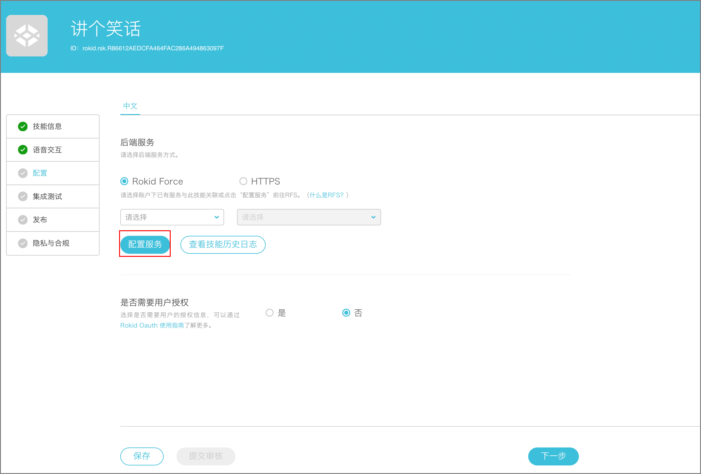
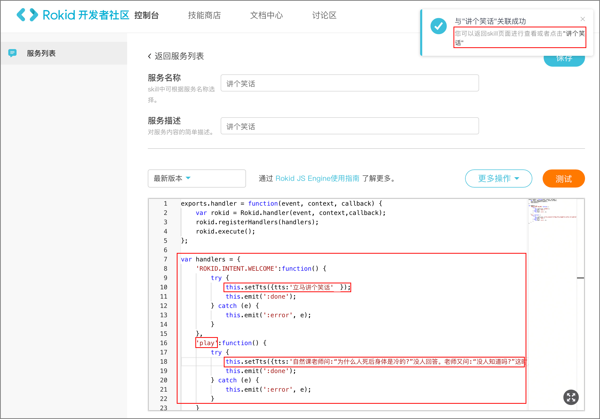

## 配置

1. 后端服务可选择Rokid Force(无需后台服务器,详情请见[Rokid Force System使用指南](../rokid-force-system-tutorial.md))或者HTTPS([Java开发后端服务示例](https://github.com/Rokid/rokid-skill-sample/tree/master/rokid-skill-sample-java))，为快速编写后端服务，优先选择Rokid Force为示例。 


2. 接着在配置页面中（见下图），填写「服务名称」和「服务描述」,将图片下方的模板复制到编辑框，在图中左下角的红框里依次修改自己的欢迎词和意图（注意:此处的意图名称需与语音交互里的意图名称一致）以及tts对应的文本。点击保存右上角会出现与技能关联成功的弹框，单击弹框里的技能名称返回技能创建列表。了解更多请参考 [Rokid Force JS指南](../rokid-force-js-tutorial.md)。

    模版
    ```
    exports.handler = function(event, context, callback) {
        var rokid = Rokid.handler(event, context,callback);
        rokid.registerHandlers(handlers);
        rokid.execute();
    };

    var handlers = {
    'ROKID.INTENT.WELCOME':function() {
        try {
            this.setTts({tts:'立马讲个笑话'});
            this.emit(':done');
        } catch (e) {
            this.emit(':error', e);
        }
    },
    'play':function() {
        try {
            this.setTts({tts:'自然课老师问:“为什么人死后身体是冷的?”没人回答。老师又问:“没人知道吗?”这时,教室后面有人说:“那是因为心静自然凉”。'});
            this.emit(':done');
        } catch (e) {
            this.emit(':error', e);
        }
        }
    };
    ```
3. 返回技能列表，配置完成


4. 选择“是否需要用户授权”默认为否，了解更多请参考[Rokid Oauth 使用指南](../rokid-oauth.md)。

[下一步](test.md)

