### 目录

本文将讲解如何在Rokid技能平台上快速地创建一个自定义技能。

* [一、准备工作](#一、准备工作)
* [二、创建技能](#二、创建技能)
* [三、填写技能信息](#三、填写技能信息)
* [四、语音交互](#四、语音交互)
  * [自定义语音交互](#自定义语音交互)
  * [预定义语音交互](#预定义语音交互)
* [五、配置后端服务](#五、配置后端服务)  
  * [选择后端服务方式](#选择后端服务方式)
  * [配置服务](#配置服务)
  * [授权设置](#授权设置)
* [六、集成测试](#六、集成测试)
  * [添加测试设备](#添加测试设备)
  * [SSML语音调试](#ssml语音调试)
  * [后端服务测试](#后端服务测试)
* [七、发布](#七、发布)
* [八、隐私与合规](#八、隐私与合规)

### 一、准备工作

#### 设计您的技能

一个好的技能离不开出色的语音交互设计，所以需要您对自然语言、人类对话的基本原理有简单的理解。请阅读[Rokid语音交互指南](/2-RokidDocument/1-SkillsKit/rokid-voice-interaction-guidelines.md)以了解如何设计出色的语音交互，呈现优质的交互体验。


### 二、创建技能

#### 注册Rokid开发者账号
在「[Rokid开放平台](https://developer.rokid.com/)」免费注册一个Rokid开发者账号。


#### 创建技能
登录「Rokid开放平台」后，点击「创建技能」按钮。

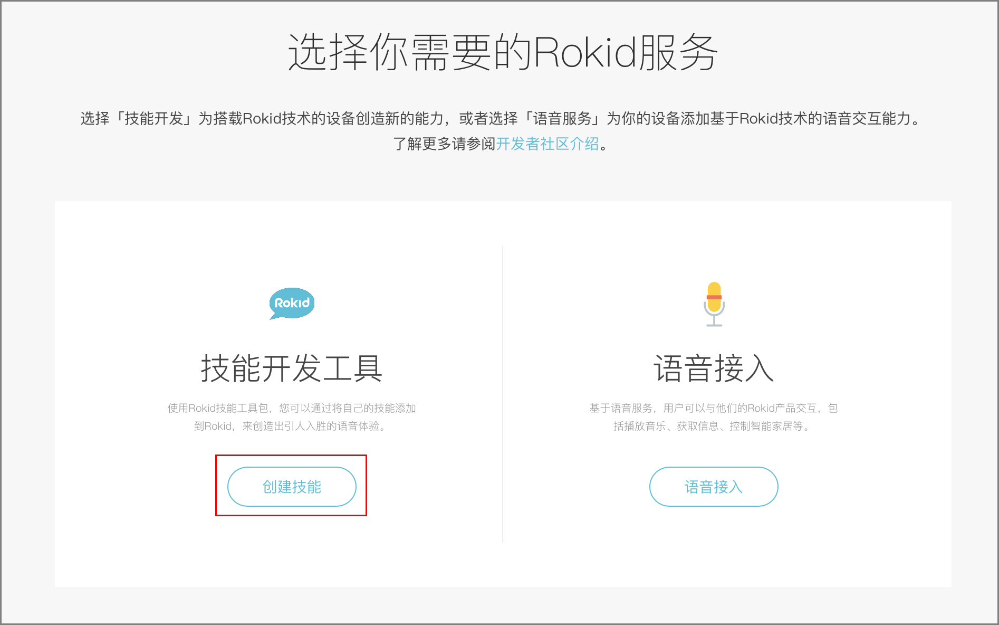

进入到如下界面，点击「开始创建」。

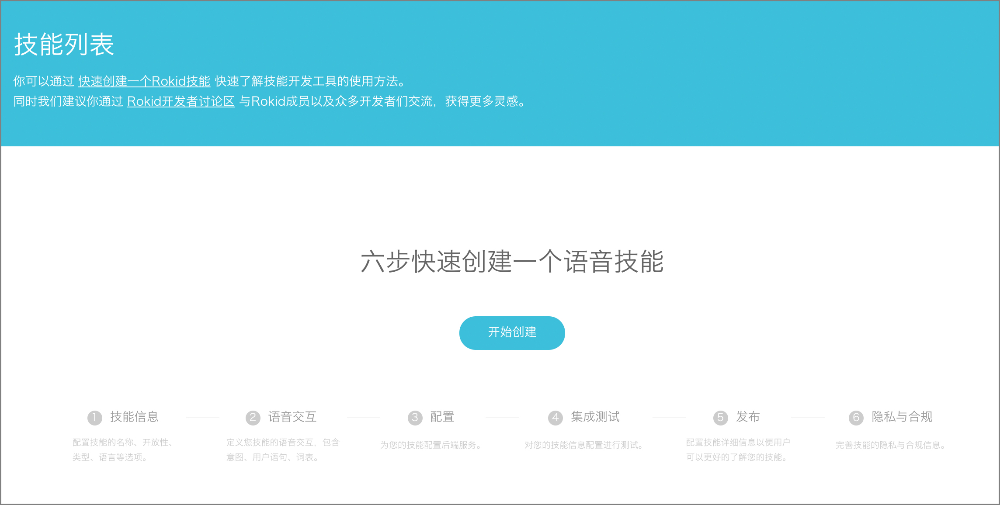


### 三、填写技能信息

**如下图所示：**
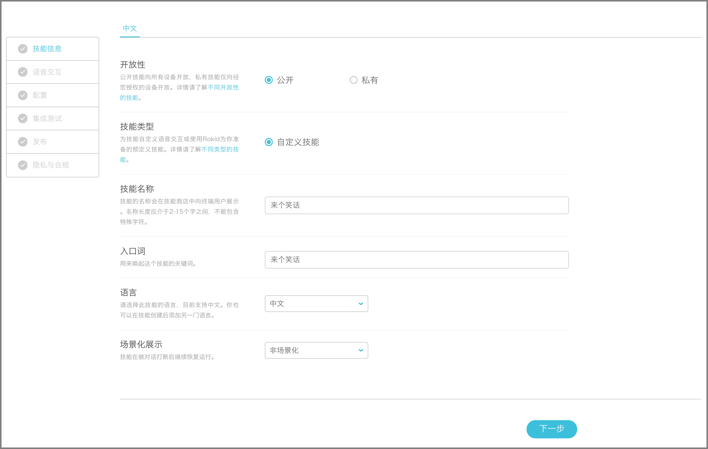


#### 设置技能的开放性
填写「技能信息」的第一步，就是设置所建技能的开放性。您可以设置创建的技能为「**`公开技能`**」，对所有设备开放；也可以设置为「**`私有技能`**」，仅对经过您授权的设备开放。

**公开技能**：公开属性的技能将会对所有搭载 Rokid 语音解决方案的设备开放，终端用户可以通过技能商店轻松开启/使用您开发的技能。

**私有技能**：私有属性的技能无法向所有用户开放，仅对经过您授权的设备开放，这些授权过的设备可以开启/使用您开发的技能。

- 注意：在创建「**`私有技能`**」时，还需选择是创建「**`本地私有技能`**」还是「**`云端私有技能`**」。创建「**`本地私有技能`**」，需要编写一个apk推送到设备上（具体参照：https://github.com/Rokid/NewsDemo ); 如创建了「**`云端私有技能`**」，则该技能的后台配置服务不在设备上而是在另外搭建的服务端上。
不管本地还是云端，都应遵守「Rokid开放平台」的[协议格式](https://developer.rokid.com/docs/2-RokidDocument/1-SkillsKit/important-concept/cloud-app-development-protocol_cn.html)进行通信。


#### 选择技能类型：自定义

「**`自定义技能`**」支持专业开发者设计符合自己业务场景的语音交互流程和业务处理逻辑，创建出功能强大的技能。

**注意**：此处用户只能选择「**`自定义技能`**」；若要调用「**`预定义技能`**」，请您在下一步设置【语音交互】时，点击【预定义语音交互】，选择【预定义语音交互配置】，再点击【引用】按钮即可。

#### 技能名称

技能名称会在技能商店中展示，名称长度应介于2-15个字之间，不能包含特殊字符。

#### 入口词

「**`入口词(唤醒词)`**」是调用技能的词语。如果用户想使用非 Rokid 官方技能，必须对若琪设备说：“若琪，打开‘**入口词**’”，技能才会被调用。

> 例如：使用「来个笑话」这个技能前，必须对若琪说：“若琪，打开来个笑话” ，该技能才会被启用。

#### 场景化展示：选择非场景化

在被对话打断后，技能仍能继续原来状态，即为**`场景化展示`**，否则即为**`非场景化展示`**。目前，非 Rokid 官方开发者只能选择非场景化展示。

> 比如播放音乐时询问天气，天气播报完毕。若音乐继续播放，则该播放音乐的技能为场景化技能。若音乐就此停止，则该播放音乐的技能为非场景化技能。


### 四、语音交互

语音交互主要定义三个要素：[意图](https://developer.rokid.com/docs/2-RokidDocument/1-SkillsKit/important-concept/intend.html)、[词表](https://developer.rokid.com/docs/2-RokidDocument/1-SkillsKit/important-concept/word-list.html)、[用户语句](https://developer.rokid.com/docs/2-RokidDocument/1-SkillsKit/important-concept/usersays.html) 

用户既可以选择「**`自定义语音交互`**」，自行配置意图、词表、用户语句等内容；也可以选择「**`预定义语音交互`**」，直接调用 Rokid 定义好的语音交互配置。如下图所示。

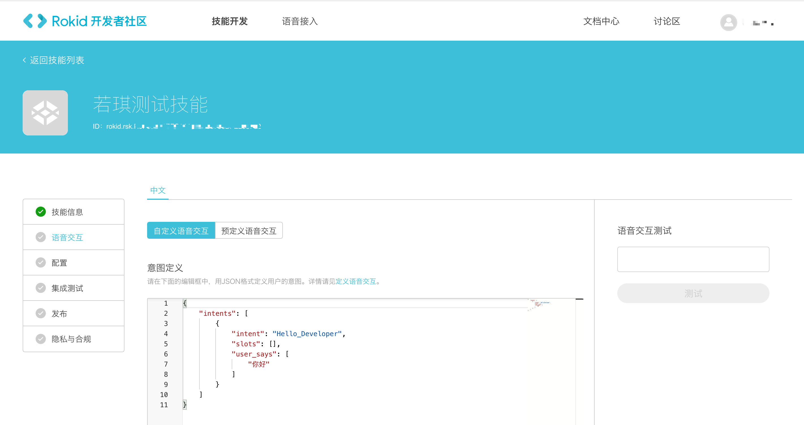


#### 自定义语音交互

##### 意图定义

设计自定义语音交互首先要定义意图。

**`意图`**指用户说话的目的，即用户想要表达什么、想做什么。

> 如用户说“今天天气怎么样？”，意图就是“查询天气”；用户说“我想订一张火车票”，意图就是“买火车票”。

用户的对话中可能含有多个意图，可将这些意图按照重要性排序。

**定义一个意图要设置三个参数：**

- **`intent`**:表示意图名称。

如下模板所示，必须用英文定义意图名称（`"intent": "play"`）。详细介绍见：[意图](https://developer.rokid.com/docs/2-RokidDocument/1-SkillsKit/important-concept/intend.html)

- **`slots`**:表示词表，包括上述意图所依赖的词表名称和词表内容。

用户既可以自定义词表内容，也可以直接引用预定义词表。详细介绍见：[词表](https://developer.rokid.com/docs/2-RokidDocument/1-SkillsKit/important-concept/word-list.html)

- **`user_says`**:表示用户语句。用户对于某一个意图，可能有各种各样的表达方式，这些不同的表达就是用户语句。详细介绍见：[用户语句](https://developer.rokid.com/docs/2-RokidDocument/1-SkillsKit/important-concept/usersays.html)

如下所示（填写时可复制图片下方的模板, 再根据自己的需求修改`intent`、`slots`、`user_says`）：

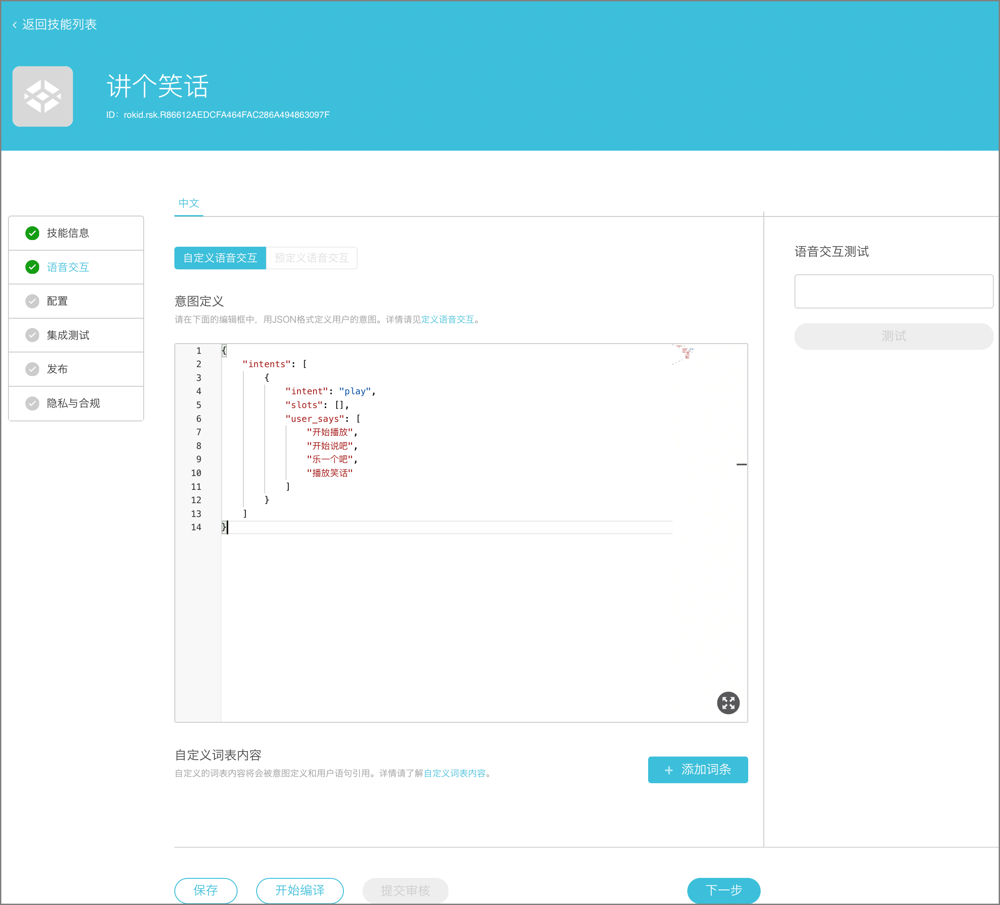

**模版**

```
{
  "intents": [
    {
      "intent": "play",
      "slots": [],
      "user_says": [
        "开始播放",
        "开始说吧",
        "开始乐吧",
        "播放笑话"
      ]
    }
  ]
}
```


##### 自定义词表内容

如果您在上一步【意图定义】中选择了自定义词表，那么您应在【语音交互】配置页面添加自定义词表内容。

###### 进入自定义词表添加页面

在语音交互配置页面下方【自定义词表内容】处，点击【添加词条】即可进入添加自定义词表内容的页面。

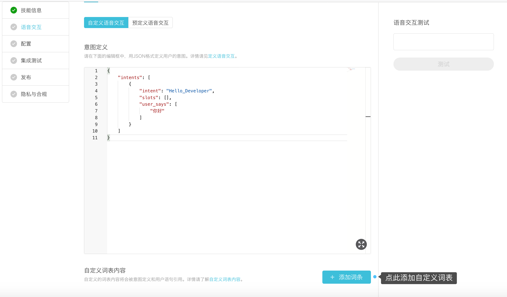


###### 添加自定义词表

用户可以通过【手动输入】和【文件导入】两种方式添加自定义词表。

**方式一：手动输入**

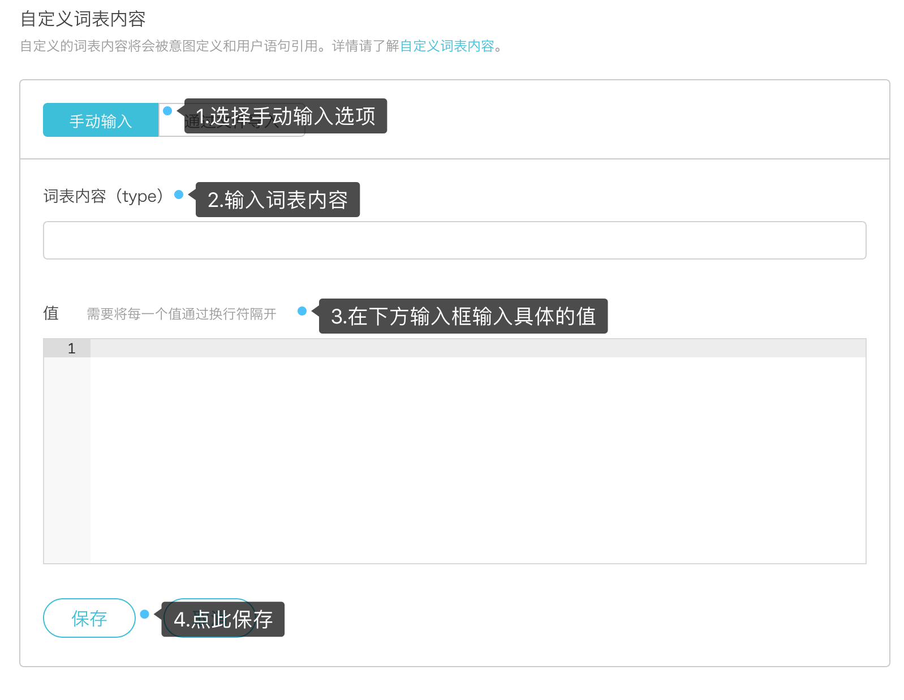

**方式二:通过文件导入**

该方式仅支持txt的文件导入，且文件格式编码须为UTF-8格式。

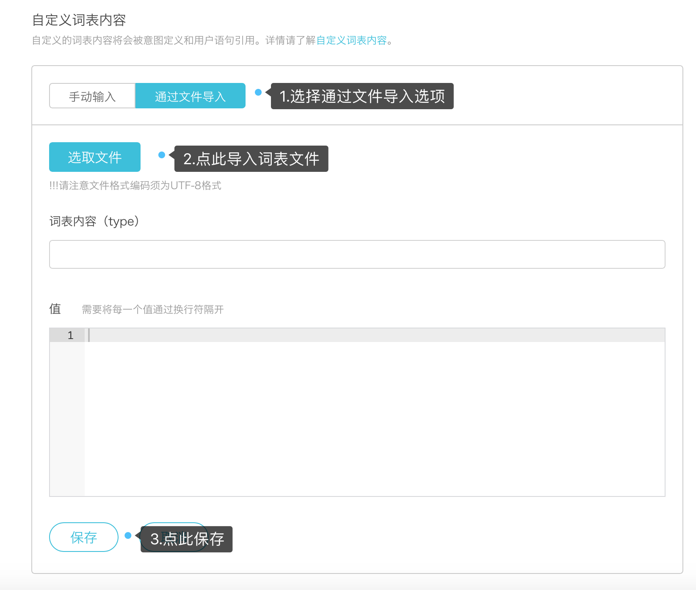

##### 语音交互测试

完成意图定义以后选择【保存】，再点击【开始编译】。编译完成后，在右侧的【语音交互测试】中输入定义好的意图，单击【测试】开始测试，正确结果示例见下图。

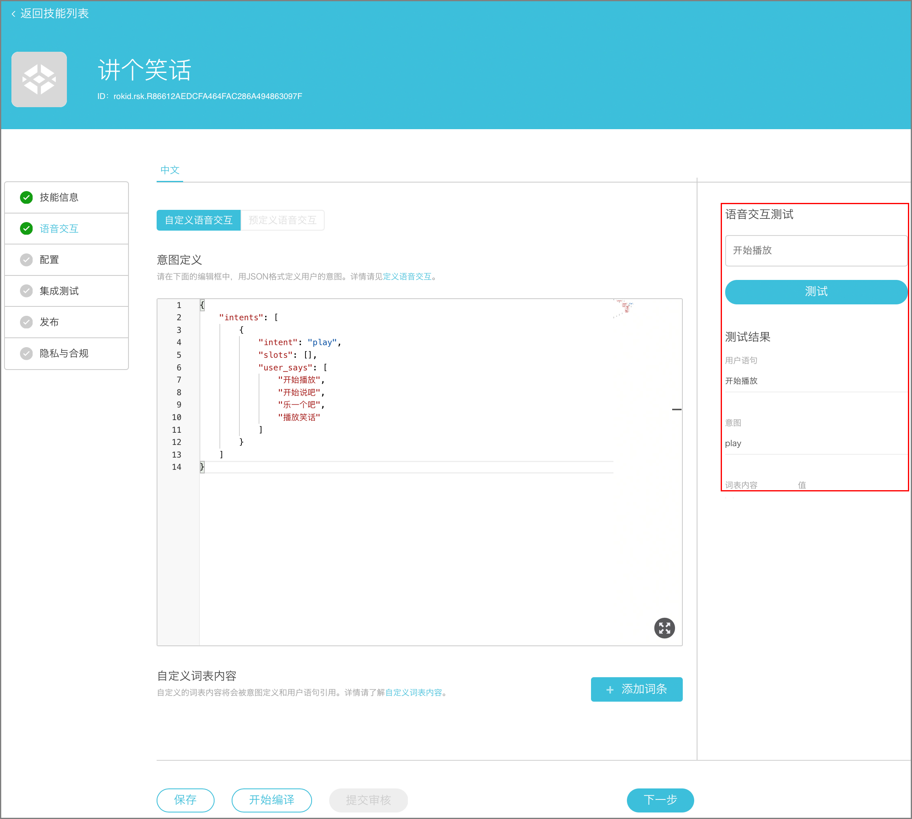


#### 预定义语音交互

在创建技能时，用户也可以直接使用【预定义语音交互配置】。

##### 具体操作

在【语音交互】配置页面，点击【预定义语音交互】，并选择想要的具体配置，直接点击【引用】即可。如下图所示：

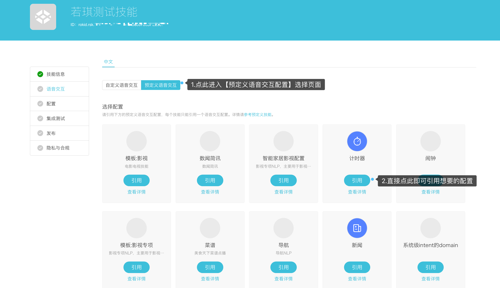

使用【预定义语音交互配置】，用户无需自己设置意图、词表、用户语句等内容，仅需在后端服务中直接实现对应的意图即可。


### 五、配置后端服务

#### 选择后端服务方式

云端技能的后端服务可选择【Rokid Force】(无需后台服务器,详情请见[Rokid Force System使用指南](../rokid-force-system-tutorial.md))或者HTTPS([Java开发后端服务示例](https://github.com/Rokid/rokid-skill-sample/tree/master/rokid-skill-sample-java))。

为快速编写后端服务，建议优先选择【Rokid Force】，。点击【配置服务】进入服务配置页面。
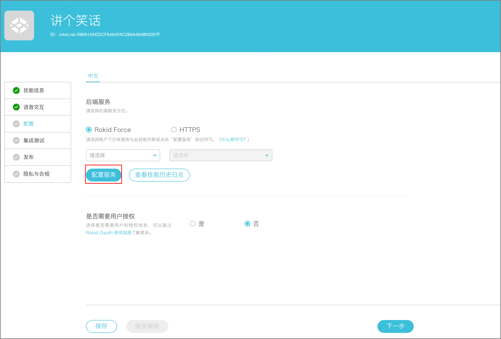

本地技能的后端服务需要开发者上传APK。


#### 云端技能的服务配置

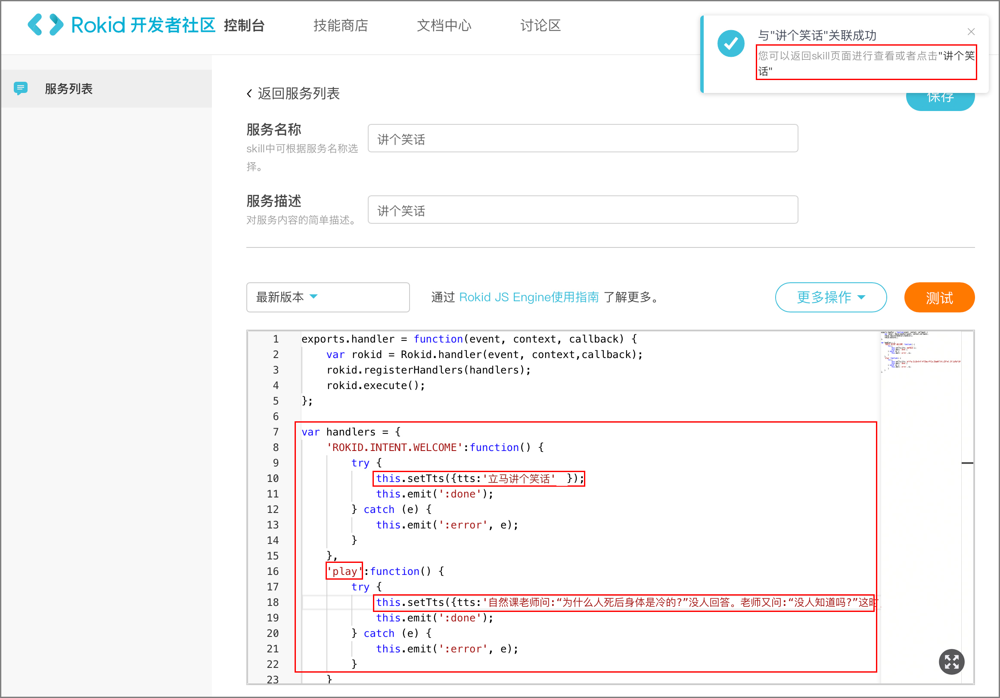

##### 1）填写【服务名称】和【服务描述】

在配置页面中，填写【服务名称】和【服务描述】。

##### 2）编辑脚本

将下方的模板复制到编辑框，在上图中间的红框里依次修改自己的**`欢迎词` **和**`意图`**（注意:此处的意图名称需与语音交互里的意图名称一致）以及tts对应的文本。

##### 3）保存

点击页面右上角的会出现与技能关联成功的弹框，单击弹框里的技能名称返回技能创建列表。了解更多请参考 [Rokid Force JS指南](../rokid-force-js-tutorial.md)**`链接不可用`**。

返回技能列表，配置完成。
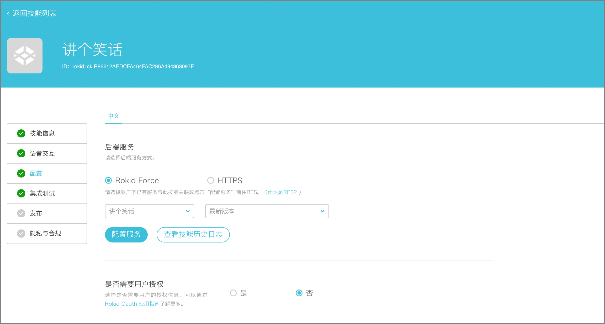

##### 模板

```
  exports.handler = function(event, context, callback) {
      var rokid = Rokid.handler(event, context,callback);
      rokid.registerHandlers(handlers);
      rokid.execute();
  };

  var handlers = {
  'ROKID.INTENT.WELCOME':function() {
      try {
          this.setTts({tts:'立马讲个笑话'});
          this.emit(':done');
      } catch (e) {
          this.emit(':error', e);
      }
  },
  'play':function() {
      try {
          this.setTts({tts:'自然课老师问:“为什么人死后身体是冷的?”没人回答。老师又问:“没人知道吗?”这时,教室后面有人说:“那是因为心静自然凉”。'});
          this.emit(':done');
      } catch (e) {
          this.emit(':error', e);
      }
      }
  };
```
#### 本地技能的服务配置

本地技能的服务配置页面，需要上传APK，目前仅能够管理搭载开发版本若琪月石设备的私有本地技能，其他设备请手动将APK推送至机器中。


#### 授权设置

选择【是否需要用户授权】，默认为否，了解更多请参考[Rokid Oauth 使用指南](https://developer.rokid.com/docs/2-RokidDocument/1-SkillsKit/rokid-oauth.html)。


### 六、集成测试

#### 添加测试设备

在【添加测试设备】下拉框可以选择【添加账号下绑定设备】将自动关联您手机账号下绑定的设备。也可以选择添加自定义设备，填写设备的type id 和sn 号，然后您可以用自动关联的设备对技能进行测试。示例如下：

```
用户：若琪，打开讲个笑话。
若琪设备：立马讲个笑话。
用户：开始播放
若琪设备：自然课老师问:“为什么人死后身体是冷的?”没人回答。老师又问:“没人知道吗?”这时,教室后面有人说:“那是因为心静自然凉。”
```

#### SSML语音调试

SSML语音调试可以自定义语音输出语句的语音语调。如图所示，点击【播放语音】可以测试TTS文本的语音语调。若需调整或者自定义语音语调（可参照[SSML使用指南](https://developer.rokid.com/docs/2-RokidDocument/1-SkillsKit/ssml-document.html)）, 在技能创建的第三步【配置】中修改【配置服务】里的代码。


#### 后端服务测试 

在后端服务测试的【输入语句】中输入用户语句，比如“开始播放”。如下图，将会得到Rokid语音服务器解析的Json服务请求和相应的服务返回数据。

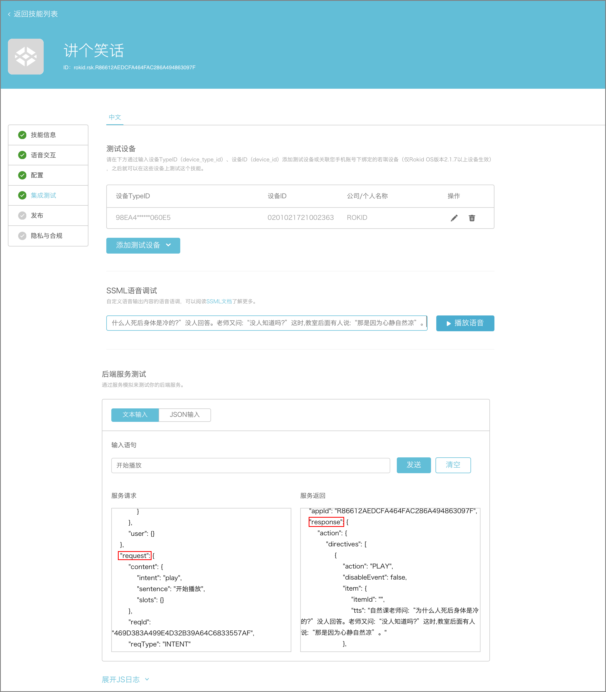

### 七、发布

如图所示，按照要求填写【技能商城分类】、【测试说明】、【国家和地区】、【技能摘要】、【技能描述】、【用户语句示例】、【关键词】、【技能图标】。再选择【保存】，进入下一步。
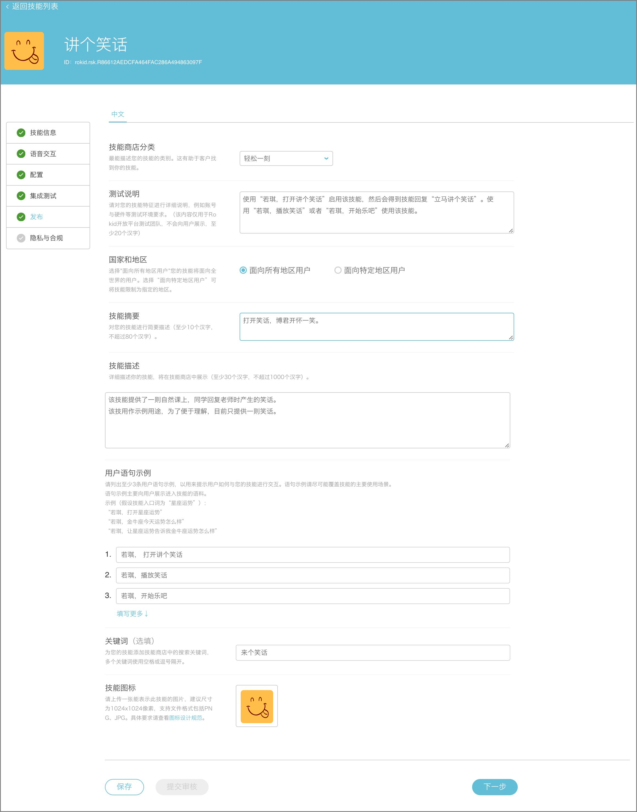

### 八、隐私与合规

按需填写，勾选【内容合规声明】。保存后点击【提交审核】提交发布申请，等待 Rokid 审核通过后技能即可发布上线。
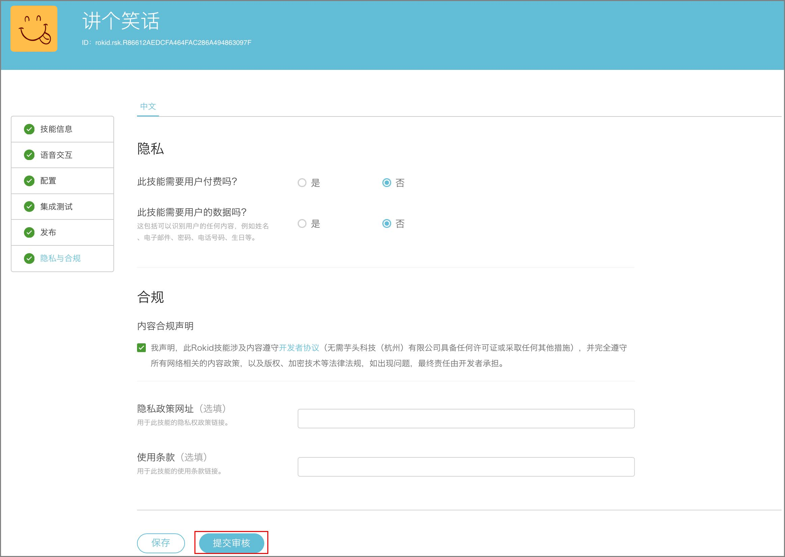

注意：公有技能需要官方工作人员进行审核，审核周期是1个工作日。私有技能无需审核，会自动发布，需要等待10分钟，状态将自动由【等待发布】变成【开发中】。【开发中】则表示技能生效、可被设备正常使用。