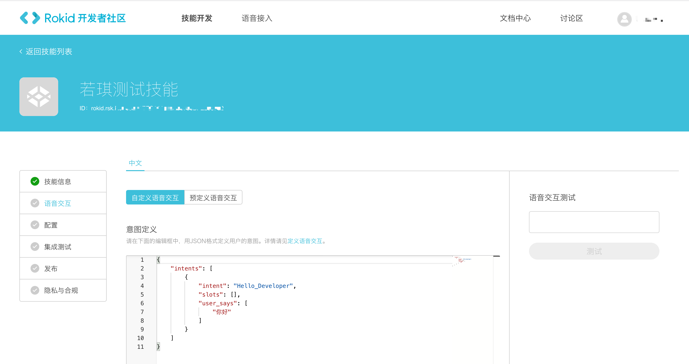
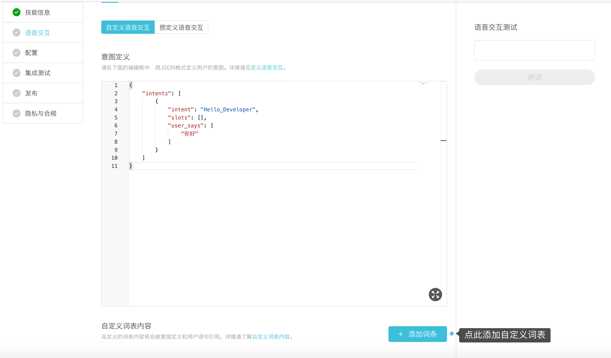
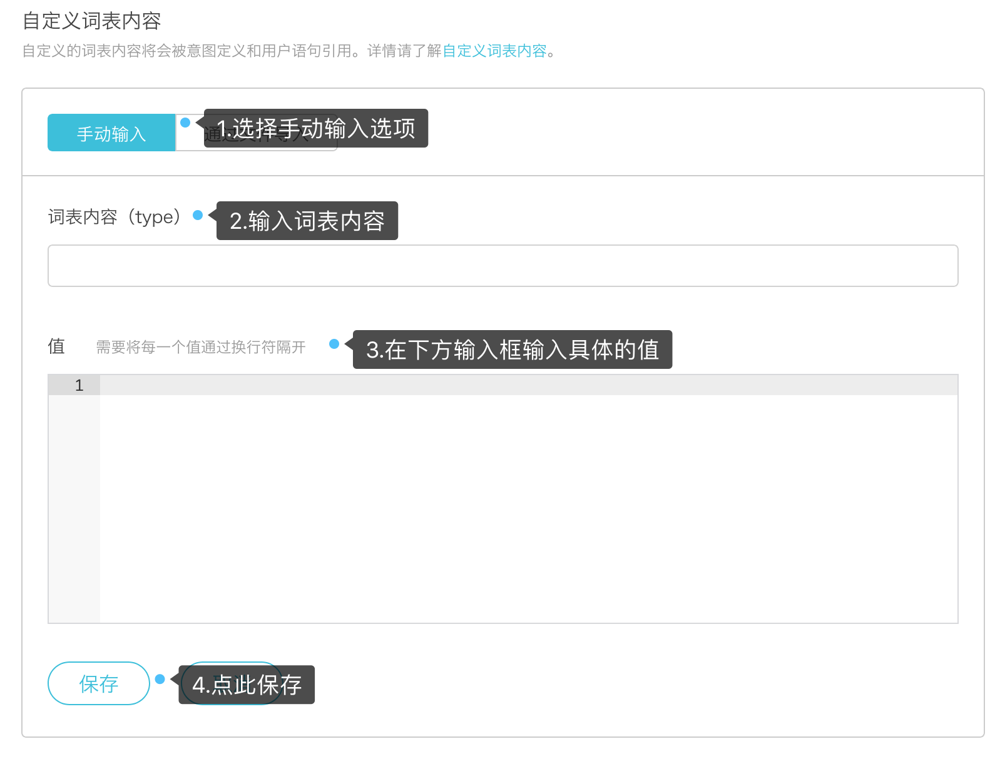
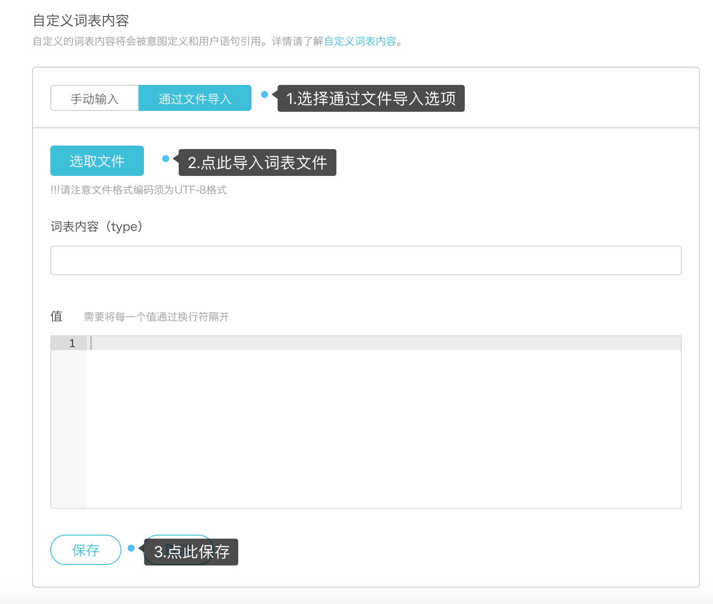
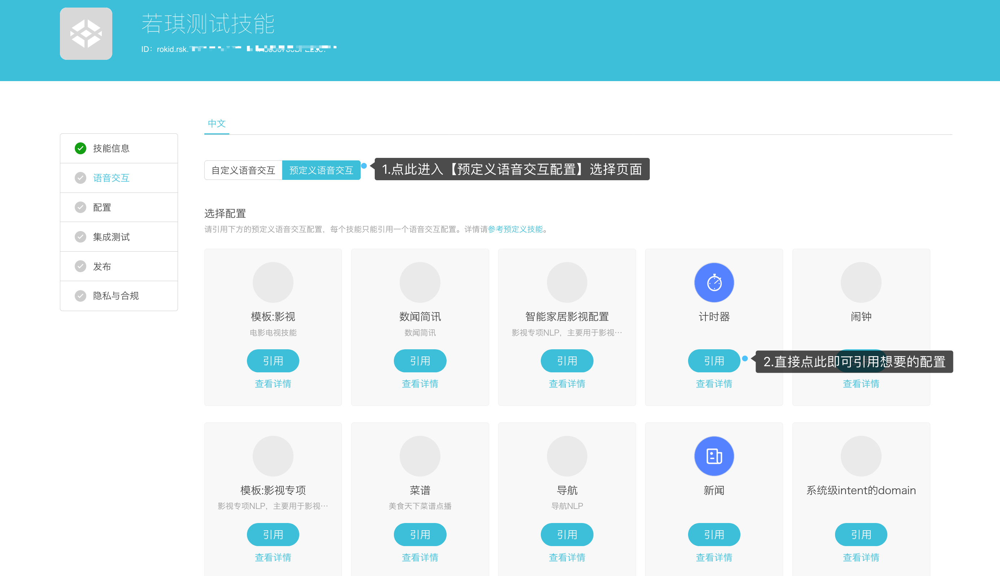

## 语音交互

语音交互主要定义三个要素：[意图](../important-concept/intend.md)、[词表](../important-concept/word-list.md)、[用户语句](./important-concept/usersays.md) 

用户既可以选择【自定义语音交互】，自行配置意图、词表、用户语句等内容；也可以选择【预定义语音交互】，直接调用Rokid定义好的语音交互配置。如下图所示。




###自定义语音交互

####意图定义

自定义语音交互首先需要进行意图定义。

**`意图`**指用户说话的目的，即用户想要表达什么、想做什么。

> 如用户说“今天天气怎么样？”，意图就是“查询天气”；用户说“我想订一张火车票”，意图就是“买火车票”。

用户的对话中可能含有多个意图，这些意图按照概率的大小进行排序。

**定义一个意图要设置三个参数：**

- **`intent`**:表示意图名称。

  如下模板所示，必须用英文定义意图名称（`"intent": "play"`）。详细介绍见：[意图](../important-concept/intend.md)

- **`slots`**:表示词表，包括上述意图所依赖的词表名称和内容。

  用户既可以自定义词表内容，也可以直接引用预定义词表。详细介绍见：[词表](../important-concept/word-list.md)

- **`user_says`**:表示用户语句。用户对于某一个意图，可能有各种各样的表达方式，这些不同的表达就是用户语句。详细介绍见：[用户语句](./important-concept/usersays.md)

如下所示（填写时可复制图片下方的模板, 然后根据自己的需求修改`intent`、`slots`、`user_says`）：


**模版**

```
{
  "intents": [
    {
      "intent": "play",
      "slots": [],
      "user_says": [
        "开始播放",
        "开始说吧",
        "开始乐吧",
        "播放笑话"
      ]
    }
  ]
}
```


####自定义词表内容

如果您在上一步【意图定义】中选择了自定义词表内容，那么您还需要在【语音交互】配置页面添加自定义词表。

#####Step1:进入自定义词表添加页面

在语音交互配置页面下方【自定义词表内容】处，点击【添加词条】即可进入自定义词表添加页面。




#####Step2:添加自定义词表

用户可以通过【手动输入】和【文件导入】两种方式添加自定义词表。

**方式一：手动输入**



**方式二:通过文件导入**

该方式仅支持txt的文件导入，且文件格式编码须为UTF-8格式。



####语音交互测试

完成意图定义以后选择【保存】--->【开始编译】。编译通过后在右侧的“语音交互测试”中输入定义好的意图，单击“测试”开始测试，正确结果应该如下图所示。


### 预定义语音交互

在创建技能时，用户也可以直接使用【预定义语音交互配置】。

####具体操作

在【语音交互】配置页面，点击【预定义语音交互】，并选择想要的具体配置，直接点击引用即可。如下图所示：



使用【预定义语音交互配置】，用户不需要自己设置意图、词表、用户语句等内容，仅需在后端服务中直接实现对应的意图即可。

[下一步](configuration.md)

