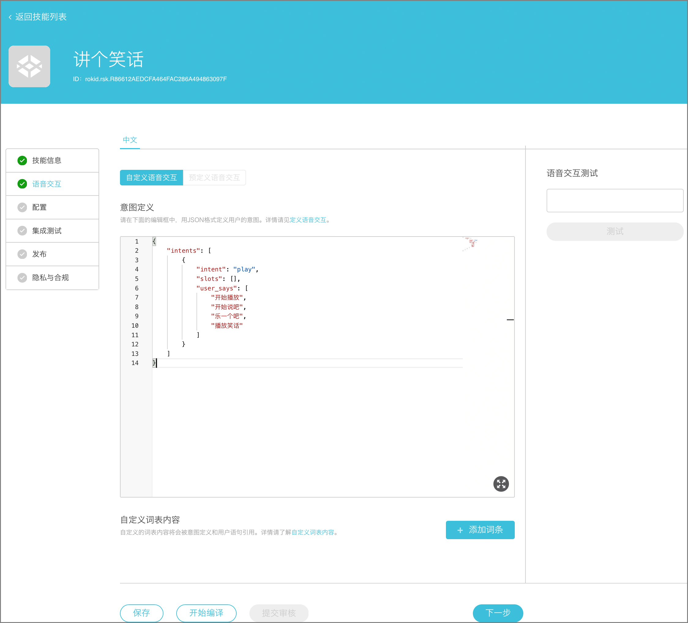
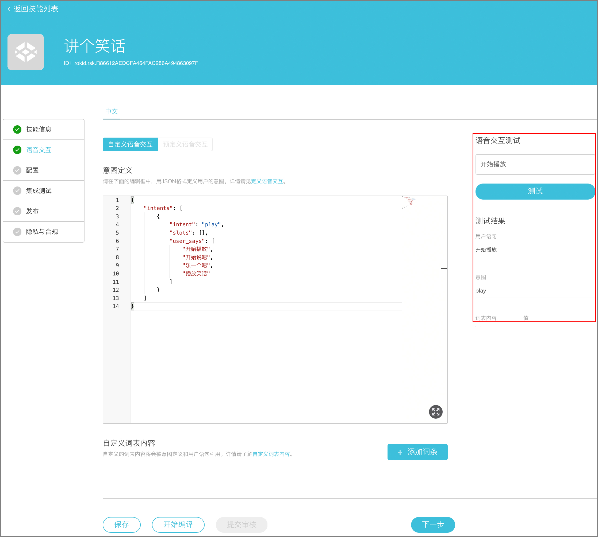

## 语音交互

语音交互主要定义三个要素（用户可根据自己的需求进行修改）
- 意图（intent）：意图指用户说话的目的，即用户想要表达什么、想做什么。比如用户说“讲个笑话”，意图是“播放笑话”。注意：如下模板所示，必须用英文定义意图名称（“intent”：“play”），模版里的意图为“播放”。当用户说“去商城购物”的时候，意图是“购物”。  详情参考[意图](../important-concept/intend.md)介绍。
- 词表（slot）：词表是指某领域词汇的集合。当用户询问北京天气怎么样时，其中北京是城市信息，将北京、天津、上海等所有城市信息集合起来就组成了中国城市的词表。详情请参考[词表](../important-concept/word-list.md)介绍.
- 用户语句（user_says）：用户语句与意图对应，例如模板里的用户语句 “开始播放”、“开始乐吧”、“播放笑话” 与 “play” 对应。当用户使用该技能时说“开始播放”，设备将会执行“play”这个意图。

如图所示（填写时可复制图片下方的模板, 然后根据自己的需求修改intent、slots、user_says）：


模版
```
{
  "intents": [
    {
      "intent": "play",
      "slots": [],
      "user_says": [
        "开始播放",
        "开始说吧",
        "开始乐吧",
        "播放笑话"
      ]
    }
  ]
}
```
意图定义完成以后选择保存 -> 开始编译。编译通过后在右侧的“语音交互测试”中输入定义好的意图，单击“测试”开始测试，正确结果应该如下图所示。



[下一步](configuration.md)

