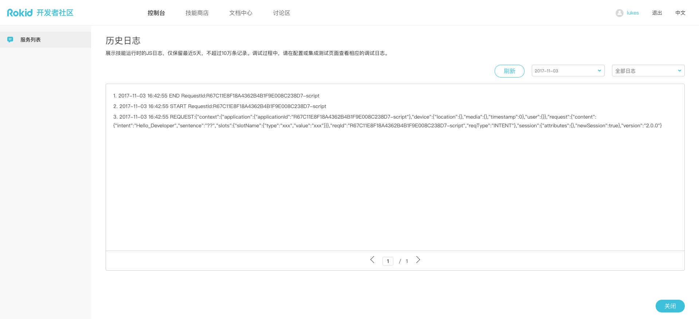

# Rokid Force System 使用指南

> -  欢迎使用Rokid-Force-System来搭建skill后端服务。
> - 为开发者能更灵活地配置skill服务，将原JS Engine服务解耦出skill配置，独立成为一个系统。
>  -  轻松切换技能功能；
>  -  随时编辑服务内容；
>  -  可选服务历史版本；
> - Rokid-Force-JS服务编写指南：[点此查看](./rokid-force-js-tutorial.md)

### 使用示例
技能创建到第三步“配置”，

选择Rokid Force方式，可分为三种情况：
- 开发者（无历史js服务配置）& skill：点击“配置服务”进入“新建服务”。
- 开发者（有历史js服务配置）& skill：可在服务列表中选择服务及其版本并保存引用关系或者点击“配置服务”进入“新建服务”。

- 开发者&skill：可再服务列表中切换服务及其版本并保存引用关系或者点击“配置服务”进入“编辑服务”。

查看技能历史日志：查看技能5天内上限10万条历史运行日志。

新建服务总览（未保存状态）：

未保存时，仅可以对脚本进行重置，

编辑完成后点击保存后，如果为新建skill会自动与该skill进行关联，

保存完成后可对服务进行配置测试用例然后进行服务测试，

测试用例中仅需对intent、sentence、slots进行编辑配合服务进行测试，

测试结果，对服务测试通过后，可回skill结合“语音交互”进行集成测试，

如果对服务需要进行封版发布，可对“最新版本”服务进行发布，发布后不可编辑同时会生成一个与当前发布版本一致的“最新版本”。
建议：为可灵活编辑服务内容，如没有封版需要，在skill中直接使用最新版本（可编辑）。

在服务版本列表中，
- “最新版本”一直存在，可直接被skill引用且可编辑修改，不可删除。
- 已发布版本，不可修改，可删除。

每个版本都可以查看服务运行日志。

服务列表，可查看帐户下所有服务，并且可独立于skill新建服务。

