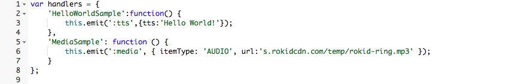

# Rokid JS Engine 使用指南

> 很高兴大家可以通过编辑JS脚本来搭建技能服务


## 使用JS脚本更快速的开发技能

> 使用JS脚本，我们的目标是帮助您更快速地构建技能，同时可以让您避免不必要的复杂性。使用JS脚本的方式有以下优势：
- **无需服务器** ：开发者不需要服务器去提供服务。
- **无需https服务**：开发者不需要自己搭建复杂的https服务。

### JS脚本

``` javascript
exports.handler = function(event, context, callback) {
    var rokid = Rokid.handler(event, context,callback);
    rokid.registerHandlers(handlers);
    rokid.execute();
};
```

我们通过Rokid对象封装了一些工具供大家使用。

 - 首先，通过Rokid.handler(event, context, callback)来使用Rokid-sdk。
 - 接下来，我们需要处理我们技能意图（intent），通过rokid.registerHandlers( )以简单来注册您所需的技能意图。
 - 最后，通过rokid.execute( )触发技能意图。
 
以上三步是必须的。

其中handlers，为大家所要写的意图技能处理函数，比如：

``` javascript
var handlers = {
	'HelloWorldSample':function() {
		this.emit(':tts',{tts:'Hello World!'});
	},
	'MediaSample': function () {
        this.emit(':media', { itemType: 'AUDIO', url:'s.rokidcdn.com/temp/rokid-ring.mp3' });
    }
};
```

在"配置"编写js脚本


其中"HelloWorldSample"与"MediaSample"对应于"语音交互"中的intent。


"语音交互"的intent，slot等request信息可在Rokid.param（下文有介绍）中获取。

（1）上面的":tts"语法是rokid-sdk用于同步响应对象的"tts"响应方法。注：传入":tts"方法的参数对象中tts属性是必须的！
其响应方法如下:

``` javascript
':tts': function (options) {

      if (this.isOverridden()) {
        //统一在执行emit之前计算监听数
        return
      }
      if (typeof options.tts !== 'string') {
        console.log(`emit(":tts")时"tts"字段必填且为string类型(当前tts值为${options.tts})`);
        return
      }

      this.handler.response.response.action = buildSpeechletResponse({
        outType: 'tts',
        version: this.handler._event.version,
        //封装res输出
        type: options.type || 'NORMAL',
        form: options.form || 'cut',
        shouldEndSession: options.shouldEndSession || true,
        needEventCallback: options.needEventCallback || false,
        behaviour: options.behaviour || 'APPEND',
        tts: options.tts

      })
      this.emit(':responseReady')
}
```

### 开发者相关字段（tts）
| 字段       |   类型 | 默认值 |
| :-------- |--------:| :--: |
| type | string |  NORMAL  |
| form | string |  cut  |
| shouldEndSession | boolean | true |
| needEventCallback | boolean | false |
| behaviour | string | APPEND |
| tts | string | 无（必填）|

（2）上面的":media"语法是rokid-sdk用于同步响应对象的"media"响应方法。注：传入":media"方法的参数对象中"url"和属性"itemType"是必须的！

``` javascript
':media': function (options) {
      if (this.isOverridden()) {
        return
      }

      if (!options.itemType) {
        console.log('emit(":media")时"itemType"字段必填(当前媒体类型AUDIO或VIDEO)');
        return
      }

      if (!options.url) {
        console.log('emit(":media")时"url"字段必填(为MediaPlayer指明可用的流媒体播放链接)');
        return
      }

      this.handler.response.response.action = buildSpeechletResponse({
        outType: 'media',
        version: this.handler._event.version,

        type: options.type || 'NORMAL',
        form: options.form || 'cut',
        shouldEndSession: options.shouldEndSession || true,
        needEventCallback: options.needEventCallback || false,
        action: options.action || 'PLAY',
        behaviour: options.behaviour || 'APPEND',
        token: options.token || '',
        itemType: options.itemType,
        url: options.url,
        offsetInMilliseconds: options.offsetInMilliseconds || 0
      })
      this.emit(':responseReady')
}
```

### 开发者相关字段（media）
| 字段       |   类型 | 默认值 |
| :-------- |--------:| :--: |
| type | string |  NORMAL  |
| form | string |  cut  |
| shouldEndSession | boolean | true |
| needEventCallback | boolean | false |
| action | string | PLAY |
| behaviour | string | APPEND |
| token | string | 无 |
| itemType(对应文档item里的type) | string | 无（必填）|
| url | string | 无（必填）|
| offsetInMilliseconds | number | 0 |

具体字段定义可参见：<https://rokid.github.io/docs/3-ApiReference/cloud-app-development-protocol_cn.html#3-response>

### 在Rokid对象中封装的工具

- Rokid.handler(event,contxt,callback)：用于调用Rokid-sdk。
- Rokid.sync_requret(method,url,options)：同步请求，需把返回的数据通过Rokid.resHandler( )进行buffer处理。
- Rokid.resHandler(content):buffer处理函数，如经过第三方请求返回数据必须通过此函数处理，再提交":tts"。
- Rokid.request(options,callback):异步请求。
- Rokid.param:NLP处理结果，可在其中获取intent，slot等信息。

### Sample

```javascript
var data = [
    "床前明月光，疑是地上霜，举头望明月，低头思故乡。",
    "白日依山尽，黄河入海流，欲穷千里目，更上一层楼。",
    "千山鸟飞绝，万径人踪灭，孤舟蓑笠翁，独钓寒江雪。",
    "松下问童子，言师采药去，只在此山中，云深不知处。",
    "向晚意不适，驱车登古原，夕阳无限好，只是近黄昏"
];


exports.handler = function(event, context, callback) {
    var rokid = Rokid.handler(event, context,callback);
    rokid.registerHandlers(handlers);
    rokid.execute();
};

var handlers = {
    'LaunchRequest': function () {
        this.emit('GetNewFactIntent');
    },
    'GetNewFactIntent': function () {
        var factArr = data;
        var factIndex = Math.floor(Math.random() * factArr.length);
        var randomFact = factArr[factIndex];
        var speechOutput = randomFact;
        this.emit(':tts', {tts:speechOutput})
    },
    'NewsRequest': function () {
        result = Rokid.sync_request('GET', 'https://www.toutiao.com/hot_words/');
        result = Rokid.resHandler(result); 
        var resStr = '';
        result.forEach(function(item){
            resStr += item + ','
        })
        this.emit(':tts', { tts: resStr });
    },
    'MediaRequest': function () {
        this.emit(':media', { itemType: 'AUDIO', url: 's.rokidcdn.com/temp/rokid-ring.mp3' });
    }
};
```

## 支持

* [Rokid讨论区](https://developer-forum.rokid.com/)

