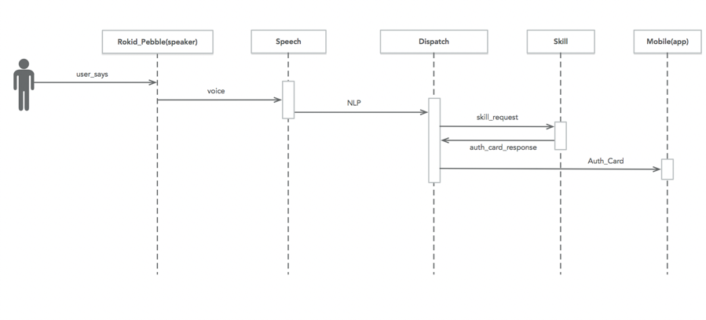
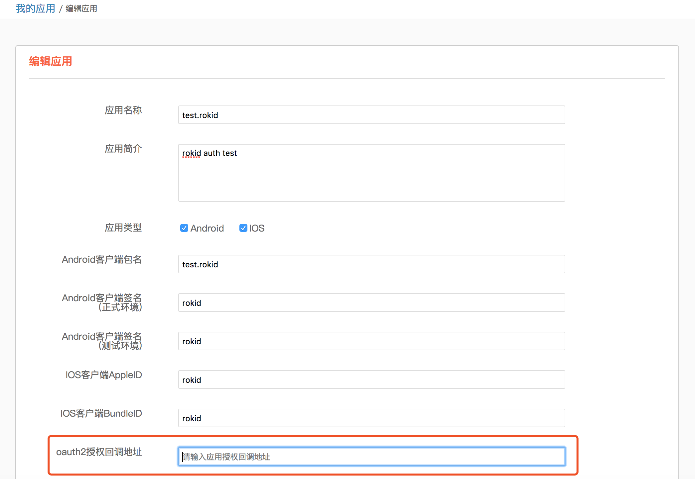
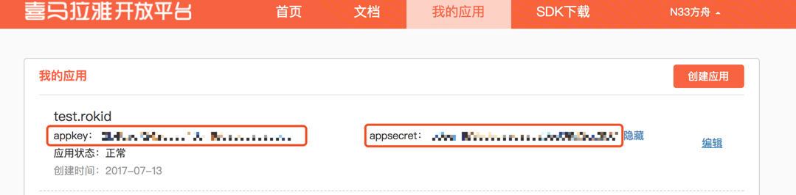
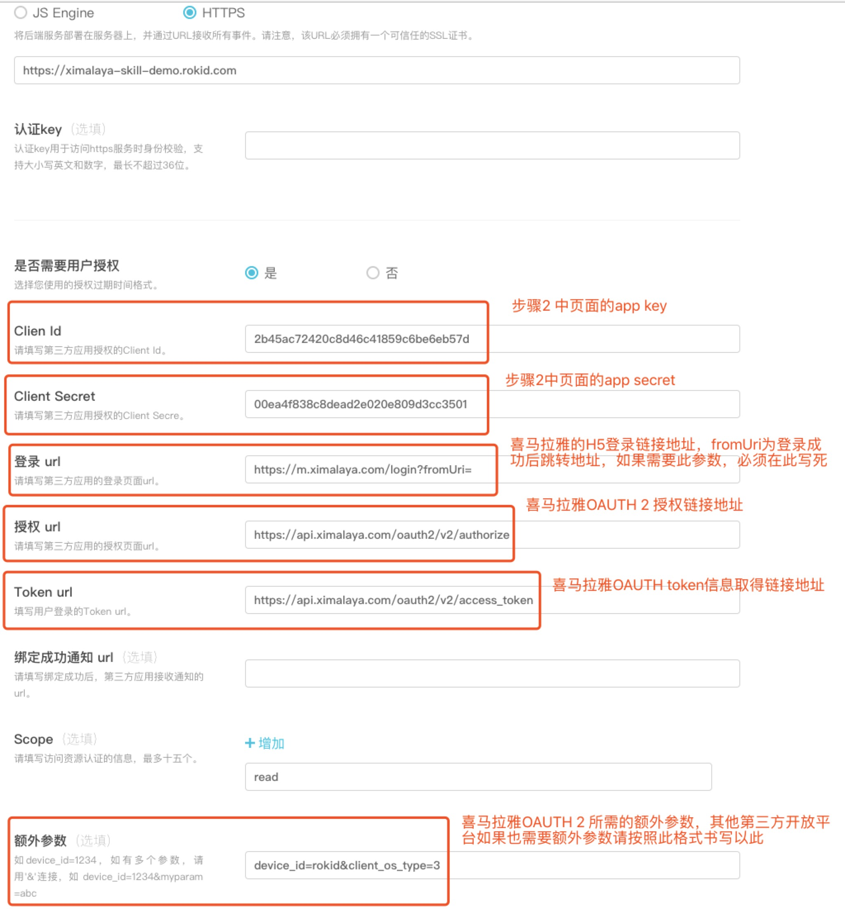

# Rokid OAuth 使用指南

## 使用场景
当你开发的技能需要通过用户授权在喜马拉雅等第三方应用上的授权信息来提升技能的个性化体验时，可以按照本指南的流程来一步步实现。

本文档适用于第三方对接Rokid OAuth2标准授权服务。Rokid开放平台标准授权登录流程采用OAuth2标准授权码（authorization code）模式。


## 交互流程

**第一步：**用户与设备产生语音交互后，经Rokid Speech、Rokid Dispatch服务处理后，交由相应技能的服务进行进一步处理。当技能服务发现用户需要提供授权信息时，会向Rokid Dispatch推送Auth Card response，Rokid Dispatch接受到response会向Rokid App推送登录授权所需要的url。

**第二步：**若已登录，则获取用户的token信息。若没有授权信息则会向用户推送登录url，用户登录并授权后即可获得用户在第三方应用中的授权信息。

**第三步：**获取了用户的授权信息后，将会通知第三方应用已获取成功授权。


## 创建一个需要授权的技能
### 一、准备工作
以喜马拉雅为例创建一个需要授权的技能。

1.在喜马拉雅开放平台创建一个技能，并且把oauth2授权回调地址填写到如下图所示位置处。回调地址为：https://account.rokid.com/skills/callback.do



2.在喜马拉雅创建应用成功后可以获得该应用的clientId和clientSecret，如下图所示：


3.在[Rokid开发者社区](https://developer.rokid.com/#/)新建一个技能

4.填写技能基本信息及语音交互信息

5.在「配置」页面填写终端服务及授权信息， 如下图：



### 二、OAuth相关的服务端开发

1.解析接收到Rokid request参数，参数信息例子如下

```json
{
  "context": {
    "application": {
      "applicationId": "R69DCB84C84E4966AF690552705018EF"
    },
    "device": {
      "basic": {
        "deviceId": "0202021716000025",
        "deviceType": "98EA4B548AEB4A329D21615B9ED060E5",
        "locale": "zh-cn",
        "masterId": "13646829663",
        "timestamp": 0,
        "vendor": "910B21C0AF987D67AE7B2D50D6197421"
      },
      "location": {},
      "media": {}
    },
    "user": {
      "accountLinkedId": "aa8afcf9c9159ac9e06aab35cde7a475",
      "userId": "8502D6F85557559C3F62B1D40247EE24"
    }
  },
  "request": {
    "content": {
      "applicationId": "R69DCB84C84E4966AF690552705018EF",
      "intent": "ROKID.INTENT.WELCOME",
      "slots": {}
    },
    "reqId": "C73901742BFA4AF7AAE0B63A24AFE4F3",
    "reqType": "INTENT"
  },
  "session": {
    "attributes": {},
    "newSession": false,
    "sessionId": "6A0B65595DCE4F4D87244FD2B652C0F0"
  },
  "version": "2.0.0"
}
```
  - 上述json中`$.context.user.accountLinkedId`处为空时，则需要发送card要求技能用户完成授权操作，返回给rokid的reponse 如下所示：
    
    ```json
    {
	    "version": "2.0.0",
	    "startWithActiveWord": false,
	    "appId": "RA66AF851FEE4CE6AF5979525AE1246A",
	    "session": {
	      "attributes": null
	    },
	    "response": {
	      "action": {
	        "version": "2.0.0",
	        "type": "NORMAL",
	        "form": "cut",
	        "shouldEndSession": true,
	        "voice": {
	          "action": "PLAY",
	          "item": {
	            "tts": "你还没有绑定喜马拉雅账号还不能使用本技能，请通过手机app绑定喜马拉雅账号以获得更加的体验"
	          }
	        },
	        "media": null
	      },
	      "card": {
	        "type": "ACCOUNT_LINK"
	      },
	      "resType": "INTENT",
	      "respId": "03EA49EB0F484BA2823773F4FB9FAF19"
	    }
	  }
    ```
   **注：** 
   
  - 返回Rokid的response参数中如`card `处设定`type`为“AUTH”，则Rokid会给推送一个申请授权的push消息到用户手机的Rokid App上（**推送功能将会在下一个版本的Rokid App实现**），此时用户点击推送消息中的链接，并按照提示的操作完成授权流程。
  - 上面Rokid request json中的`$.context.user.accountLinkedId`处，不为空时，则用户已登录第三方开放平台
  - 使用步骤1中的Rokid request json参数中`$.context.user.accountLinkedId`完成请求第三方开放平台资源操作。
 


