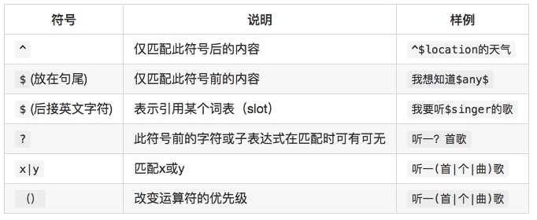

##Rokid NLP正则表达式使用指南

### 目前支持的正则符号





### 简单实践
#### 休眠
假设你想为你的设备设计一个休眠语句，比如：

- “若琪，没事了。”

同时，你并不希望以下语句会误触发休眠操作，

- “若琪，你没事了呀。”

此时，你可以用到`^` `$`两种语法：

```text
^没事了$
```

#### 调整音量
假设你需要为你的设备设计一个调整音量的语句，比如：

- ”若琪，声音小一点。“

同时，你希望这个语句具备更广的兼容性，希望被下面的语句命中，

- ”若琪，声音再小一点。“
- ”若琪，音量小一点好吗。“

那么此时，语句的正则表达式应为：

```text
$volume再?$low($ah$ha)?$ 
```

解释

```text
再？：表示「再」这个字在此句的匹配时可有可无。
$low：表示引用low这个词表（slot）。
($ah$ha)?：表示括号内的两个词表所含的内容在匹配时可有可无。
句尾的$：表示此句需要绝对匹配。若不加句尾的$，此句后再跟一些无关的字也可以命中。
```

#### 合法字符
```
-,_.'
```

