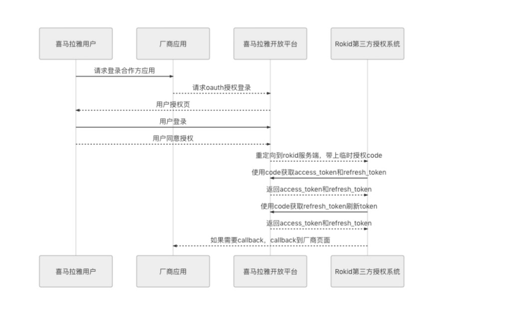

### Rokid账户喜马拉雅授权对外开发文档V2.0
#### 1.概述
```
本文档适用用第三方厂商，使用rokid喜马拉雅技能时，需要喜马拉雅token。作用于授权成功后，喜马拉雅token和rokid账户进行绑定
```

#### 2.接入前置依赖
* 厂商已经和rokid账户实现了互通(并且已经获得rokid分配的 clientId，clientSecret，AccessKey)
* 厂商已经把对应设备导入到开放平台

#### 3.准备阶段
* 在喜马拉雅oauth平台申请appId，appSecret
* 提供给rokid已经申请的喜马拉雅appId，appSecret。Rokid会分配对应厂商的callback
* 根据Rokid提供的callback，完善喜马拉雅oauth平台callback地址


#### 4.系统交互流程图



#### 5.接口信息
##### 5.1.地址
```
调试环境：https://third-oauth-party-pre.rokid.com
正式环境：https://third-oauth-party.rokid.com
```
##### 5.2.喜马拉雅回调地址（Rokid生成）
```
/third/non/{access_code}/callback.do
具体由rokid生成access_code
```
##### 5.3.第三方厂商请求喜马拉雅oauth授权登录必传参数

| 参数说明 | 是否必须 | 含义 |
| --- | --- | --- |
| device_id | 是 | 移动设备唯一标识，厂商在发起oauth喜马拉雅必传 |
| state | 是 | 业务字段，厂商在发起oauth喜马拉雅时候必传，喜马拉雅callback时候会透传给rokid |

##### 5.4 state参数说明
| 参数说明 | 是否必须 | 含义 |
| --- | :---: | --- |
| userId | 是 | 账户标识 |
| type | 是 | XMLY，授权类型，定值 |
| typeSource | 是 | APP 请求来源：如果是移动端授权写成APP |
| sign | 是 | 签名，签名规则见下文 |
| time | 是 | 时间搓，建议为数字 |
| deviceTypeId | 是 | rokid生成的设备类型id |
| userType | 是 | userId类型：0代表rokidToken，1代表rokid账号唯一标识，2代表第三方账号唯一标识。当为2时候，clientId字段必传 |
| clientId | 否 | rokid分配的账号授权的clientId |
| extraInfo | 否 | 第三方额外参数，当选择是callback时候，改参数可传 |

##### 5.5. 不需要rokid回调，state生成
以下参数经过base64位加密生成
```
{
    "userId": "",
    "type": "XMLY",
    "typeSource": "APP",
    "time": "",
    "sign": "",
    "deviceTypeId": "",
    "userType": "",
    "clientId": ""
}
```
##### 5.6. 需要rokid回调，state生成
如果需要Rokid callback到厂商地址，state参数需要额外增加：extraInfo这个字段，在Rokid进行回调厂商页面时，原封不动传递回去。
```
{
    "userId": "",
    "type": "XMLY",
    "typeSource": "APP",
    "time": "",
    "sign": "",
    "deviceTypeId": "",
    "userType": "",
    "clientId": "",
    "extraInfo":""
}
```

##### 5.7. sign生成
以下参数经过MD5 32位加密后生成(不区分大小写)
clientSecret 为和rokid账户绑定时候由rokid分配 
```
clientSecret+time+clientSecret
```

##### 5.8 是否需要回调
```
如果厂商应用采用的是h5页面进行喜马拉雅授权登录，那么在喜马拉雅回调到Rokid后，access_token也已经完成。
需要重定向页面到厂商页面，厂商判断如何展示用户成功和失败
需要厂商提供具体的callback接口

重要！！！
厂商callback接口必须为GET形式，
接口接受参数为：result，extraInfo，tokenInfo
```

##### 5.9 Rokid成功处理完成授权后，如果需要跳转，Rokid会重定向到厂商的callbackUrl，并带上result，extraInfo，tokenInfo参数

| 参数说明 | 含义 |
| --- | --- |
| result |0:授权失败 1：授权成功 如果result为0，tokenInfo为空的json字符串 ""|
| extraInfo |厂商发起时传递的参数 |
| tokenInfo |为json格式，喜马拉雅返回的token信息 |

#### 厂商提供callback url例：
```
redirect_uri?result=1&extraInfo={extraInfo}&tokenInfo={tokenInfo}
```


