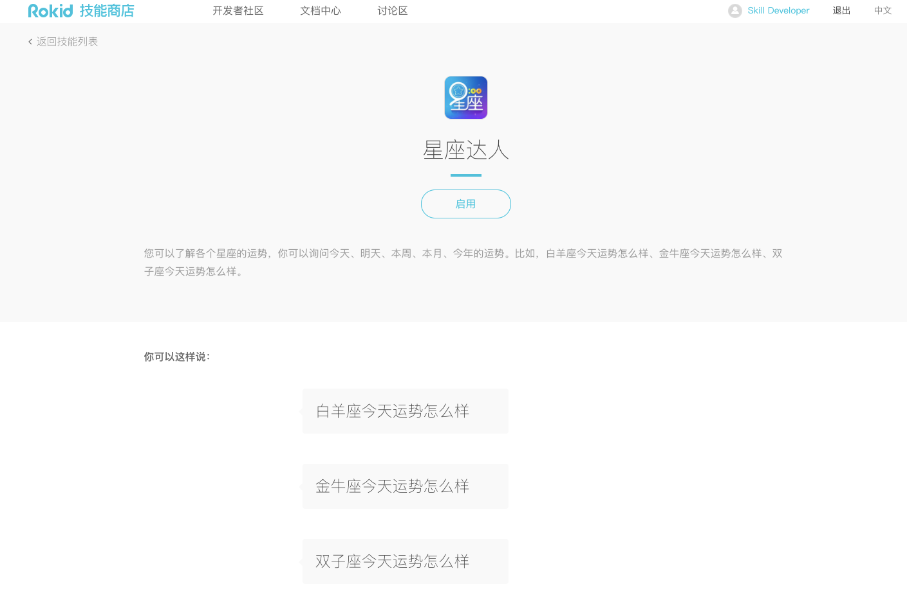

# 如何展示您的技能信息

## 您的技能信息在「技能商店」中的展示效果
### 1.技能卡片


| 信息展示  | 说明        | 配置位置 
| ------------- | :-------------:| :-----:|
| 图标 | 代表技能的图标 |   「发布-技能图标」 |
| 星座达人|  该技能的名称   |   「技能信息-技能名称」 |
| 若琪，打开星座达人 | 打开技能的语句，其中「星座达人」为入口词| 「技能信息-入口词」    |
|您可以了解各个星座的运势，你可以询问今天、明天、本周、本月、今年的运势。比如...| 对技能进行简要的描述 | 「发布-技能摘要」|
|2017/08/18| 技能的发布日期 |无需配置|
|Skill Developer|开发者用户名| 账户中心-用户名|

### 2.技能详情页



| 信息展示  | 说明        | 配置位置 
| ------------- | :-------------:| :-----:|
| 图标 | 代表技能的图标 |   「发布-技能图标」 |
| 星座达人|  该技能的名称   |   「技能信息-技能名称」 |
| 您可以了解各个星座的运势，你可以询问今天、明天、本周、本月、今年的运势。比如，白羊座今天运势怎么样、金牛座今天运势怎么样、双子座今天运势怎么样。| 对技能进行简要的描述| 发布-技能描述」    |
|白羊座今天运势怎么样| 用户使用技能时的说法 | 「发布-用户示例语句」|

#### 2.1 如何配置用户示例语句
在「发布-用户示例语句」中需要配置三句引导用户使用技能的短语，帮助用户开始使用并访问您的技能的核心功能。

为了更好的让用户了解您的技能，要求按照以下几点配置：

- 保证配置的示例语句，技能可以正常响应。否则技能将在审核中被拒绝。
- 如果您的用户语句引用了词表，则需要对用户语句中的词表填充进相应的词表内容，还原句子为用户的自然语言。之后，可以配置为用户示例语句。
- 如果您的用户语句为自然语言，则可以直接配置为用户示例语句。

例如，「星座达人」的核心功能是询问某星座某时间段的运势，其用户语句是：

```
"$Constellation$QueryTime运势怎么样"
```

其中，Constellation表示星座名称，QueryTime表示时间。

相应的用户语句示例，即可以是“**狮子座今日运势怎么样** ”


