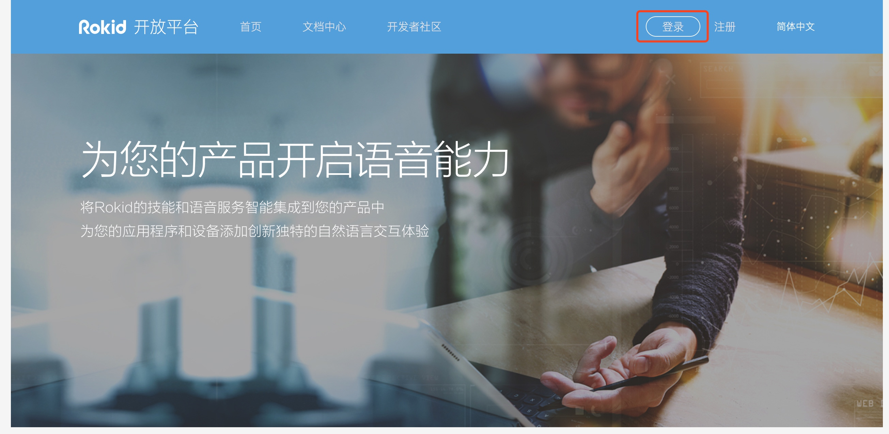
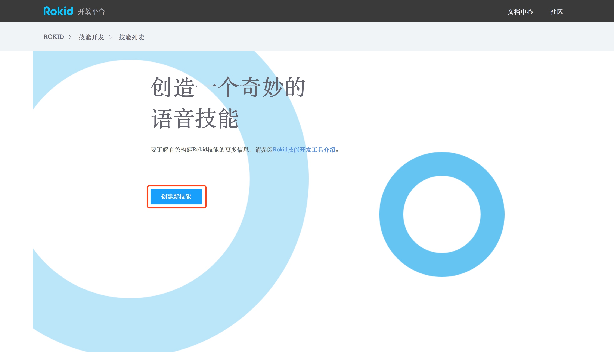
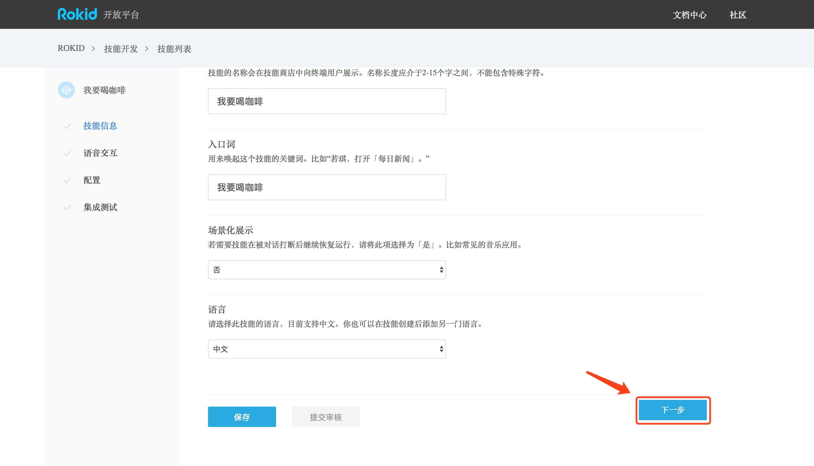
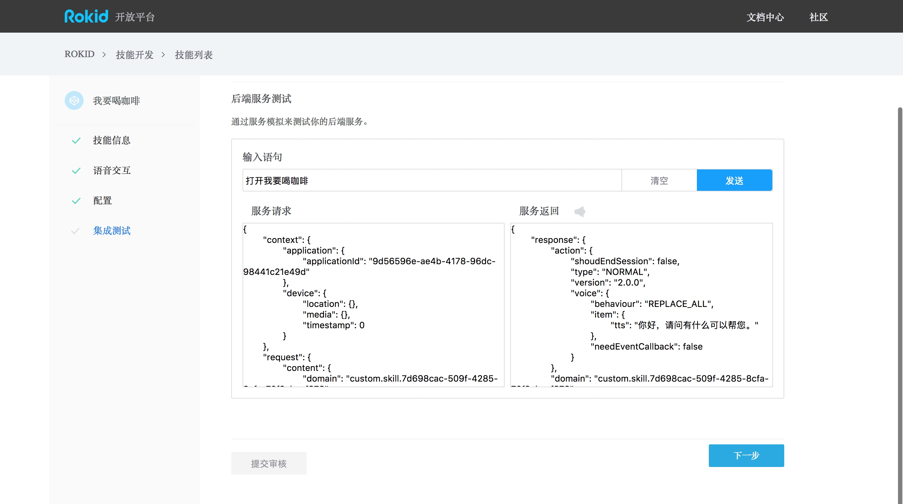
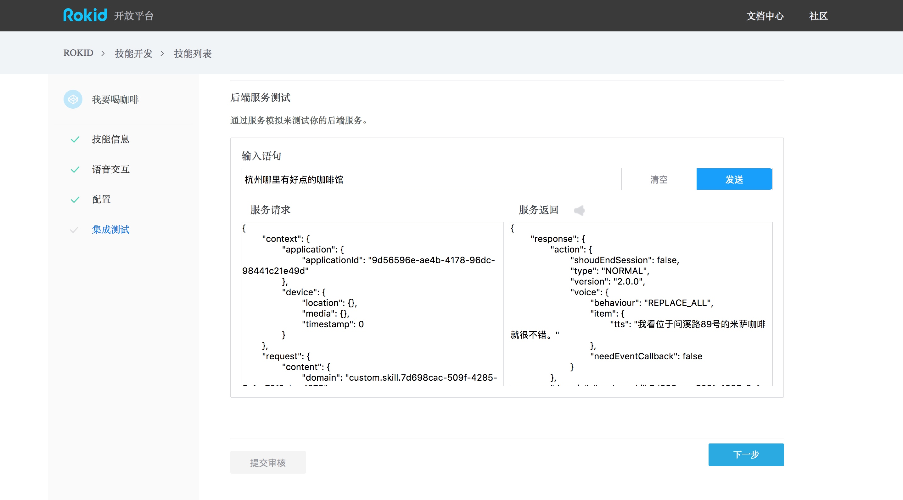

# 示例技能：我要喝咖啡

## 您将学会
- 如果通过6步快速创建一个Rokid技能。

## 您需要
- Rokid开发者账号
- [GitHub](https://github.com/Rokid/rokid-skill-sample/tree/master/rokid-skill-sample-java-tastecoffee)中的示例代码
- 一台能够部署java代码的服务器

## 1 注册Rokid开发者账号
在[Rokid开放平台](https://developer.rokid.com/)免费注册一个Rokid开发者账号。

## 2 创建一个技能
登录Rokid开发后台，

登录后，选择「技能开发」，并点击「创建新技能」。

#### 给你的技能起个名字

1. 技能类型请选择「自定义技能」。
2. 技能属性请选择「公开」。
3. 为技能起个好名字。
4. 为技能起一个朗朗上口的「入口词」，用户将用他来唤起你的技能。

> 此处的示例`技能名称`，`入口词`均为「我要喝咖啡」。

完成后请点击「下一步」。

## 3 定义技能的语音交互并进行后端配置
首先请查看我们的[技能模板：我要喝咖啡](https://github.com/Rokid/rokid-skill-sample/tree/master/rokid-skill-sample-java-tastecoffee)。

#### 定义语音交互
接着在「语音交互」页面中，

1. 将模板工程 > voice-interaction中的`intent.json`文件内容，复制进「意图定义」编辑框。
2. 将模板工程 > voice-interaction中的`usersays.txt`文件内容，复制进「用户语句」编辑框。

> 把intent.json的内容复制进「意图定义」

> 把usersays.txt的内容复制进「用户语句」

完成后请点击「下一步」。

#### 完成服务配置
接着在「服务配置」界面中，

1. 选中「HTTPS」，
2. 将模板工程 > sample-java文件中的内容部署到您的服务器中
3. 将HTTPS URL贴到此处。

完成后请点击「下一步」。

## 4 测试你的技能
接下来，在「集成测试」页面中，

1. 在「后端服务测试」下，输入「用户语句」，比如“若琪，打开「入口词」。”
1. 你将会看到下方框体中出现经过Rokid语音服务解析的Json「服务请求」，和相应的「服务返回」。
1. 点击「播放icon」来收听返回的TTS结果。
1. （可选）如果需要在机器上进行测试，请根据公司ID、设备Type ID、设备ID来「添加测试设备」。

> 此处使用：“打开「我要喝咖啡」”进行测试

> 此处使用：“杭州哪里有好点的咖啡馆”进行测试

> 此处使用：“米萨咖啡最好喝的是哪一种”进行测试

### 5 自定义这个技能
持续完善中。

### 6 发布
持续完善中。

