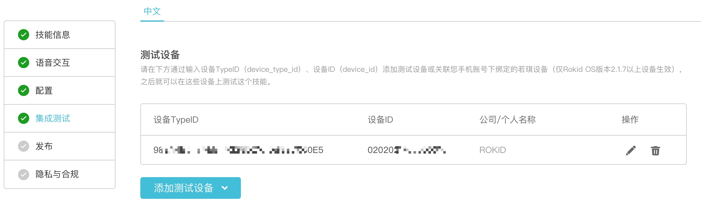

# 示例技能：我要喝咖啡

## 您将学会
- 如果通过6步快速创建一个Rokid技能。

## 您需要
- Rokid开发者账号
- [GitHub](https://github.com/Rokid/rokid-skill-sample/tree/master/rokid-skill-sample-js-tastecoffee)中的示例代码

## 1 注册Rokid开发者账号
在[Rokid开放平台](https://developer.rokid.com/)免费注册一个Rokid开发者账号。

## 2 创建一个技能
登录Rokid开发后台，

登录后，选择「技能开发工具」，并点击「创建新技能」。

#### 给你的技能起个名字

1. 技能属性请选择「公开」。
2. 技能类型请选择「自定义技能」。
3. 为技能起个好名字。
4. 为技能起一个朗朗上口的「入口词」，用户将用他来唤起你的技能。

> 此处的示例`技能名称`，`入口词`均为「我要喝咖啡」。

完成后请点击「下一步」。

## 3 定义技能的语音交互并进行后端配置
首先请查看我们的[技能模板：我要喝咖啡](https://github.com/Rokid/rokid-skill-sample/tree/master/rokid-skill-sample-js-tastecoffee)。

#### 定义语音交互
接着在「语音交互」页面中，

- 将模板工程 > voice-interaction中的[`intent.json`][]文件内容，复制进「意图定义」编辑框。

> 把intent.json的内容复制进「意图定义」

- 粘贴完成后，请一定要点击页面下方的「开始编译」按钮，使得配置生效。
- 之后可以在该页面右侧的“语音交互测试”中测试配置是否正确。

完成后请点击「下一步」。

#### 完成服务配置
接着在「配置」页面中，

1. 选中「Rokid Force」（可点击[使用指南](./rokid-force-system-tutorial.md)查看Rokid Force详细介绍）
2. 点击配置服务
3. 将模板工程 > sample-js中的[`rokid-force.js`][]文件内容复制到新出现的编辑框中。
4. 完善「服务名称」和「服务描述」，并点击保存。

完成后请回到技能页面，并点击「下一步」。

## 4 测试你的技能
接下来，在「集成测试」页面中，

1. 真机测试
    1. 在「测试设备」标签下选择「添加测试设备 - 添加账号下绑定设备」，将您Rokid账号下绑定的设备添加到您的技能中，作为测试设备使用。
    2. （若是自定义设备）如果需要在机器上进行测试，请根据设备Type ID、设备ID来「添加测试设备」。
1. 页面测试
    1. 在「后端服务测试」下，输入「用户语句」，比如“若琪，打开「入口词」。”
    1. 你将会看到下方框体中出现经过Rokid语音服务解析的Json「服务请求」，和相应的「服务返回」。

> 添加账号下绑定设备

> 完成测试设备的添加

> 此处使用：“打开「我要喝咖啡」”进行测试

> 此处使用：“杭州哪里有好点的咖啡馆”进行测试

> 此处使用：“米萨咖啡最好喝的是哪一种”进行测试

### 5 自定义这个技能

1. 首先，您可以对技能的名称和入口词进行修改，比如起一个新的名字「我要喝橙汁」。

2. 接着您可以修改技能的intent名称和相应的用户语句。比如将问句变为「杭州哪里有好点的鲜榨果汁」。

3. 修改Js Engine中的相关回复。

4. 通过集成测试页面看看修改后效果吧。

### 6 发布
将「发布」及「隐私与合规」所需的内容填写完毕后，点击页面最下方亮起的“提交审核”按钮提交发布申请，等待Rokid审核通过后技能即可发布上线。
> 需注意：开发者需要通过个人身份认证才可以将技能提交审核。

技能发布上线后，将会在[Rokid技能商店](https://skill.rokid.com/store/#/)中展示给所有Rokid用户使用。

[`intent.json`]: https://github.com/Rokid/rokid-skill-sample/blob/master/rokid-skill-sample-js-tastecoffee/tastecoffee-js/voice-interaction/intent.json
[`rokid-force.js`]: https://github.com/Rokid/rokid-skill-sample/blob/master/rokid-skill-sample-js-tastecoffee/tastecoffee-js/sample-js/rokid-force.js
