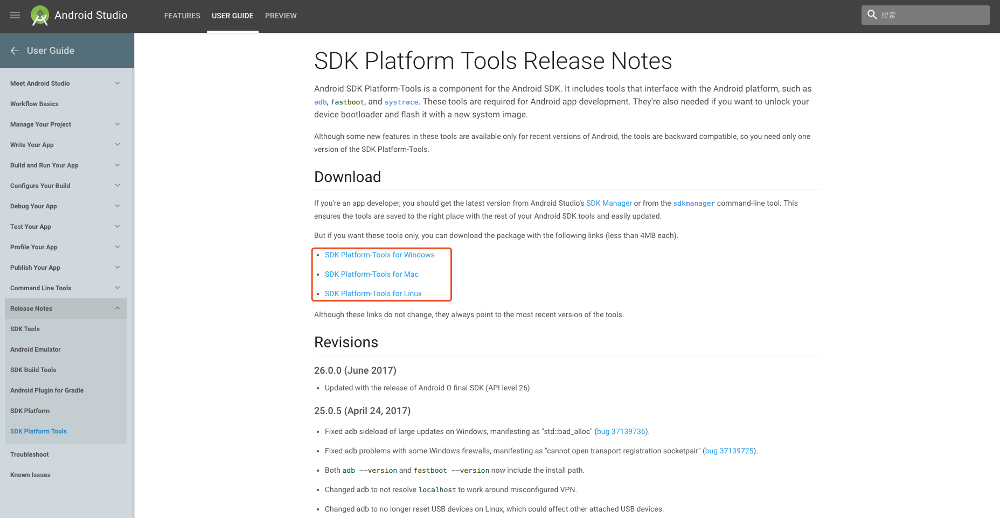
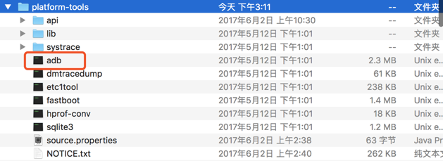
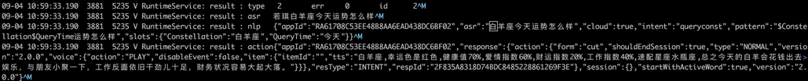
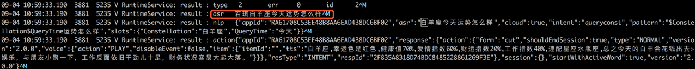
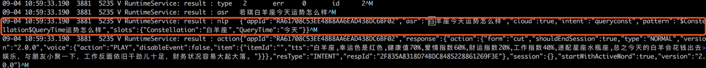
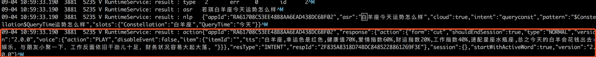

# 读取设备日志以测试技能

## 前期准备
需要在本机安装Android adb命令行工具
下载地址如下：https://developer.android.com/studio/releases/platform-tools.html

根据您的操作系统，选择相应的版本进行下载，并保存到本地。

解压文件后，打开adb，前期准备即可完成。

## 连接设备操作步骤
1.	确认设备连接到pc后， 执行adb shell登陆机器，执行`logcat`查看。或者在命令行中执行`adb logcat `> `log.log`将设备日志打印到本地文件；
2.	假设您对设备说出**“若琪白羊座今天运势怎么样”**设备拾音效果可查看日志，示例如下：

3.	检查asr识别结果，以确认识别的语音和预期是否一致首先看这里，如下图所示

4.	检查nlp处理结果，这里会对命中的skillid（即appId）、slot、intent、pattern进行显示。

可以将日中中解析结果和开发者社区「语音交互」页面进行对照，来定位是否为语音交互配置问题；
5. 检查服务端返回的内容是否正常，如下图所示：

如出现异常，可以检查开发者社区「配置」中的后端服务是否正常。

## 常见问题排查点
如出现语音未能按照预期出现结果，可按照以下几点进行排查：

1.	asr识别错误；
2.	技能未发布，或者开发中技能未添加对应测试设备；
3.	asr正确， 但nlp不符合预期，一般三种情况：

- nlp语音交互写错了，请到开放平台语音交互页面修改；
- js-engine配置错误，导致执行脚本错误；https服务配置错误；
- 系统bug，需要开发解决；

