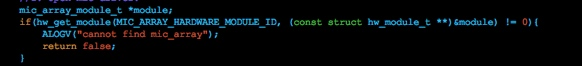
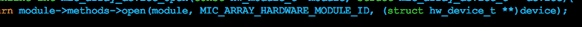
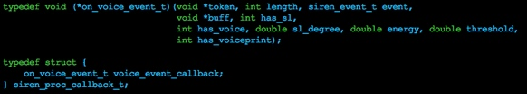
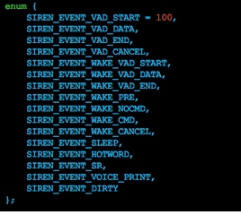

# Rokid Open Voice SDK 使用方法

## 简介

Rokid voice开放平台SDK包含siren, speech, nlp, asr,tts几大模块。

- siren：拾音模块，接收HAL的音频数据，算法处理，滤波；
- tts：文字转语音；
- speech和asr：都是语音转文字，不同的是speech专门处理siren的语音事件。

要使用这些SDK，需要下载rokid-black-siren，speech，grpc，protobuf，下面开始讲解使用流程。

### 1 打开mic驱动

首先使用Android的标准函数`hw_get_module()`查找mic设备，通过传入的`hw_module_t`结构体指针，调用其中的open函数打开设备。如果打开成功，结果返回0。

### 2 初始化siren

siren调用下图这些函数来完成音频数据的采集，通过上面得到的mic设备来实现这些函数。并调用siren的`init_siren(void*,
siren_input_if_t*)`函数来初始化它

### 3 设置siren回调接口

siren需要一个函数把经过算法处理过的语音回传回来，所以我们还需要实现一个callback供siren调用。`start_siren_process_stream(siren_t,
siren_proc_callback_t*)`把这个函数指针传给siren

### 4 发送数据给speech

在`on_voice_event_t()`函数中，通过`siren_event_t`参数来调用speech的函数。

`SIREN_EVENT_WAKE_PRE`，siren准备开始工作，可以根据自己的业务做些准备工作。
`SIREN_EVENT_VAD_STARE`，siren开始拾音，这里需要创建Speech对象初始化，并掉用它的poll等待消息(这是一个堵塞函数，建议在另外一个线程调用)。
`SIREN_EVENT_VAD_START`，siren的处理语音结果事件，直接传给speech即可。
`SIREN_EVENT_VAD_END`，音频输入结束的事件。
`SIREN_EVENT_VAD_CANCEL`，音频输入取消的事件。

### 5 处理speech返回消息

如果有数据回来，speech的`poll()`函数会得到一个SpeechResult，其中包含asr，nlp，action，根据它们的协议处理具体逻辑。

