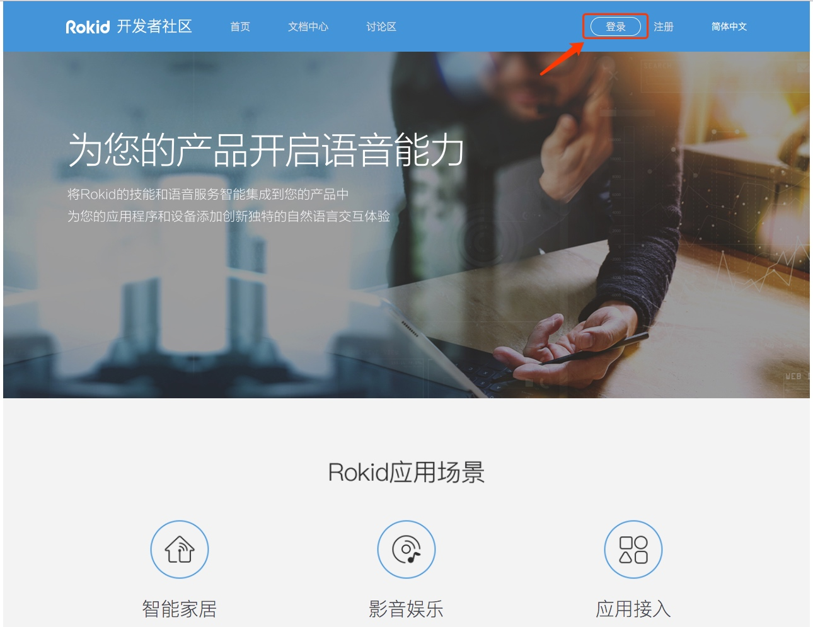
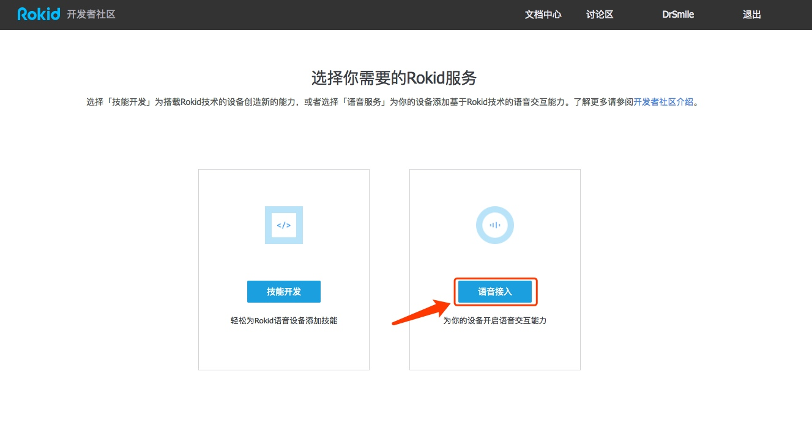
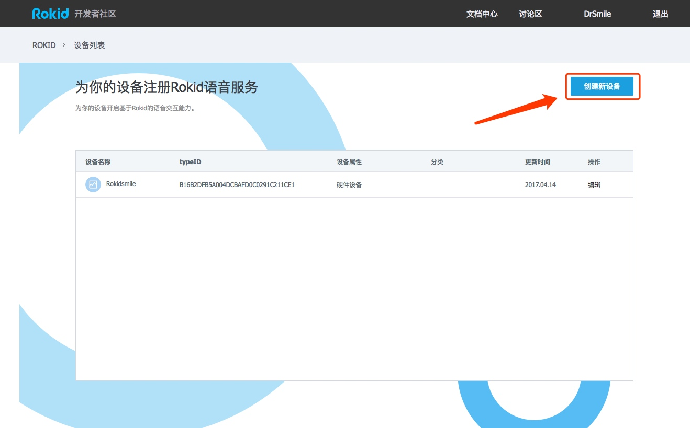
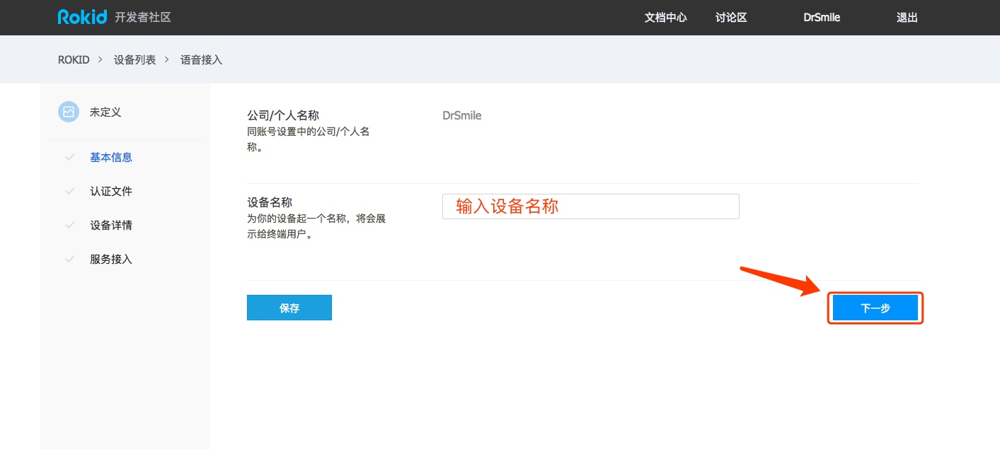
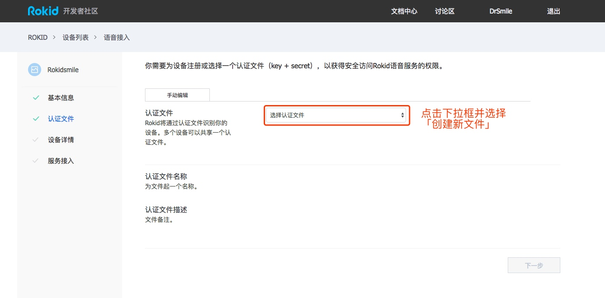
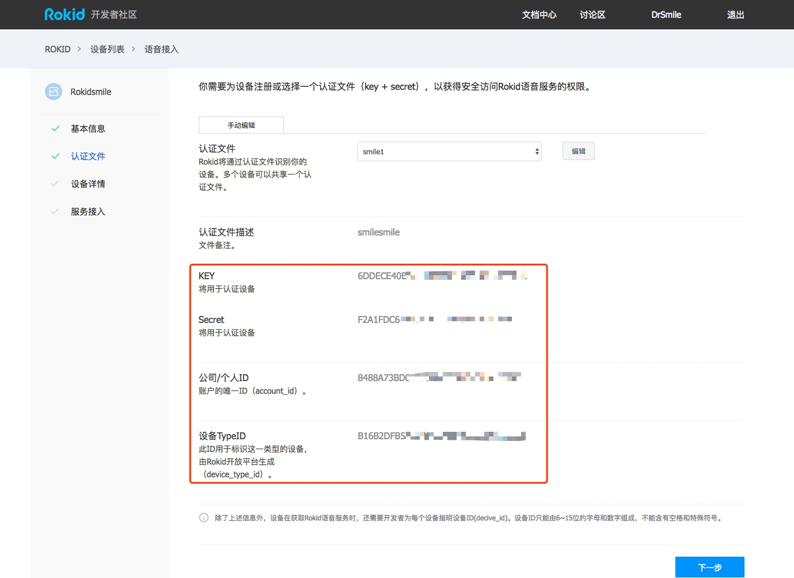

# 获取认证文件
## 认证文件的用途
用于调用Rokid开发者社区提供的各项服务时的认证工作。

## 1创建认证文件
### 1.1 注册Rokid开发者账号
在[Rokid开放平台](https://developer.rokid.com/)免费注册一个Rokid开发者账号。

### 1.2 创建一个设备
登录Rokid开发者社区，


选择「语音接入」，


选择「创建新设备」，


给您的设备起个名字，


创建认证文件，


### 1.3 获得认证文件


到此，获取认证文件的步骤已经结束，您已经可以根据上图处提供的`key` `secret` `account_id` `device_id` 获取Rokid提供的服务了。

页面中后续的「设备详情」和「服务接入」是对设备进行更多的配置，不在此进行讨论。

## 2 使用方法
### 2.1 直接调用API时的配置方法
直接通过API调用Rokid语音服务时，按照[Rokid开发者社区接口文档](https://github.com/Rokid/rokid-openvoice)中的要求，填入相应的参数即可。
其中提到的`key` `secret` `account_id` `device_type_id`均通过上一步中的创建认证文件获得。

但需要注意，`device_id`**需要由开发者自行指定**，由6~15位的字母和数字组成，不能含有空格和特殊符号。此ID每个设备唯一。

### 2.2 使用C++ SDK时的配置方法
通过调用SDK中的config方法来配置认证信息：

```c++
void config(String key, String value)
```

同样的，`device_id`需要开发者自行指定，用以区分每个不同的设备。

具体请查看[Rokid客户端SDK文档中的示例](/3-ApiReference/rokid-client-sdk-doc.md)。

### 2.3 在Android设备上使用TTS、Speech SDK时的配置方法

#### TTS SDK
SDK解包后`etc`目录下文件最终需要放到安卓设备的`/system/etc`目录下。
其中`tts_sdk.json`提供TTS SDK需要的配置信息，包括连接服务器的认证信息。

首先需要将创建认证文件中获得的认证信息填入到此文件中，具体需要修改如下几项：
`key` `secret` `device_type_id` `device_id`

再将`tts_sdk.json`文件push到设备中：

```text
cd etc
adb push . /system/etc/
```

#### Speech SDK
使用上述TTS SDK中的方式，修改`speech_sdk.json`中的相关信息。


