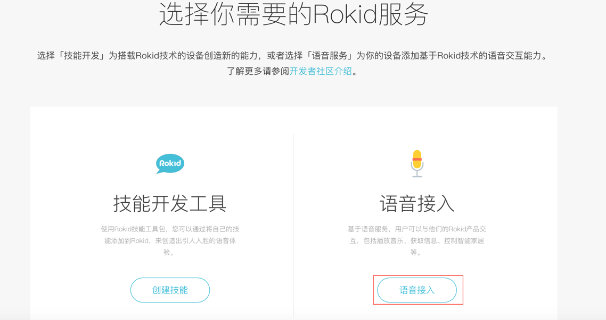
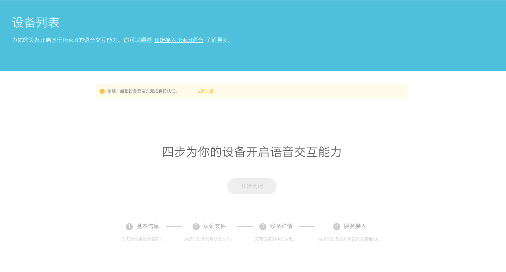
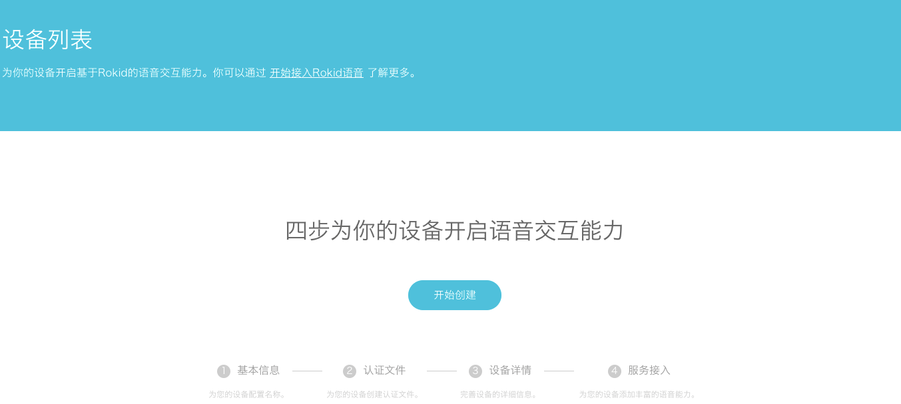
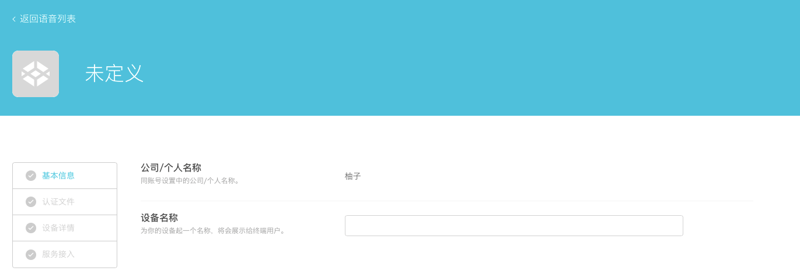
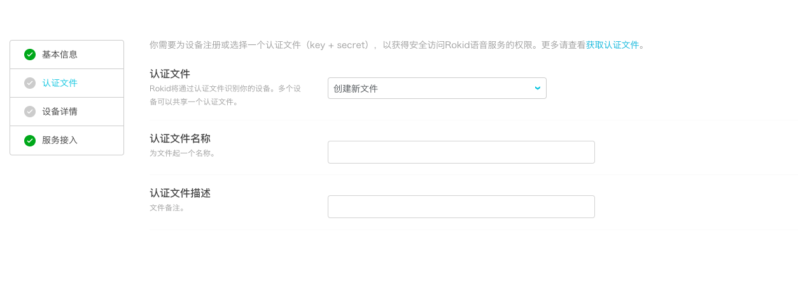
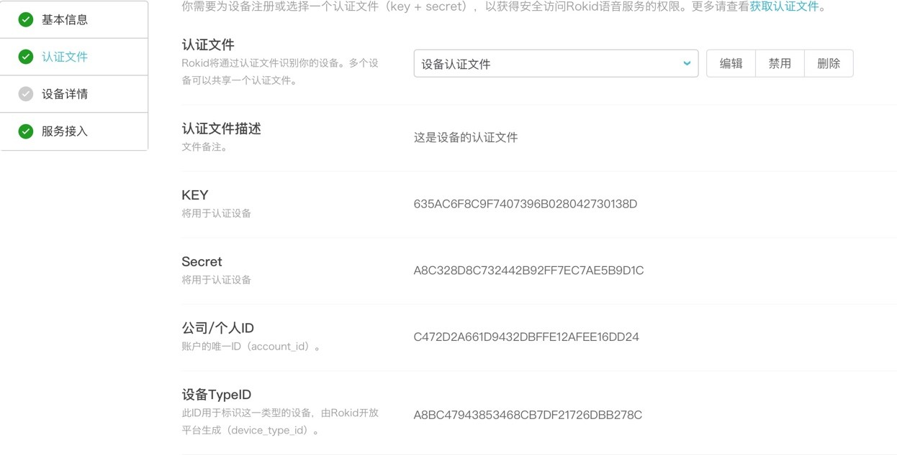
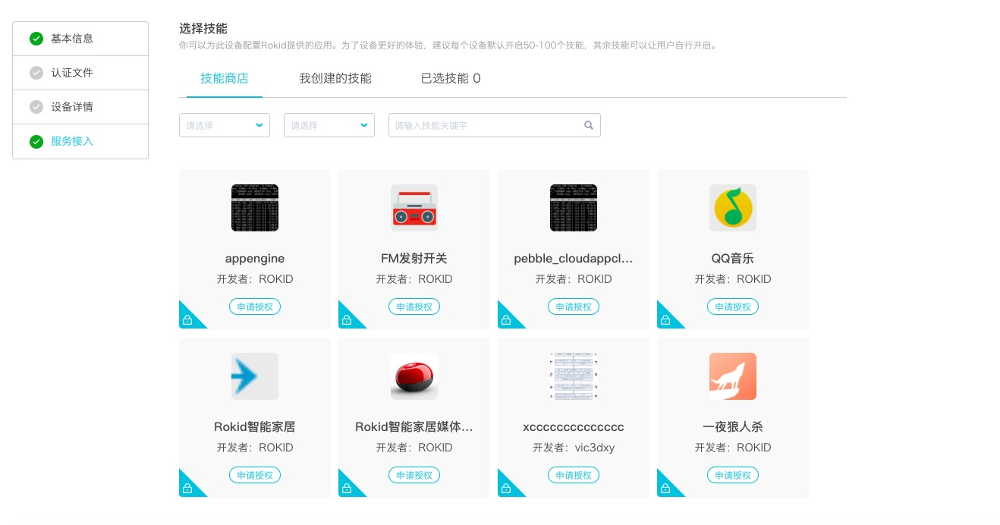
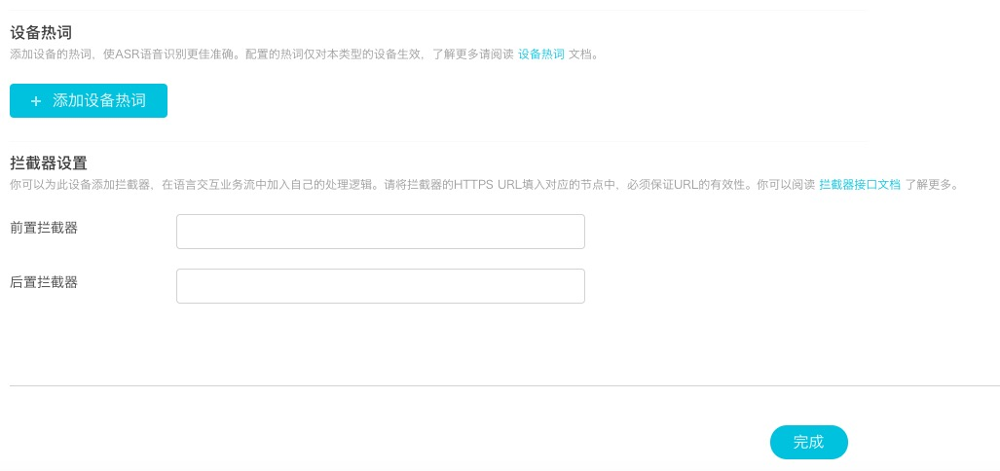

## 获取认证文件

1. 注册Rokid开发者账号
在[Rokid开放平台](https://developer.rokid.com/)免费注册一个Rokid开发者账号。
登录Rokid开发者社区，选择语音接入 进入语音接入，若没有完成身份认证的用户，需要先完成实名认证。

2. 创建一个设备

给您的设备起个名字

3. 创建认证文件,选择新文件，填写认证的文件名称和认认证文件描述。

4. 点击下一步，就可以获得你的设备文件的信息 key secret account_iddevice_id 。 

5. 点击下一步进入服务接入页面，用户可以在此处选择需开启的技能，添加[设备热词](https://developer.rokid.com/docs/2-RokidDocument/2-EnableVoice/important-concept.html)，进行[拦截器](https://developer.rokid.com/docs/3-ApiReference/rokid-interceptor.html)设置。用户可以在此处选择公有技能进行添加。启用/禁用：为当前设备启用或禁用被授权的私有技能。取消授权：取消指定私有技能对您设备的授权。

