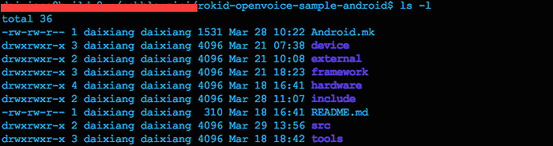
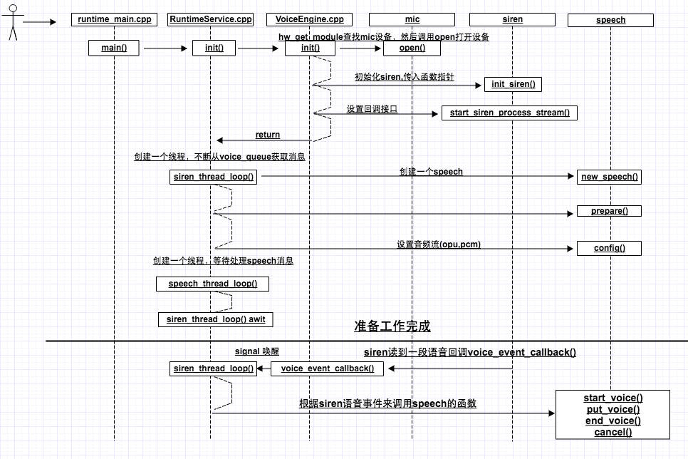
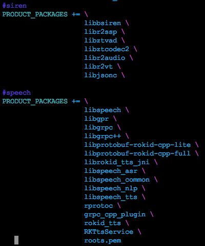

# Rokid SDK接入指南

## 简介

Rokid开放平台SDK包含Siren、Speech、NLP、ASR、TTS几大模块。

- Siren：拾音模块，接收HAL的音频数据，算法处理，滤波；
- TTS：文字转语音；
- Speech和ASR：都是语音转文字，不同的是Speech专门处理Siren的语音事件。

## 开始
要使用Rokid开放平台的SDK，首先需要下载相关的依赖模块：

- [rokid-blacksiren](https://github.com/Rokid/rokid-blacksiren.git)
- [speech](https://github.com/Rokid/rokid-openvoice-sdk.git)
- [grpc](https://github.com/Rokid/rokid-openvoice-sdk-deps-grpc.git)
- [protobuf](https://github.com/Rokid/rokid-openvoice-sdk-deps-protobuf.git)

这里为大家提供了一个[Sample](https://github.com/Rokid/rokid-openvoice-sample-android.git)，
其中，

- 增加了一些自己的逻辑
- 用到了Android的Binder机制
- 用到了C++多线程

接下来会从以下9个步骤完整讲述如何为自己的项目部署Rokid开放平台的SDK，

- [1 目录结构](#1-目录结构)
- [2 编译](#2-编译)
- [3 安装mic驱动](#3-安装mic驱动)
- [4 初始化](#4-初始化)
- [5 处理siren事件](#5-处理siren事件)
- [6 处理speech语音识别结果](#6-处理speech语音识别结果)
- [7 编写mk](#7-编写mk)
- [8 权限问题](#8-权限问题)
- [9 运行](#9-运行)

## 1 目录结构
先来看看它的目录结构：

* device 编译集成相关的mk，与Android device相同
* framework 一个java层service, 处理具体的业务逻辑，接收native service的Binder消息
* hardware mic的驱动文件，给siren提供硬件支持
* src 主要的代码目录，是siren和speech之间的桥梁，可以通过Binder通信

## 2 编译
目前这些SDK都放在Android根目录，整编需要先make rprotoc，make grpc_cpp_plugin，然后再make -j20(建议写成脚本)。单编先编译Andorid,然后使用mm依次编译：protobuf，grpc，speech，siren，编译后会得到下图这些lib库。siren所有库都是必需的，speech根据需求增减libspeech/libspeech_asr/libspeech_tts/libspeech_nlp.

## 3 安装mic驱动
mic kernel部分在Linux中已经有了，但HAL层还需要我们自己来完成，我们只需要在/hardware/libhardware/include/hardware下创建一个mic_array.h。

mic_array.h文件的内容如下:
                                                                           
	#include <stdint.h>                                                                                                    
	#include <hardware/hardware.h>                                                                                                                                                                                           
    //定义模块名                                                                                                                   
	#define MIC_ARRAY_HARDWARE_MODULE_ID "mic_array"                                                                       
    //硬件模块结构体                                                                                                                   
	struct mic_array_module_t {                                                                                            
    	struct hw_module_t common;                                                                                         
	};                                                                                                                     
    //硬件接口结构体                                                                                                                   
	struct mic_array_device_t {                                                                                            
    	struct hw_device_t common;                                                                                         
    	int channels;                                                                                                      
    	int sample_rate;                                                                                                   
    	int bit;                                                                                                           
    	unsigned int frame_cnt;                                                                                          
    	struct pcm *pcm;                                                                                                   
                                                                                                                                                                                                                                     
    	int (*get_stream_buff_size) (struct mic_array_device_t *dev);                                                      
    	int (*start_stream) (struct mic_array_device_t *dev);                                                              
    	int (*stop_stream) (struct mic_array_device_t *dev);                                                               
    	int (*finish_stream) (struct mic_array_device_t * dev);                                                            
    	int (*resume_stream) (struct mic_array_device_t *dev);                                                             
    	int (*read_stream) (struct mic_array_device_t *dev, char *buff, unsigned int frame_cnt);                           
    	int (*config_stream) (struct mic_array_device_t *dev, int cmd, char *cmd_buff);                                    
	};     
这里按照Android硬件抽象层规范的要求，分别定义模块ID、模块结构体以及硬件接口结构体。在硬件接口结构体中， pcm为设备描述符，用来读取音频裸数据，剩下是一些函数指针为该HAL对上层提供的函数接口。

接下来进入到hardware/libhardware/modules目录，新建目录mic_array，并添加mic_array.c文件。这个文件比较长，我们分段来看  

	#include "mic/mic_array.h"

	#define MODULE_NAME "mic_array"  

	#define MODULE_AUTHOR "jiaqi@rokid.com"

	static struct pcm_config pcm_config_in = {
    	.channels = 8,
    	.rate = 48000,
    	.period_size = 1024,
    	.period_count = 4,
    	.format = PCM_FORMAT_S32_LE,
	};
	//pcm缓冲区结构体
	static struct amlogic_mic_array_device {
    	struct mic_array_device_t mic_array;

    	int pts;
    	char* buffer;
	};
	//设备打开和关闭接口
	static int mic_array_device_open(const struct hw_module_t* module,
    	const char* name, struct hw_device_t** device);
	static int mic_array_device_close(struct hw_device_t* device);

	//设备访问接口
	static int mic_array_device_start_stream(struct mic_array_device_t* dev);
	static int mic_array_device_stop_stream(struct mic_array_device_t* dev);
	static int mic_array_device_finish_stream(struct mic_array_device_t* dev);
	static int mic_array_device_read_stream(
    	struct mic_array_device_t* dev, char* buff, unsigned int frame_cnt);
	static int mic_array_device_config_stream(
    	struct mic_array_device_t* dev, int cmd, char* cmd_buff);
	static int mic_array_device_get_stream_buff_size(
    	struct mic_array_device_t* dev);
	static int mic_array_device_resume_stream(struct mic_array_device_t* dev);
	//模块方法表
	static struct hw_module_methods_t mic_array_module_methods = {
    	.open = mic_array_device_open,
	};
	//模块实例变量
	struct mic_array_module_t HAL_MODULE_INFO_SYM = {
    	.common = {
        	.tag = HARDWARE_MODULE_TAG,
        	.version_major = 1,
        	.version_minor = 0,
        	.id = MIC_ARRAY_HARDWARE_MODULE_ID,
        	.name = MODULE_NAME,
        	.author = MODULE_AUTHOR,
        	.methods = &mic_array_module_methods,
    	},
	};                                                                                         

首先是包含相关头文件和定义相关结构，这里，实例变量名必须为HAL_MODULE_INFO_SYM，tag也必须为HARDWARE_MODULE_TAG，这是Android硬件抽象层规范规定的

	static int mic_array_device_open(const struct hw_module_t* module,
    		const char* name, struct hw_device_t** device)
	{
    	int i = 0;
    	struct amlogic_mic_array_device* am_dev = NULL;
    	struct mic_array_device_t* dev = NULL;
    	am_dev = (struct amlogic_mic_array_device*)malloc(
        sizeof(struct amlogic_mic_array_device));
    	dev = (struct mic_array_device_t*)am_dev;

    	if (!am_dev) {
        	ALOGE("MIC_ARRAY: FAILED TO ALLOC SPACE");
        	return -1;
    	}

    	memset(am_dev, 0, sizeof(struct amlogic_mic_array_device));
    	dev->common.tag = HARDWARE_DEVICE_TAG;
    	dev->common.version = 0;
    	dev->common.module = (hw_module_t*)module;
    	//函数指针
    	dev->common.close = mic_array_device_close;
    	dev->start_stream = mic_array_device_start_stream;
    	
    	. . .	. . .

    	// use pcm_config_in instead
    	dev->channels = pcm_config_in.channels;
    	dev->sample_rate = pcm_config_in.rate;
    	dev->bit = pcm_format_to_bits(pcm_config_in.format);
    	dev->frame_cnt = pcm_config_in.period_size * pcm_config_in.period_count
        	* pcm_config_in.channels * (pcm_format_to_bits(pcm_config_in.format) >> 3);
    	ALOGI("alloc frame buffer size %d", dev->frame_cnt);
    	dev->pcm = NULL;
    	am_dev->pts = 0;
    	am_dev->buffer = (char*)malloc(dev->frame_cnt);

    	*device = &(dev->common);
    	return 0;
	}

首先在堆区创建了一个amlogic_mic_array_device，并强转成mic_array_device_t（这是可以强转成功的，想想你定义了一个数组，数组名其实就是第一个元素的指针，struct同理），接着为mic_array_device_t赋值:函数指针，channel, sample_rate, bit ... 。这样我们在上层能过open函数就可以得到这个结构体mic_array_device_t。

接下来就是实现这些函数指针了

	static int mic_array_device_start_stream(struct mic_array_device_t* dev)
	{
    	struct mic_array_device_t* mic_array_device
        		= (struct mic_array_device_t*)dev;
    	struct pcm* pcm = NULL;
		//得到一个pcm
    	pcm = pcm_open(PCM_CARD, PCM_DEVICE, PCM_IN, &pcm_config_in);
    	  
    	mic_array_device->pcm = pcm;
    	return 0;
	}
	
	static int mic_array_device_read_stream(
    		struct mic_array_device_t* dev, char* buff, unsigned int frame_cnt)
	{
    	struct pcm* pcm = dev->pcm;
    	struct amlogic_mic_array_device* am_dev
        		= (struct amlogic_mic_array_device*)dev;
    	char *target = NULL;

    	int ret = 0;
    	int left = 0;
    	int size = dev->frame_cnt;
    	if (size <= 0) {
        	ALOGE("frame cnt lt 0");
        	return -1;
    	}

    	if (buff == NULL) {
        	ALOGE("null buffer");
        	return -1;
    	}

    	if (frame_cnt >= size) {
       		int cnt = frame_cnt / size;
        	int i;
        	left = frame_cnt % size;
        	for (i = 0; i < cnt; i++) {
            	if ((ret = read_frame(dev, buff + i * frame_cnt)) != 0) {
                	ALOGE("read frame return %d, pcm read error", ret);
                	resetBuffer(am_dev);
                	return ret;
            	}
        	}

        	if (left != 0) {
            	if ((ret = read_frame(dev, am_dev->buffer)) != 0) {
                	ALOGE("read frame return %d, pcm read error", ret);
                	resetBuffer(am_dev);
                	return ret;
            	}
        	}

        	target = buff + cnt * frame_cnt;
    	} else {
        	target = buff;
        	left = frame_cnt;
    	}

    	if ((ret = read_left_frame(am_dev, buff, left)) != 0) {
        	ALOGE("read frame return %d, pcm read error", ret);
        	resetBuffer(am_dev);
        	return ret;
       	 }

    	return ret;
	}

mic_array_device_start_stream函数中通过pcm_open得到一个pcm。当调用mic_array_device_read_stream的时候，先把dev强转回amlogic_mic_array_device，再来算出cnt值（要根据pcm的建议值来read一次数据）, 有多余的数据，保存起来下次再用，这就是amlogic_mic_array_device的作用。

继续在mic_array目录下新建Android.mk文件

	LOCAL_PATH := $(call my-dir)
	include $(CLEAR_VARS)

	LOCAL_SRC_FILES := mic_array.c
	LOCAL_MODULE_PATH := $(TARGET_OUT_SHARED_LIBRARIES)/hw
	LOCAL_MODULE := mic_array.$(TARGET_DEVICE)

	LOCAL_MODULE_TAGS := optional
	LOCAL_C_INCLUDES += \
    	hardware/libhardware \
    	rokid-openvoice-sample-android/hardware/include \
    	external/tinyalsa/include

	LOCAL_SHARED_LIBRARIES := liblog libcutils libtinyalsa

	LOCAL_MODULE_TARGET_ARCH := arm 

	include $(BUILD_SHARED_LIBRARY)
	
## 4 初始化

现在我们只需要使用Android的标准函数hw_get_module()查找mic设备， 通过传入的hw_module_t结构体指针，调用其中的open函数打开设备。如果打开成功，结果返回0

rokid-openvoice-sample-android/src/VoiceEngine.cpp
	
	struct mic_array_device_t *mic_array_device;
	
	bool VoiceEngine::init(RuntimeService *runtime)
	{
    	this->runtime_service = runtime;        
    	mic_array_module_t *module;
    	if(hw_get_module(MIC_ARRAY_HARDWARE_MODULE_ID, (const struct hw_module_t **)&module) != 0){ 
        	ALOGV("cannot find mic_array");
        	return false;
    	}   
    	if(module->common->methods->open(module, MIC_ARRAY_HARDWARE_MODULE_ID, 
    			(struct hw_device_t **)mic_array_device) != 0){ 
        	ALOGE("open mic_array failed");
        	return false;
    	}   
    	ALOGI ("open mic array done");
    	siren_t _siren = init_siren(runtime, NULL, &siren_input);  
    	//设置回调接口
    	start_siren_process_stream(_siren, &siren_callback);
    	return true;
    }
	
	siren_input_if_t siren_input = { 
    	init_input,
    	release_input,
    	start_input,
    	stop_input,
    	read_input,
    	on_err_input
	};	
	
	siren_proc_callback_t siren_callback = {
    	voice_event_callback
	};
	
siren_input_if_t里面都是一些函数指针，定义在blacksiren/include/siren.h中。这些函数都对的mic驱动应ice_t相关函数。siren会掉用这些函由来我们来调用mic_array_d。
#### 

## 5 处理siren事件
rokid-openvoice-sample-android/src/RuntimeService.cpp

	void siren::voice_event_callback(void *token, int length, siren_event_t event, 
        void* buff, int has_sl,
        int has_voice, double sl_degree, 
        double energy, double threshold,
        int has_voiceprint){

    	ALOGV("voice_event_callback    >>>  token : %x, has_voice : %d, len : %d",token, has_voice, length);
    	RuntimeService *runtime_service = (RuntimeService*)token;
    	if(runtime_service == NULL) return;
    	pthread_mutex_lock(&runtime_service->siren_mutex);
    	//add to siren_queue
    	RuntimeService::VoiceMessage *voice_msg = new RuntimeService::VoiceMessage();
    	char *_cache = NULL;
    	if(has_voice > 0){ 
        	assert(length >= 0); 
        	_cache = new char[length];
        	memcpy(_cache, buff, length);   
        	voice_msg->buff = _cache;
    	} 
    	  
    	. . .	. . .
    	
    	runtime_service->voice_queue.push_back(voice_msg);

    	pthread_cond_signal(&runtime_service->siren_cond);
    	pthread_mutex_unlock(&runtime_service->siren_mutex);
	}
	
如果siren开始拾音，就会回掉voice_event_callback，这里我的做法是把数据拷贝一份，把这个msg放到voice_queue链表的末尾，然后唤醒另外一个线程去做。当然这个还有待优化，没必要拷贝一次数据。

	void* siren_thread_loop(void* arg){

    	ALOGV("thread join !!");
    	RuntimeService *runtime_service = (RuntimeService*)arg;
    	int id = -1; 
   		
    	bool err = false;;
    	runtime_service->_speech = new_speech();
    	if (!runtime_service->_speech->prepare()) {
        	ALOGE("=========prepare failed===============");
        	return NULL;
        }   
    	runtime_service->_speech->config("codec", "opu");
    	pthread_create(&runtime_service->speech_thread, NULL, speech_thread_loop, runtime_service);
    	for(;;){
        	pthread_mutex_lock(&runtime_service->siren_mutex);
        	while(runtime_service->voice_queue.empty()){
            	pthread_cond_wait(&runtime_service->siren_cond, &runtime_service->siren_mutex);
        	}   

        	const RuntimeService::VoiceMessage *voice_msg = runtime_service->voice_queue.front();
        	ALOGV("event : -------------------------%d----", voice_msg->event);
        	switch(voice_msg->event){
            	case SIREN_EVENT_WAKE_CMD:
                	ALOGV("voice event   >>>   wake_cmd");
                	runtime_service->current_status = SIREN_STATE_AWAKE;
                	break;
            	case SIREN_EVENT_WAKE_NOCMD:
            	case SIREN_EVENT_SLEEP:
                	ALOGV("voice event   >>>   wake_nocmd or sleep");
                	runtime_service->current_status = SIREN_STATE_SLEEP;
                	break;
            	case SIREN_EVENT_VAD_START:
            	case SIREN_EVENT_WAKE_VAD_START:
                	runtime_service->current_status = SIREN_STATE_AWAKE;
                	id = runtime_service->_speech->start_voice();
                	ALOGV("voice event   >>   start   id   :  <<%d>>     err : <<%d>>", id,  err);
                	break;
            	case SIREN_EVENT_VAD_DATA:
            	case SIREN_EVENT_WAKE_VAD_DATA:
                	if (id > 0 && voice_msg->has_voice > 0) {
                    	runtime_service->_speech->put_voice(id, (uint8_t *)voice_msg->buff, voice_msg->length);
                	}
                	break;
            	case SIREN_EVENT_VAD_END:
            	case SIREN_EVENT_WAKE_VAD_END:
                	ALOGV("voice event : end   id    >>>   %d ",id);
                	if(id > 0) {
            	case SIREN_EVENT_VAD_CANCEL:
            	case SIREN_EVENT_WAKE_CANCEL:
                	if(id > 0)
                   		runtime_service->_speech->cancel(id);
                	ALOGI("voice event : cancel   id    >>>    %d", id);
                	break;
            	case SIREN_EVENT_WAKE_PRE:
                	ALOGV("vicee event  >>>   prepare");
                	break;
        	}
        	. . .	. . .
        	pthread_mutex_unlock(&runtime_service->siren_mutex);
    	}
    	runtime_service->_speech->release();
    	return NULL;
	}
	
这个线程起来的时候我们创建了Speech，调用它的prepare，config函数。`注意：一定要在连网的情况下开始调试，否则speech的prepare()方法会一直堵塞，因为prepare的时候speech会和服务端认证，grpc会一直block`。config设置音频数据的类型（opu，pcm）。在线程被唤醒后，从voice_queue链表头部获取msg，根据msg的siren_event_t事件来处理具体的逻辑。每段语音开始之前，都会收到`SIREN_EVENT_WAKE_PRE`，`SIREN_EVENT_VAD_START`事件，语音结束会有`SIREN_EVENT_VAD_END`，`ENT_VAD_CANCEL`事件，语音传递中有`SIREN_EVENT_VAD_DATA`事件。
	
* SIREN_EVENT_WAKE_PRE，siren准备开始工作，可以根据自己的业务做些准备工作
* SIREN_EVENT_VAD_STARE, siren开始拾音，这里需要创建Speech对象初始化，并掉用它的poll等待消息(这是一个堵塞函数，建议在另外一个线程调用)
* SIREN_EVENT_VAD_DATA，siren的处理语音结果事件，直接传给speech即可
* SIREN_EVENT_VAD_END，音频输入结束的事件
* ENT_VAD_CANCEL

## 6 处理speech语音识别结果

	void* speech_thread_loop(void* arg){
    	RuntimeService *runtime_service = (RuntimeService*)arg;
    	json_object *_json_obj = NULL;
    	for(;;){
        	SpeechResult sr; 
        	int32_t flag = runtime_service->_speech->poll(sr);
        	if (flag < 0)
            	break;

        	. . .	. . . 
        	
        	if(flag == 0 && sr.nlp != ""){
            	_json_obj = json_tokener_parse(sr.nlp.c_str());
            	json_object_object_add(_json_obj, "asr", json_object_new_string(sr.asr.c_str()));
            	json_object_object_add(_json_obj, "action", json_object_new_string(sr.action.c_str()));
            	ALOGV("-------------------------------------------------------------------------");
            	ALOGV("%s", json_object_to_json_string(_json_obj));
            	ALOGV("-------------------------------------------------------------------------");
            	if(runtime_service->_binder != NULL){
                	Parcel data, reply;
                	data.writeInterfaceToken(String16("rokid.os.IRuntimeService"));
                	data.writeString16(String16(json_object_to_json_string(_json_obj)));
                	runtime_service->_binder->transact(IBinder::FIRST_CALL_TRANSACTION + 0, data, &reply);
                	reply.readExceptionCode();
            	}else{
                	ALOGI("java runtime is null , Waiting for it to initialize");
            	}   
            	delete _json_obj;
            	_json_obj = NULL;
        	}   
    	}   
    	return NULL;
	}

这个线程一直在poll等待消息，有结果返回就把它打包成json，并通过Binder传给java层。

## 7 编写mk

	LOCAL_PATH := $(call my-dir)
	include $(CLEAR_VARS)

	LOCAL_SRC_FILES := \
        src/IRuntimeService.cpp \
        src/RuntimeService.cpp \
        src/VoiceEngine.cpp \
        src/runtime_main.cpp
	
	LOCAL_SHARED_LIBRARIES := \
        libbinder \
        liblog \
        libhardware \
        libbsiren \
        libjsonc \
        libutils \
        libgpr \
        libgrpc \
        libgrpc++ \
        libprotobuf-rokid-cpp-lite \
        libprotobuf-rokid-cpp-full \
        libspeech_common \
        libspeech \
        libspeech_nlp \
        libspeech_tts \
        libspeech_asr

	SPEECH_DIR = speech/src
	SPEECH_DIR_DEP = speech/external

	LOCAL_C_INCLUDES += \
        $(LOCAL_PATH)/include \
        $(LOCAL_PATH)/hardware/include \
        rokid-blacksiren/thirdparty/libjsonc/include \
        speech/include

	IGNORED_WARNINGS := -Wno-sign-compare -Wno-unused-parameter -Wno-sign-promo -Wno-error=return-type -Wno-error=non-virtual-dtor
	LOCAL_MODULE := runtime
	LOCAL_ARM_MODE := arm
	LOCAL_CPPFLAGS := -DCURRENT_ANDROID_PLATFORM_SDK_VERSION=$(PLATFORM_SDK_VERSION) $(IGNORED_WARNINGS) -DGOOGLE_PROTOBUF_NO_RTTI
	LOCAL_MODULE_TAGS := optional
	LOCAL_MODULE_TARGET_ARCH := arm

	include $(BUILD_EXECUTABLE)
	
* LOCAL_PATH 调用宏`call my-dir`获取当前路径
* include $(CLEAR_VARS) 清除一些变量
* LOCAL_SRC_FILES 添加需要编译的cpp文件
* LOCAL_SHARED_LIBRARIES 添加库依赖（SDK编译生成的都是动态库）
* SPEECH_DIR/SPEECH_DIR_DEP是自定义变量，和shell相似
* LOCAL_C_INCLUDES 添加自己的和依赖的.h头文件
* IGNORED_WARNINGS 自定义变量
* LOCAL_CPPFLAGS 编译控制选项
* LOCAL_MODULE 模块名
* include $(BUILD_EXECUTABLE) 编译成可执行文件

## 8 权限问题
Android上也引入了selinux，这是美国国安局专门为linux设计的一套安全机制。它有三种工作模式，在Android4.2以前，它一直处于Permission模式，之后便工作在enforcing模式，这就需要我们根据selinux的规范添加相应的.te文件，建议在开发阶段设回Permission

	system/core/init/init.cpp 

	static selinux_enforcing_status selinux_status_from_cmdline() {
    	selinux_enforcing_status status = SELINUX_ENFORCING;
    	修改为
    	selinux_enforcing_status status = SELINUX_PERMISSIVE;
    	. . .	. . .
    }  

## 9 运行
可以选择手动运行这个程序，先把这些依赖库push到/system/libs/下，然后把runtime这个可执行文件放到/system/bin/下，之后在adb shell下敲runtime就可以了。也可以加到init.rc下，开机就启动，具体操作如下：

	device/xxxx/common/products/mbox/init.xxxx.rc（每个人目录可能不一样）

	service runtime /system/bin/runtime
    class main
    user root
    group root

runtime起来以后会看到如下信息：

	01-01 00:00:08.939  3743  3743 I VoiceEngine: open mic array done
	01-01 00:00:10.788  3743  3743 V VoiceEngine: init input ..
	01-01 00:00:10.788  3743  3743 I VoiceEngine: =====-------------=============f5889100
	01-01 00:00:10.788  3743  3743 V RuntimeService: current_status     >>   2,   2
	01-01 00:00:10.789  3743  3772 V VoiceEngine: siren state is : 2
	01-01 00:00:10.801  3743  3878 V RuntimeService: thread join !!
	01-01 00:00:35.992  4083  4083 E RuntimeService: RuntimeService  created android.app.ContextImpl@76a209a
	01-01 00:00:35.992  4083  4083 E RuntimeService: mContext   android.app.ContextImpl@76a209a
	01-01 00:00:36.057  4083  4083 E RuntimeService: service conneted   _thiz : android.os.BinderProxy@65568b5
	01-01 00:00:36.058  3743  3743 V RuntimeService: add_binder success f5889080
	01-01 00:00:37.417  4083  4083 E RuntimeService: service conneted   _binder : com.rokid.server.RuntimeService@eed3eb2

	03-30 12:12:53.880  3743  3878 V RuntimeService: event : -------------------------107----
	03-30 12:12:53.880  3743  3878 V RuntimeService: vicee event  >>>   prepare
	03-30 12:12:53.880  3743  3878 V RuntimeService: event : -------------------------100----
	03-30 12:12:53.880  3743  3878 V RuntimeService: voice event   >>   start   id   :  <<1>>     err : <<0>>
	03-30 12:12:53.880  3743  3878 V RuntimeService: event : -------------------------101----
	03-30 12:12:53.881  3743  5050 V RuntimeService: result : asr  >>      1
	03-30 12:12:53.881  3743  5050 V RuntimeService: result : nlp  >>  
	03-30 12:12:53.881  3743  5050 V RuntimeService: result : action >>  
	03-30 12:12:53.975  3743  3772 V VoiceEngine: voice_event_callback    >>>  token : f5889100, has_voice : 1, len : 1662
	03-30 12:12:53.975  3743  3878 V RuntimeService: event : -------------------------101----
	03-30 12:12:53.993  3743  3772 V VoiceEngine: voice_event_callback    >>>  token : f5889100, has_voice : 1, len : 147
	03-30 12:12:53.993  3743  3878 V RuntimeService: event : -------------------------101----
	03-30 12:12:54.019  3743  3772 V VoiceEngine: voice_event_callback    >>>  token : f5889100, has_voice : 1, len : 113
	03-30 12:12:54.020  3743  3878 V RuntimeService: event : -------------------------101----
	03-30 12:12:54.075  3743  3772 V VoiceEngine: voice_event_callback    >>>  token : f5889100, has_voice : 1, len : 132
	03-30 12:12:54.075  3743  3878 V RuntimeService: event : -------------------------101----
	03-30 12:12:54.101  3743  3772 V VoiceEngine: voice_event_callback    >>>  token : 	03-30 12:12:54.226  3743  3878 V RuntimeService: event : -------------------------101----
	03-30 12:12:54.275  3743  3772 V VoiceEngine: voice_event_callback    >>>  token : f5889100, has_voice : 1, len : 138
	03-30 12:12:54.275  3743  3878 V RuntimeService: event : -------------------------101----
	03-30 12:12:54.298  3743  3772 V VoiceEngine: voice_event_callback    >>>  token : f5889100, has_voice : 1, len : 132
	03-30 12:12:54.299  3743  3878 V RuntimeService: event : -------------------------101----
	03-30 12:12:54.316  3743  3772 V VoiceEngine: voice_event_callback    >>>  token : f5889100, has_voice : 1, len : 132
	03-30 12:12:54.316  3743  3878 V RuntimeService: event : -------------------------101----
	03-30 12:12:54.365  3743  3772 V VoiceEngine: voice_event_callback    >>>  token : f5889100, has_voice : 0, len : 0
	03-30 12:12:54.365  3743  3878 V RuntimeService: event : -------------------------109----
	03-30 12:12:54.365  3743  3878 V RuntimeService: voice event   >>>   wake_cmd
	03-30 12:12:54.371  3743  3772 V VoiceEngine: voice_event_callback    >>>  token : f5889100, has_voice : 1, len : 59
	03-30 12:12:54.372  3743  3878 V RuntimeService: event : -------------------------101----
	03-30 12:12:54.372  3743  3772 V VoiceEngine: voice_event_callback    >>>  token : f5889100, has_voice : 0, len : 0
	03-30 12:12:54.372  3743  3878 V RuntimeService: event : -------------------------102----
	03-30 12:12:54.372  3743  3878 V RuntimeService: voice event : end   id    >>>   1 
	03-30 12:12:54.372  3743  3772 V VoiceEngine: voice_event_callback    >>>  token : f5889100, has_voice : 1, len : 4781
	03-30 12:12:54.372  3743  3878 V RuntimeService: event : -------------------------114----
	03-30 12:12:54.676  3743  5050 V RuntimeService: result : asr  >>  若琪你好    0
	03-30 12:12:54.676  3743  5050 V RuntimeService: result : nlp  >>  
	03-30 12:12:54.676  3743  5050 V RuntimeService: result : action >>  
	03-30 12:12:54.708  3743  5050 V RuntimeService: result : asr  >>  若琪你好    0
	03-30 12:12:54.708  3743  5050 V RuntimeService: result : nlp  >>  {"cloud":true,"confidence":1,"domain":"com.rokid.system.chat","intent":"chat","posEnd":0,"posStart":0,"slots":{"asr":"若琪你好","emo":"smile","intent_type":"chat","tts":"你好"}}
	03-30 12:12:54.708  3743  5050 V RuntimeService: result : action >>  {"response":{"action":{"shoudEndSession":true,"type":"NORMAL","version":"2.0.0","voice":{"behaviour":"APPEND","item":{"tts":"你好"},"needEventCallback":false}},"domain":"com.rokid.system.chat","resType":"INTENT","shot":"CUT"},"version":"2.0.0"}
	03-30 12:12:54.709  3743  5050 V RuntimeService: ------------------------------------------------
	03-30 12:12:54.709  3743  5050 V RuntimeService: { "nlp": "{\"cloud\":true,\"confidence\":1,\"domain\":\"com.rokid.system.chat\",\"intent\":\"chat\",\"posEnd\":0,\"posStart\":0,\"slots\":{\"asr\":\"若琪你好\",\"emo\":\"smile\",\"intent_type\":\"chat\",\"tts\":\"你好\"}}", "asr": "若琪你好", "action": "{\"response\":{\"action\":{\"shoudEndSession\":true,\"type\":\"NORMAL\",\"version\":\"2.0.0\",\"voice\":{\"behaviour\":\"APPEND\",\"item\":{\"tts\":\"你好\"},\"needEventCallback\":false}},\"domain\":\"com.rokid.system.chat\",\"resType\":\"INTENT\",\"shot\":\"CUT\"},\"version\":\"2.0.0\"}" }
	03-30 12:12:54.709  3743  5050 V RuntimeService: ------------------------------------------------
	

