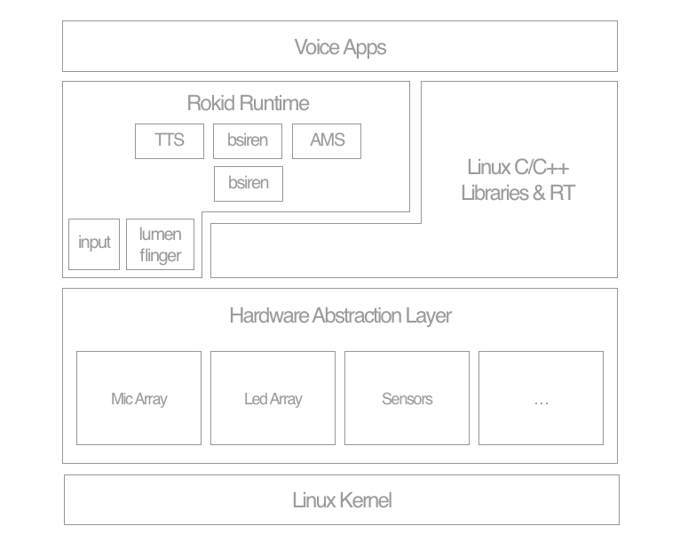

# Linux语音系统介绍

## 系统架构图

## 系统特性
* **Linux Native Services**
	* **systemd** Linux Init System - systemd 管理各种服务进程
	* **PulseAudio** 提供Audio服务及路由机制

* **Rokid Openvoice SDK**
	* **Speech SDK** 封装了与Rokid云服务交互协议，包括ASR、NLP、TTS等云端服务
	* **Blacksiren SDK** 输入麦克风数据，经内部拾音算法及云端服务（调用SpeechSDK），输出语音识别结果、各种拾音事件

* **Rokid System上的基础组件**
	* **媒体播放库** 提供媒体播放功能
	* **Android Binder** 提供Android系统进程间通讯机制
	* **Android HAL** 提供Android HAL功能
		* Android HAL 移植到Linux系统，方便实现Mic Array，Led Array，Sensor等

* **Rokid System Services/Framework**
	* **OpenvoiceProc Service** 将Blacksiren封装成服务，维护拾音、唤醒、云端识别解析业务的状态
	* **Application Manager Service** Rokid语音应用的生命期调度、事件分发框架
	* **Openvoice App Zygote** 由该进程负责启动所有语音应用
	* **系统音量控制** 提供系统的音量控制服务
	* **Input Service** 提供按键、触摸、鼠标事件服务
	* **TtsFlinger Service** 提供设备端的语音转文字服务
	* **LumenFlinger Service** 提供灯光渲染服务
	* **BtFlinger Service** 提供蓝牙功能
	* **系统电量服务** 系统电量服务
	* **应用包管理** 应用安装升级
	* **OTA** 系统升级
	* **蓝牙配网服务** 通过蓝牙BLE来配置Wifi网络

* **Rokid Node.js Runtime**

* **Rokid System Apps**
	* **CloudAppAgent** 云应用通用客户端
		* 支持天气、新闻、音乐、聊天、百科等云应用
	* **灯光寻向指示**
	* **蓝牙音乐应用**

* **调试开发工具**
	* **Android ADB** 提供ADB支持，方便开发
	* **手机端蓝牙配网应用** 提供手机端配网及相关功能

## 当前支持的Linux开源编译框架列表
* Buildroot

### 编译环境要求

- Ubuntu 14.04.5 LTS
- gcc 4.8.4 及以上
- 编译详情见: [开发板列表](./board/board_list.md)对应开发板

### BuildRoot Package

Rokid在Amlogic上游代码的基础上，通过buildroot external机制扩展了新特性配置
rokid_br_external目录Rokid 通过 BuildRoot 的 external 机制，将 Rokid 提供的包或第三方库的编译配置放在此处

#### FFWT
  
需要使用Rokid对该包的配置，核心的语音算法会依赖该动态库，不要修改该包的编译配置

#### NE10
  
需要使用Rokid对该包的配置，核心的语音算法会依赖该动态库，不要修改该包的编译配置

#### tinyplay

需要使用Rokid对该包的配置，目前Mic Array使用了tinyalsa接口读取数据，而目前上游Buildroot默认配置的tinyalsa源码释放出的tinyplay版本存在超过2个channel时读取音频数据会存在Bug，所以至少要使用比目前Rokid配置的版本要高。

