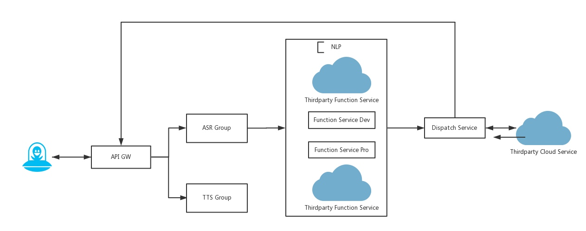
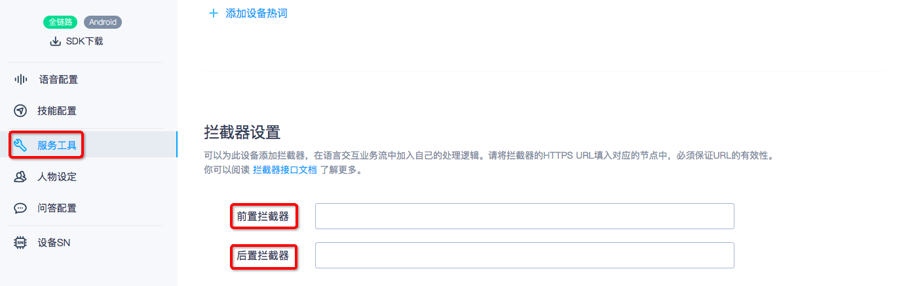

### 拦截器接口文档

语义理解（NLP）的拦截器（interceptor），可以允许开发者在进入Rokid NLP匹配之前或者是asr结果在若琪的NLP处理完成后结果为空时将请求进行拦截，拦截到开发者自己的https拦截器。

下图是整个语音的后端处理流程图：



> 图中的「NLP」即为语义理解服务

> 图中的「Function Service Dev/Pro」即为Rokid NLP匹配服务
 
> 图中的「Thirdparty Function Service」即为https拦截器

从图中可知，开放平台允许开发者对于每一类自有设备类型提供两个拦截器，从上到下依次为前置拦截器、后置拦截器。

用户可以在 Rokid 开放平台[语音接入](https://developer.rokid.com/voice/#/)板块中的服务接入中设置，具体配置的位置见下图，



**备注：**语义理解服务会**并行**调用开发者的前置拦截器，Rokid NLP匹配引擎以及后置拦截器，但是对于正常的响应结果，语义理解服务会对响应结果做优先级处理，优先级如下：前置拦截器结果>Rokid NLP匹配服务>后置拦截器，即当前置拦截器有正常结果响应时，语义理解服务会选择前置拦截器的结果给Dispatch Services,否则会查看Rokid NLP匹配服务是否有结果响应，有则将该结果给Dispatch Services，没有的话再看后置拦截器的结果。

#### 拦截器协议说明
从上图内容可知，无论是前置拦截器还是Rokid NLP匹配引擎以及后置拦截器最终的结果都是需要都递给Dispatch Services，由Dispatch Services做服务的分发给云端技能服务或者本地技能服务，因此三者的最终响应结果的数据都是保持一致的（具体详见下面的**拦截器协议说明**），且单独的拦截器是无法让设备进行结果响应的，因此需要有一个技能来配合做响应结果的处理，无论该技能是本地的还是云端的。

* 语音理解服务调用拦截器的调用说明
    * 请求方式: POST
    * 请求内容: Json字符串
    
    ```Json
    {
        "version": "1.0.0",
        "account_id": "用户账户ID",
        "device_type_id": "设备类型ID",
        "device_id": "设备ID",
        "sentence": "用户语句",
        "language": "zh",
        "client_stack": "SkillId1:SkillId2"
}
    ```
    
    * Json参数说明:

| 参数名            | 类型 |是否必须| 描述 |
| :------------- | :-- | :-- | :-- |
| version        | string |否| 接口版本号，默认1.0.0 |
| account_id     | string |否|当前设备的账户ID |
| device_type_id | string |是|设备类型ID |
| device_id      | string |是|设备ID |
| sentence       | string |是|待解析语句 |
| language       | string |是|语言，当前仅支持zh（中文） |
| client_stack          | string |否|当前设备的会话技能Id列表用'**:**'进行分割 | 

* 语音理解服务调用拦截器的调用说明
    * 响应内容:Json字符串
    
    ```Json
    {
        "slots": {
            "key1": {
                "type": "type1",
                "value": "value1"
            },
            "key2": {
                "type": "type2",
                "value":"value2"
            }
        },
        "app_id": "SkillId",
        "intent": "intentName"
}
    ```

    * Json参数说明:
    
| 参数名 | 类型 | 描述 | 默认值 | 必填 |
| :-- | :-- | :-- | :-- | :-- |
| app_id | string | 技能的ID | 无 | 是 |
| intent | string |Intent名称 | 无 | 否 |
| slots | slot | slots | 无 | 否 |

**特别说明：**
* 由于拦截器的响应不能单独在设备上响应，需要指向特定的技能（Skill）来进行协议的响应处理，Dispatch Services会根据app_id来将拦截器的响应投递给对应的技能（app_id即辅助拦截器做响应的技能ID），Intent以及Slots的响应具体内容是app_id对应的技能和拦截器商议的结果，语义解析服务不会对内容进行校验，但是会对整个响应格式做校验。

* 辅助拦截器做响应的技能需要对请求设备类型有授权或者请求的设备在该技能的测试列表中，否则响应无法投递给技能。
* 如果辅助拦截器做响应的技能是一个云端的技能，则拦截器的响应内容会对应[Rokid 云端技能协议](../2-RokidDocument/1-SkillsKit/important-concept/cloud-app-development-protocol_cn.md)中的request.content中，云端技能可以拿该内容做响应。
* 如果辅助拦截器做响应的技能是一个本地的技能，则拦截器的响应内容会对应本地技能数据的NLP内容，本地的技能可以拿NLP数据做响应处理。

#### 拦截器使用场景说明

* 前置拦截器
    * 主要场景：智能场景/NLP人工干预/用户指令是一个TTS播报指令
    * NLP人工干预简述：
        * 做一个配置后台，配置ASR以及NLP数值的对应关系
        * 当用户语句命中该ASR文本时，直接将NLP返回
    * 智能场景简述：
        * 做一个后台服务，配置用户的指令（ASR）如“我回家了”，以及对应整个场景包含的实际ASR以及时间 ，如：“播放音乐”，“播报欢迎回家”等
        * 拦截器将该内容做拦截器响应，响应的技能是一个本地技能，然后由本地技能走Speech文本请求，依次执行指令
    * 用户指令是一个TTS播报指令
        * sentence以：'tts:'开头
        * 将sentence中'tts:'以后的文本内容做一个聊天响应（详见下面后置拦截器的聊天部分）
    


* 后置拦截器
    * 主要场景：聊天问答/百科问答
    * 官方后置拦截器辅助技能：聊天（app_id：E33FCE60E7294A61B84C43C1A171DFD8）
    * 官方后置拦截器响应：
    ```json
    {
      "slots": {
        "tts": {
          "type": "tts",
          "value": "我是若琪，很高兴认识你"
        },
        "from": {
          "type": "from",
          "value": "XXX聊天"
        },
        "asr": {
          "type": "asr",
          "value": "你好"
        }
      },
      "app_id": "E33FCE60E7294A61B84C43C1A171DFD8",
      "intent": "chat"
    }
    ```
Json参数说明:
 
| 参数名 | 类型 | 描述 | 默认值 | 必填 |
| :-- | :-- | :-- | :-- | :-- |
| app_id | string | E33FCE60E7294A61B84C43C1A171DFD8| 固定 | 是 |
| intent | string |chat | 固定 | 否 |

Slots参数说明：

```json
"asr": {
    "type": "asr",
    "value": "你好"
}
```

**说明:**开发者只需要将value替换为用户的语句
（sentence）即可

    
```json
"from": {
  "type": "from",
  "value": "XXX聊天"
}
```

**说明:**开发者只需要将value替换为厂商的聊天名称，如“若琪聊天”

```json
"tts": {
  "type": "tts",
  "value": "我是若琪，很高兴认识你"
}
```

**说明:**开发者只需要将value替换为本地聊天的内容即可


