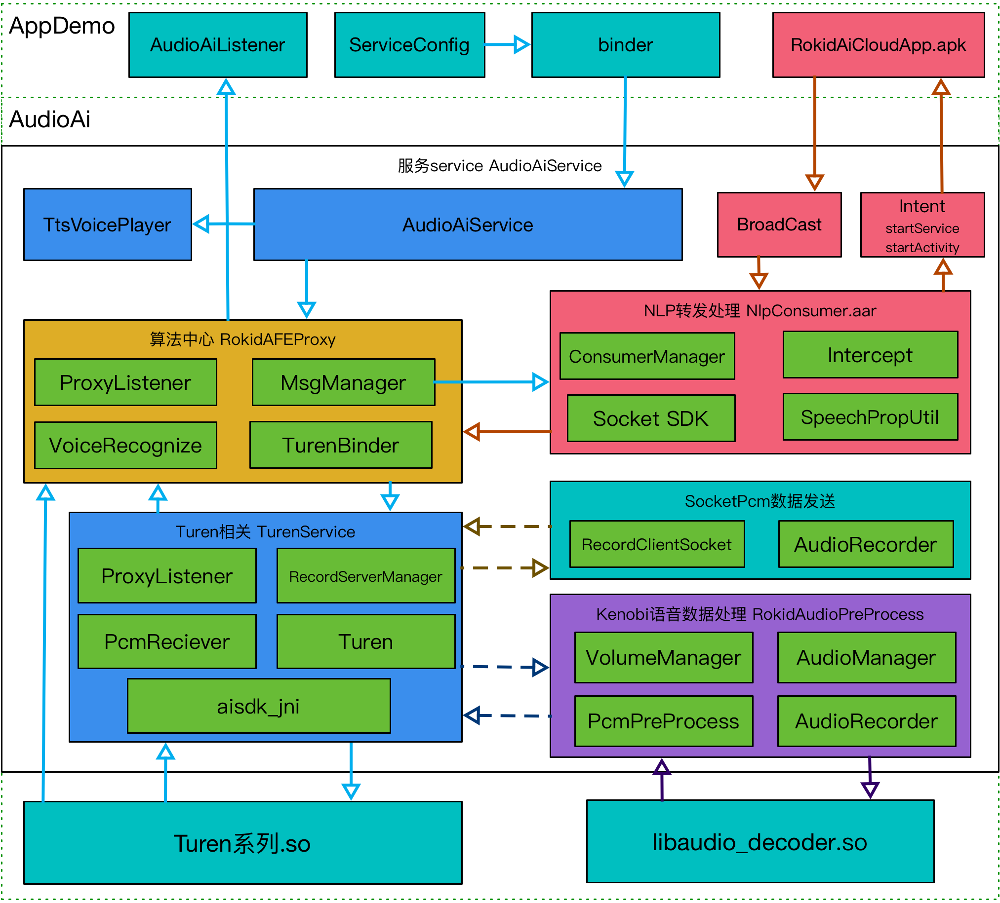

## 目录
* [一、概述](#一、概述)
* [二、软件架构](#二、软件架构)
  * [1、整体架构图](#1、整体架构图)
  * [2、各模块说明图](#2、各模块说明图)
  * [3、主要调用流程图](#3、主要调用流程图)
* [三、集成说明](#三、集成说明)
  * [硬件环境](#需要硬件环境)
  * [所需Android权限](#所需android权限)
  * [配置文件](#配置文件)
  * [实现代码](#实现代码)
    * [1、使用StartService方式启动](#1、使用startservice方式启动)
    * [2、使用bind方式启动](#2、使用bind方式启动)
    * [3、不使用默认的kenobi模块](#3、不使用默认的kenobi模块：只列出上面代码的修改区块)
    * [4、单独使用算法处理过的pcm数据](#4、单独使用算法处理过的pcm数据：只列出上面代码的修改区块)
    * [5、使用RokidAiCloudApp.apk来处理NLP及云端技能](#5、使用rokidaicloudapp来处理nlp及云端技能)
    * [6、单独算法模块](#6、单独算法模块)
    * [7、Demo使用说明](#7、demo使用说明)
* [四、主要API参考](#四、主要api参考)
* [五、其他说明](#五、其他说明)


### 一、概述

RokidAiSdk集合Kenobi项目的BTS方案，算法端Turen相关功能，通过speech、云端来进行语音语义识别，并返回处理信息给三方开发者，附带Rokid的TTS功能。
面向Android 软件开发工程师, 提供aar形式的SDK，简化接入流程，适应单独apk形式的集成，更方便用户接入Rokid AI语音技术。


### 二、软件架构

#### 1、整体架构图

   


#### 2、各模块说明图

   * 主AiService模块
     - 主要表现形态为Android的Service和Aidl Binder
     - 用IRokidAudioAiServer.aild来承接Activity端各种控制需求，用IRokidAudioAiListener.aidl来实现各种处理结果通知回调。
     - 支持startService和bind两种启动方式，可以在ServiceConfig中附加控制参数。
     - Service运行在独立进程，服务与app实现1对多关系。
   * RokidAFEProxy 算法中心模块
     - 包含NotifyMsgManager消息中心，完成数据1对n形式分发。
     - 连接turen进程的VoiceRecognize实现，默认使用apk级自有turen进程连接，同时支持系统级别的turen进程连接。
     - 实现Turen-Speech-云端 数据处理结果接收，并将其用消息中心向监听者分发。
     - 实现算法中心所有流程事件抛出，并通知其监听者。
     - binder桥接对turen进程的控制方法。
   * NlpConsumer NLP转发处理模块

     - 包含Consumer处理类，完成NLP分发给对应的Service或Activity。
     - 提供ServerSocket和ClientSocket基础SDK，未非kenobi用法提供pcm数据跨进程提供能力。
     - 提供Turen Pcm数据收集器，用socket形式不断收集算法处理后的pcm数据。
     - 提供广播方式处理与RokidAiCloudApp交互，完成主动拾音、更新协议栈等功能。
     - 提供一套NLP拦截机制，可以拦击其中任意一个NLP处理。

   * Turen进程模块
     - 包含aisdk_jni的具体调用，独立的apk级别turen so相关进程，和系统级别的turenproc功能相同。
     - 实现turen启动，控制相关功能，并提供所有流程事件抛出，并通知其监听者。
     - 配合RokidAFEProxy 算法中心模块实现自动重启功能。
     - 实现turen 所需配置文件自动copy功能。

   * RokidAudioPreProcess 语音数据预处理中心模块
     - 使用Android AudioRecord录音并输出相关pcm数据。
     - 桥接libaudio_decoder.so，实现pcm原始数据优化。
     - 通过系统AudioManager配合声音音量管理，优化数据收集。
     - 将优化过后的pcm数据传递给算法中心做下一步处理。

   * Socket 数据发送（非Kenobi ）
     - 使用ServerSocket和ClientSocket方式向turen 传递pcm数据。
     - ServerSocket运行在sdk进程，ClientSocket运行在用户appdemo进程。
     - 附带心跳机制，自动重连机制。
   * TTS中心
     - 简单TTS语音功能
   * 上层AppDemo
     - 语音识别结果及相关中间事件的UI展示
     - 实现播放/停止音乐功能
     - 实现播放TTS功能
     - 语音识别结果输出与统计
     - 实现AiService调用流程

#### 3、主要调用流程图

   

   

### 三、集成说明

#### 需要硬件环境

1. Kenobi
	- Android 系统电视一台
	- Kenobi 单片机及相关USB线（Rokid提供）
2. 其他方案
	- 带麦克风的Android 系统机器一台
	- 对应的麦克风配置

  如需动态替换turen的so，需要此设备拥有root权限

#### 所需Android权限

```
<!-- 网络 -->
<uses-permission android:name="android.permission.INTERNET" />
<!-- 录音 -->
<uses-permission android:name="android.permission.RECORD_AUDIO" />
<uses-permission android:name="android.permission.MODIFY_AUDIO_SETTINGS" />
<!-- 读取SD卡 -->
<uses-permission android:name="android.permission.READ_EXTERNAL_STORAGE" />
<uses-permission android:name="android.permission.WRITE_EXTERNAL_STORAGE" />
```

#### 配置文件

	对外接入方式，附带BSP模块，Service服务在com.rokid.ai.audioai单独进程中

- 引入aar

  - 像引入jar包一样引入aar文件 
  - gradle配置：

  ```groovy
  // eg: aar 
  // rokid_aisdk 命名为rokid_aisdk_1.2.7.aar
  // rokid_nlp_consumer 命名为rokid_nlp_consumer_release_1.0.aar
  // 把 libs 目录加入依赖：
  repositories {
      flatDir {
          dirs 'libs'
      }
  }
  
  dependencies {
      implementation fileTree(include: ['*.jar'], dir: 'libs')
      implementation(name: 'rokid_aisdk_1.2.7', ext: 'aar')
      api (name:'rokid_nlp_consumer_release_1.0', ext:'aar')
  }
  ```

#### 实现代码

##### 1、使用startService方式启动

```java
// 创建IRokidAudioAiService实例
private IRokidAudioAiService mAudioAiService;

@Override
protected void onCreate(Bundle savedInstanceState) {
    super.onCreate(savedInstanceState);
    setContentView(R.layout.activity_main);
    // 如果是Android 6.0以上系统，需要单独申请Android权限并用户通过
    requestPermission();
    // 开始绑定AudioAiService (sdk在独立进程方式)
    Intent mServiceIntent = AudioAiConfig.getIndependentIntent(this);
    mServiceIntent.putExtra(AudioAiConfig.PARAM_SERVICE_START_CONFIG, getServiceConfig());
    startService(mServiceIntent);
    // SDK和app在相同进程方式
    // Intent mServiceIntent = AudioAiConfig.getAttachmentIntent(this);
    // 需要同过binder来操作Service和设置监听
    bindService(mServiceIntent, mAiServiceConnection, BIND_AUTO_CREATE);
}

// 创建ServiceConnection，用来连接AudioAiService
private ServiceConnection mAiServiceConnection = new ServiceConnection() {
    @Override
    public void onServiceConnected(ComponentName name, IBinder service) {
        if (service != null) {
            mAudioAiService = IRokidAudioAiService.Stub.asInterface(service);
            try {
                // *** 注册监听
                mAudioAiService.registAudioAiListener(mAudioAiListener);
            } catch (RemoteException e) {
                e.printStackTrace();
            }
        }
    }

    @Override
    public void onServiceDisconnected(ComponentName name) {
        mAudioAiService = null;
    }
};

// 配置启动服务参数
private ServerConfig getServiceConfig() {
    // "workdir_asr_cn": 算法配置文件在assets目录中的位置
    // "kenobi": 算法库配置文件名，kenobi专用 eg: device.kenobi.cfg -> "kenobi"
    // useOtherAudio: 是否使用用户自己的audio数据模块
    ServerConfig config = new ServerConfig("workdir_asr_cn", "kenobi", false);
    // 设置日志配置
    config.setLogConfig(Logger.LEVEL_D, true, true);
    // key: Rokid开放平台注册时生成的Key
    String key = "BBF450D04CC14DBD88E960CF5D4DD697";
    // secret: Rokid开放平台注册时生成的Secret
    String secret = "29F84556B84441FC885300CD6A85CA70";
    // deviceTypeId: Rokid开放平台注册时生成的DeviceTypeId
    String deviceTypeId = "3301A6600C6D44ADA27A5E58F5838E02";
    // deviceId: 设备SN号，由6~15位的字母和数字组成，不能含有空格和特殊符号
    String deviceId = "57E741770A1241CP";

    config.setKey(key).setSecret(secret)
        .setDeviceTypeId(deviceTypeId).setDeviceId(deviceId);
    // 使用语音处理软件处理NLP技能，需要配合RokidAiCloudApp.apk
    config.setUseNlpConsumer(true);
    return config;
}

// 设置IRokidAudioAiListener监听，来接收算法处理结果数据
private IRokidAudioAiListener mAudioAiListener = new IRokidAudioAiListener.Stub() {...}

@Override
protected void onDestroy() {
    // 解绑AudioAiService，如果当前绑定数为0，则AudioAiService及语音识别进程会自动销毁
    unbindService(mAiServiceConnection);
    try {
        // 如果非常驻后台程序，在destory时需要stop掉Service
        stopService(mServiceIntent);
    } catch (Throwable e) {
        e.printStackTrace();
    }
    super.onDestroy();
}

// 用户在播放媒体声音时调用，方便SDK优化判断是否有外部声音干扰
if (mAudioAiService != null) {
    mAudioAiService.setUserMediaPlaying(true);
}

// 用户在停止播放媒体声音时调用，方便SDK优化判断是否有外部声音干扰
if (mAudioAiService != null) {
    mAudioAiService.setUserMediaPlaying(true);
}

// 使用TTS功能
if (mAudioAiService != null) {
    mAudioAiService.playTtsVoice("大家好，我是电视小精灵，若琪！");
}
```

##### 2、使用bind方式启动

```java
// 创建IRokidAudioAiService实例
private IRokidAudioAiService mAudioAiService;

@Override
protected void onCreate(Bundle savedInstanceState) {
    super.onCreate(savedInstanceState);
    setContentView(R.layout.activity_main);
    // 如果是Android 6.0以上系统，需要单独申请Android权限并用户通过
    requestPermission();
    // 开始绑定AudioAiService (sdk在独立进程方式)
    Intent mServiceIntent = AudioAiConfig.getIndependentIntent(this);
    // SDK和app在相同进程方式
    // Intent mServiceIntent = AudioAiConfig.getAttachmentIntent(this);
    bindService(mServiceIntent, mAiServiceConnection, BIND_AUTO_CREATE);
}

// 创建ServiceConnection，用来连接AudioAiService
private ServiceConnection mAiServiceConnection = new ServiceConnection() {
    @Override
    public void onServiceConnected(ComponentName name, IBinder service) {
        if (service != null) {
            mAudioAiService = IRokidAudioAiService.Stub.asInterface(service);
            try {
                // *** 启动服务
                mAudioAiService.srartAudioAiServer(getServiceConfig(), mAudioAiListener);
            } catch (RemoteException e) {
                e.printStackTrace();
            }
        }
    }

    @Override
    public void onServiceDisconnected(ComponentName name) {
        mAudioAiService = null;
    }
};

// 配置启动服务参数
private ServerConfig getServiceConfig() {
    // "workdir_asr_cn": 算法配置文件在assets目录中的位置
    // "kenobi": 算法库配置文件名，kenobi专用 eg: device.kenobi.cfg -> "kenobi"
    // useOtherAudio: 是否使用用户自己的audio数据模块
    ServerConfig config = new ServerConfig("workdir_asr_cn", "kenobi", false);
    // 设置日志配置
    config.setLogConfig(Logger.LEVEL_D, true, true);
    // key: Rokid开放平台注册时生成的Key
    String key = "BBF450D04CC14DBD88E960CF5D4DD697";
    // secret: Rokid开放平台注册时生成的Secret
    String secret = "29F84556B84441FC885300CD6A85CA70";
    // deviceTypeId: Rokid开放平台注册时生成的DeviceTypeId
    String deviceTypeId = "3301A6600C6D44ADA27A5E58F5838E02";
    // deviceId: 设备SN号，由6~15位的字母和数字组成，不能含有空格和特殊符号
    String deviceId = "57E741770A1241CP";

    config.setKey(key).setSecret(secret)
        .setDeviceTypeId(deviceTypeId).setDeviceId(deviceId);
    // 使用语音处理软件处理NLP技能，需要配合RokidAiCloudApp.apk
    config.setUseNlpConsumer(true);
    return config;
}

// 设置IRokidAudioAiListener监听，来接收算法处理结果数据
private IRokidAudioAiListener mAudioAiListener = new IRokidAudioAiListener.Stub() {...}

@Override
protected void onDestroy() {
    // 解绑AudioAiService，如果当前绑定数为0，则AudioAiService及语音识别进程会自动销毁
    unbindService(mAiServiceConnection);

    super.onDestroy();
}
```

##### 3、不使用默认的kenobi模块：只列出上面代码的修改区块

```java
private RecordClientManager mRecordClientManager;

@Override
protected void onCreate(Bundle savedInstanceState) {
    --- --- 同上：略 --- ---

    mRecordClientManager = new RecordClientManager();
}

// 配置启动服务参数
private ServerConfig getServiceConfig() {
    // "workdir_asr_cn": 算法配置文件在assets目录中的位置
    // "phonetest": 算法库配置文件名,单麦 eg: device.phonetest.cfg -> "phonetest"
    // useOtherAudio: 是否使用用户自己的audio数据模块
    ServerConfig config = new ServerConfig("workdir_asr_cn", "phonetest", true);

    --- --- 同上：略 --- ---

    return config;
}

private IRokidAudioAiListener mAudioAiListener = new IRokidAudioAiListener.Stub() {

    @Override
        public void onIntermediateSlice(int id, String asr) throws RemoteException {...}

        @Override
        public void onIntermediateEntire(int id, String asr) throws RemoteException {...}

        @Override
        public void onCompleteNlp(int id, String nlp, String action) throws RemoteException {...}

        @Override
        public void onVoiceEvent(int id, int event, float sl, float energy) throws RemoteException {...}

        @Override
        public void onRecognizeError(int id, int errorCode) throws RemoteException {...}

        @Override
        public void onServerSocketCreate(String ip, int post) throws RemoteException {
            if (TextUtils.isEmpty(ip) || port < 1) {
                return;
            }
            Logger.d(TAG,"onServerSocketCreate(): ip = " + ip + ", port = " + port);
            // SDK Server端数据接收服务已经准备好，启动ClientSocket来发送数据
            // mConnnectListener：socket连接状态监听
            // ClientSocket带自动重连功能
            if (mRecordClientManager != null) {
                mRecordClientManager.startSocket(ip, port, mConnnectListener);
            }
        }

        @Override
        public void onPcmServerPrepared() throws RemoteException {...}

        @Override
        public String getKey() throws RemoteException {...}

        @Override
        public void controlNlpAppExit() throws RemoteException {...}

        @Override
        public boolean interceptCloudNlpControl(int id, String nlp, String action) throws RemoteException {...}
};

// socket连接状态监听
private ClientSocketManager.IConnnectListener mConnnectListener = new ClientSocketManager.IConnnectListener() {
    @Override
    public void onConnectSuccess(ClientSocketManager socketManager) {
        // socket连接成功
        mSocketConnect = true;
        Logger.d(TAG,"IConnnectListener(): onConnectSuccess");
        new Thread(new Runnable() {
            @Override
            public void run() {
                // 读取文件中的pcm数据，不断发送给SDK
                sendPcmData();
            }
        }).start();
    }

    @Override
    public void onConnectFailed(ClientSocketManager socketManager) {
        // socket连接失效
        mSocketConnect = false;
        Logger.d(TAG,"IConnnectListener(): onConnectFailed");
    }
};

/**
    * 通过Android AudioRecord 来获取pcm数据，不断发送给SDK 
    * 麦克风类型为单麦，单通道，16000采样率，16bit数据
    * 这里只做示例，具体请根据自己的需求方式来实现
    */
private void sendPcmData() {
    int bufferSize = 0;
    bufferSize = AudioRecord.getMinBufferSize(16000, AudioFormat.CHANNEL_IN_MONO, AudioFormat.ENCODING_PCM_16BIT);
    bufferSize = bufferSize * 3;

    if(mAudioRecord == null) {
        mAudioRecord = new AudioRecord(MediaRecorder.AudioSource.MIC
                , FREQUENCY
                , CHANNEL
                , ENCODING_BIT
                , bufferSize);
        isRecording = true;
        byte[] buffer = new byte[bufferSize];
        mAudioRecord.startRecording();
        Logger.d(TAG, "$$$$$$$$$$ the pcm data is " + bufferSize);

        int bufferReadResult;
        while (isRecording) {
            bufferReadResult = mAudioRecord.read(buffer, 0, bufferSize);
            if (mCanSendPcm) {
//                                Logger.d(TAG, "sendRecordData data is" + bufferSize);
                if (mRecordClientManager != null) {
                    mRecordClientManager.sendRecordData(buffer);
                }
            }
        }
    }
}

@Override
protected void onDestroy() {
    --- --- 同上：略 --- ---

    mRecordClientManager.onDestroy();
    mRecordClientManager = null;

    super.onDestroy();
}
```

##### 4、单独使用算法处理过的pcm数据：只列出上面代码的修改区块

   配置修改：

```shell
# workdir_asr_cn/ctc.xxx.cfg
# 打开30003、30010端口，打开端口后cup占用会增高，如果没有必要，请不要配置
...
start.server=30003,30010
...
```

   实现代码：

```java
private PcmClientManager mPcmSocketManager;

@Override
protected void onCreate(Bundle savedInstanceState) {
    ... ... 同上：略 ... ...

    mPcmSocketManager = new PcmClientManager();
}

private IRokidAudioAiListener mAudioAiListener = new IRokidAudioAiListener.Stub() {
    ......

    @Override
    public void onPcmServerPrepared() throws RemoteException {
        Logger.d(TAG,"onPcmServerPrepared(): called");
        if (mPcmSocketManager != null) {
            mPcmSocketManager.startSocket(null, mPcmReceiver, 30003);
        }
    }

    ......
};

private IReceiverPcmListener mPcmReceiver = new IReceiverPcmListener() {
    @Override
    public void onPcmReceive(int length, byte[] data) {
        String s = "onPcmReceive(): len = " + length + "\n\r";
        Logger.d(TAG, s);
        // showPcmData(length, data);
    }
};

@Override
protected void onDestroy() {
    ... ... 同上：略 ... ...

    mRecordClientManager.onDestroy();
    mRecordClientManager = null;

    super.onDestroy();
}
```
   
##### 5、使用RokidAiCloudApp来处理NLP及云端技能

```java
// 需要安装RokidAiCloudApp.apk
// 在ServerConfig中打开NlpConsumer开关
private ServerConfig getServiceConfig(int status) {

    ServerConfig config = null;
    ...

    // 使用语音处理软件处理NLP技能
    config.setUseNlpConsumer(true);
    
    ...
    return config;
}
```

##### 6、单独算法模块

```java
// 1. 创建RokidAFEProxy对象实例
RokidAFEProxy mRokidAFEProxy = new RokidAFEProxy(this);

// 2. 设置IRokidAudioAiListener监听，来接收算法处理结果数据
IRokidAudioAiListener mAudioAiListener = new IRokidAudioAiListener.Stub() {...};
ServerConfig config = new ServerConfig("workdir_asr_cn", "phonetest", false);
// 设置日志配置
config.setLogConfig(Logger.LEVEL_D, true, true);
mRokidAFEProxy.addResultListener(config, mAudioAiListener);

// 3. 配置启动服务参数
AfeParam param = new AfeParam();
// key: Rokid开放平台注册时生成的Key
param.key = "BBF450D04CC14DBD88E960CF5D4DD697";
// secret: Rokid开放平台注册时生成的Secret
param.secret = "29F84556B84441FC885300CD6A85CA70";
// deviceTypeId: Rokid开放平台注册时生成的DeviceTypeId
param.deviceTypeId = "3301A6600C6D44ADA27A5E58F5838E02";
// deviceId: 设备SN号，由6~15位的字母和数字组成，不能含有空格和特殊符号
param.deviceId = "57E741770A1241CP";

// 4. 开始算法处理服务
mRokidAFEProxy.startAfeServer(param);

// **** 正确的数据长度获取方法，测试时需要保持这种长度的数据
int count = mRokidAFEProxy.getAudioLengh(16000, AudioFormat.ENCODING_PCM_16BIT, 1);
// 5. 延迟3~5秒，待Turen服务完全开启，开始循环注入原始Pcm数据
mRokidAFEProxy.addPcmData(count, myte);

// 6. 算法处理结果数据会通过IRokidAudioAiListener内方法回调返回
```

##### 7、Demo使用说明

ApkDemo因需要在不同地点、不同的设备上演示，所以提供一些动态替换启动参数或配置的功能。

具体详见：

[SDK Demo使用指南.md](extra/SDK_Demo使用指南.md)


### 四、主要API参考

* IRokidAudioAiService.java  ASR 主Service的binder接口

| 返回值 | 方法和说明 |
| ------ | ------------------------------------------------------------ |
| `void` | `playTtsVoice(java.lang.String text)`用tts服务播放text语音   |
| `void` | `setUserMediaPlaying(boolean userMediaPlaying)`通知当前设备是否有用户媒体流在播放 |
| `boolean` | `srartAudioAiServer(ServerConfig config, IRokidAudioAiListener listener)`根据配置信息启动服务, 并注册Asr语音服务处理结果的监听（若当前服务已启动，则不会重新启动）        true：表示监听添加成功，false：表示监听添加失败，config中的Key、Secret、DeviceTypeId三个值与服务启动时的config中的三个值不相等 |
| `void` | `unRegistAudioAiListener(IRokidAudioAiListener listener)`注销Asr语音服务处理结果的监听 |
| `void` | `setAngle(int angle)` 设置麦克风寻向角度 angle（0 ~ 360） |
| `void` | `setPickUp(boolean open)` 在单独的激活模块中，主动开启拾音和关闭拾音 true: 开启拾音, false: 结束拾音 |
| `void` | `registAudioAiListener(IRokidAudioAiListener listener)` 注册Asr语音服务处理结果的监听 |

* IRokidAudioAiListener.java 监听AudioAiService服务对语音的处理结果

| 返回值 | 方法和说明 |
| ------ | ------------------------------------------------------------ |
| void   | onIntermediateSlice(int id, String asr) 返回语音识别中间结果片段 (id: 本次激活会话id)   |
| void   | onIntermediateEntire(int id, String asr)  返回语音识别中间结果完整的数据(id: 本次激活会话id) |
| void   | onCompleteNlp(int id, String nlp, String action) 返回最终语音识别结果（id: 本次激活会话id，nlp：自然语义解析结果， action：云端skill结果） |
| void   | onVoiceEvent(int id, int event, float sl, float energy)  返回语音唤醒事件（id: 本次激活会话id，event: 语音事件类型VoiceRecognize.Event的ordinal()值（见**VoiceRecognize.Event  enum 类型说明**）， sl：当前唤醒角度(0到360度之间)， energy：当前说话能量值(0到1之间的浮点数)） |
| void   | onRecognizeError(int id, int errorCode)  返回语音识别出错信息（id: 本次激活会话id，errorCode：错误码，**见错误码说明**） |
| void   | onServerSocketCreate(String ip, int port) 接收pcm数据的socket启动成功时的回调 （ip：socket的ip地址， post：socket的端口） |
| void   | onPcmServerPrepared()  发送算法处理过后的pcm数据的服务已经准备好  |
| String   | getKey()  返回当前IRokidAudioAiListener 唯一标志 （不可为null或""，否则IRokidAudioAiListener将会注册失败）  |
| void   | controlNlpAppExit()  处理NLP中的退出所有app指令  |
| boolean   | interceptCloudNlpControl(int id, String nlp, String action)  对NlpConsumer云端处理NLP进行拦截（id：会话ID，nlp：自然语义解析结果， action：云端skill结果）  |

* ServiceConfig.java 启动参数配置类

| 返回值             | 方法和说明  |
| ------------------ | ------------------------------------------------------------ |
| `java.lang.String` | `getAssetsConfigPath()`获取Assets目录中算法库配置文件路径    |
| `java.lang.String` | `getCertificate()`获取服务启动密匙                           |
| `java.lang.String` | `getConfigFileName()`获取初始化turen配置文件名               |
| `java.lang.String` | `getDeviceId()`获取设备的DeviceId， sn号                     |
| `java.lang.String` | `getDeviceTypeId()`获取当前DeviceTypeId                      |
| `java.lang.String` | `getKey()`获取当前Key                                        |
| `int`              | `getLogLevel()`返回log等级                                   |
| `java.lang.String` | `getRealConfigPath()`获取算法库配置文件真实路径              |
| `java.lang.String` | `getSecret()`获取当前Secret                                  |
| `java.lang.String` | `getSpeechConfig()`                                          |
| `boolean`          | `isIgnoreMoveConfig()`获取是否忽略Turen配置文件拷贝，用于turen开发人员测试 |
| `boolean`          | `isIgnoreSuppressAudioVolume()`获取是否忽略声音压制，默认BSP模块测试使用 |
| `boolean`          | `isMustInit()`是否强制初始化                                 |
| `boolean`          | `isShowDecoderSoLog()`返回decode so日志是否展示              |
| `boolean`          | `isShowTurenLog()`查看Turen Log的展示                        |
| `boolean`          | `isTestWays()`获取是否开启测试模式                           |
| `boolean`          | `isUseMacArray()`查询是否使用mic_array方式获取PCM数据        |
| `boolean`          | `isUseNlp()`查询是否输出NLP功能                              |
| `boolean`          | `isUseNlpConsumer()`查询是否使用NLP云端、本地技能语音处理功能 |
| `boolean`          | `isUseOtherAudio()`获取当前是否使用用户自己的audio数据模块   |
| `boolean`          | `isUsePcm()`查询是否输出PCM功能                              |
| `boolean`          | `isUseTurenProc()`查询是否turenproc命令行工具启动Turen方式   |
| `ServerConfig`     | `setAssetsConfigPath(java.lang.String path)`设置Assets目录中算法库配置文件路径 |
| `ServerConfig`     | `setCertificate(java.lang.String secretKey)`设置服务启动密匙 |
| `ServerConfig`     | `setConfigFileName(java.lang.String fileName)`设置初始化turen配置文件名 |
| `ServerConfig`     | `setDeviceId(java.lang.String mDeviceId)`设置设备的DeviceId， sn号 |
| `ServerConfig`     | `setDeviceTypeId(java.lang.String mDeviceTypeId)`设置开放平台注册时生成的Type ID |
| `ServerConfig`     | `setIgnoreMoveConfig(boolean ignoreMoveConfig)`设置是否忽略Turen配置文件拷贝，用于turen开发人员测试 |
| `ServerConfig`     | `setIgnoreSuppressAudioVolume(boolean ignoreSuppressAudioVolume)`设置是否忽略声音压制，默认BSP模块测试使用 |
| `ServerConfig`     | `setKey(java.lang.String key)`设置开放平台注册时生成的KEY    |
| `ServerConfig`     | `setLogConfig(int logLevel, boolean showTurenLog, boolean showDecoderSoLog)`设置log等级 |
| `ServerConfig`     | `setMustInit(boolean mustInit)`设置是否强制初始化            |
| `ServerConfig`     | `setRealConfigPath(java.lang.String path)`设置算法库配置文件真实路径 |
| `ServerConfig`     | `setSecret(java.lang.String secret)`设置开放平台注册时生成的Secret |
| `ServerConfig`     | `setShowDecoderSoLog(boolean show)`设置decode so日志是否展示 |
| `ServerConfig`     | `setShowTurenLog(boolean show)`设置Turen Log的展示           |
| `ServerConfig`     | `setTestWays(boolean testWays)`设置是否开启测试模式，识别服务器会有区别 |
| `ServerConfig`     | `setUseMacArray(boolean useMacArray)`设置是否使用mic_array方式获取PCM数据 |
| `ServerConfig`     | `setUseNlp(boolean useNlp)`设置是否输出NLP功能               |
| `ServerConfig`     | `setUseNlpConsumer(boolean useNlpConsumer)`设置是否使用NLP云端、本地技能语音处理功能 |
| `ServerConfig`     | `setUseOtherAudio(boolean useOtherAudio)`设置是否使用用户自己的audio数据模块（默认使用SDK的BSP Audio数据模块） |
| `ServerConfig`     | `setUsePcm(boolean usePcm)`设置是否输出PCM功能               |
| `ServerConfig`     | `setUseTurenProc(boolean useTurenProc)`设置是否turenproc命令行工具启动Turen方式 |

* IProxyListener.java 算法中心相关事件监听

| 返回值 | 方法和说明 |
| ------ | -------------------------------------- |
| `void` | `onRealAsrBegin()`真正算法语音识别开始 |
| `void` | `onRealAsrEnd()`真正算法语音识别结束   |
| `void` | `onStartAfeServer()`服务建立并启动     |

* VoiceRecognize.Event  enum 类型说明

| 类型 | 语音唤醒事件枚举定义 |
| ---- | ------------------------------------------------------------ |
| `EVENT_VOICE_COMING` | 激活即将开始（sl 存在值，energy值为0） |
| `EVENT_VOICE_LOCAL_WAKE` | 本地已经激活（sl 存在值，energy值为0） |
| `EVENT_VOICE_START` |  开始上传VAD（sl 值为0，energy存在值 ）  |
| `EVENT_VOICE_NONE`  | 二次确认结果为空，只出于已经在激活状态下，直接说语音命令 |
| `EVENT_VOICE_ACCEPT`  | 云端二次确认通过 |
|  `EVENT_VOICE_REJECT`  | 云端二次确认不通过 |
|  `EVENT_VOICE_CANCEL`  | 取消当前上传VAD |
|  `EVENT_VOICE_LOCAL_SLEEP` |  通过休眠词从激活状态进入休眠状态 |

* RecordClientManager 录音Pcm的Client Socket

| 类型 | 描述 |
| ---------------------------- | ----------------------------------------------------------- |
| `boolean` | `isUseQueue()`查看是否使用队列缓存数据发送 |
| `void` | `onDestroy()` |
| `void` | `sendRecordData(byte[] data)`发送录音数据 |
| `void` | `setUseQueue(boolean useQueue)`设置是否使用队列缓存数据发送 |
| `void` | `startSocket(java.lang.String ip, int port, ClientSocketManager.IConnnectListener listener)` 启动一个socket长连接|

* IRecordPcmReceiver 录音pcm数据获取后处理监听回调

| 类型 | 描述 |
| ---------------------------- | ----------------------------------------------------------- |
| `void` | `onPcmReceive(int length, byte[] data)`录音pcm数据获取后处理 |

* ClientSocketManager.IConnnectListener Socket连接监听

| 类型 | 描述 |
| ---------------------------- | ----------------------------------------------------------- |
| `void` | `onConnectFailed(ClientSocketManager socketManager)`连接失败 |
| `void` | `onConnectSuccess(ClientSocketManager socketManager)`连接成功 |

* PcmClientManager 录音Pcm的Client Socket

| 类型 | 描述 |
| ---------------------------- | ----------------------------------------------------------- |
| `boolean` | `isUseQueue()`查看是否使用队列缓存数据发送 |
| `void` | `onDestroy()` |
| `void` | `sendRecordData(byte[] data)`发送录音数据 |
| `void` | `setUseQueue(boolean useQueue)`设置是否使用队列缓存数据发送 |
| `void` | `startSocket(ClientSocketManager.IConnnectListener listener, IReceiverPcmListener pcmReceiver)` 启动一个socket长连接 |

* IReceiverPcmListener 算法pcm数据获取后处理监听回调

| 类型 | 描述 |
| ---------------------------- | ----------------------------------------------------------- |
| `void` | `onPcmReceive(int length, byte[] data)`算法pcm数据获取后处理|

* 错误码说明
  
| 值 | 错误描述 |
| ---|---|
| 0 | 成功 |
| 3 | 与服务器连接数量过多 |
| 4 | 服务器资源不足 |
| 5 | 服务器忙 |
| 6 | 服务器内部错误 |
| 7 | 语音识别超时 |
| 101 | 无法连接到服务器 |
| 103 | 语音请求服务器超时未响应 |
| 104 | 未知错误 |


### 五、其他说明

SDK 版本：（aar）
    1.2.7 
    rokid_ai_sdk_release_1.2.7.aar
    rokid_nlp_consumer_release_1.0.aar

1. 项目git地址：https://gitlab.rokid-inc.com/system_software/RokidAiSdk
2. 项目产物地址：https://gitlab.rokid-inc.com/system_software/RokidAudioAiProduct
