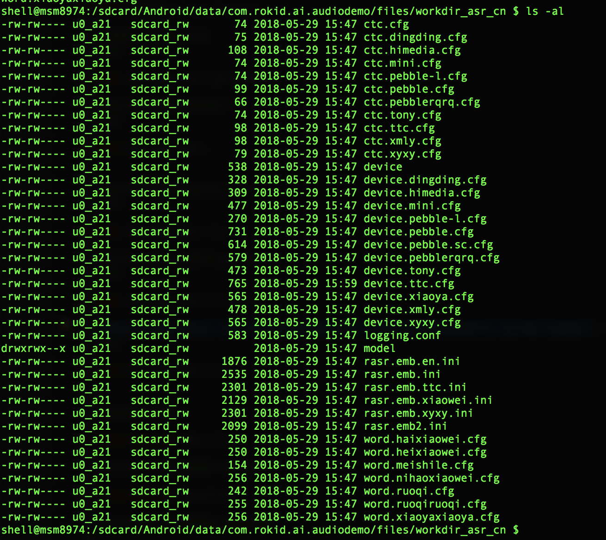

### SDK Demo使用指南

#### 说明：

	SDK 内部AppDemo主要用于演示以及内部调试、测试使用


#### 修改启动配置

使用ApkDemo因需要在不同地点、不同的设备上演示，所以提供动态替换启动参数的功能。

* key: 开放平台注册时生成的KEY
* secret: 开放平台注册时生成的Secret
* deviceTypeId: 开放平台注册时生成的Type ID
* deviceId: 需要由开发者自行指定，由6~15位的字母和数字组成，不能含有空格和特殊符号。此ID每个设备唯一
* ignoreMoveConfig: 获取是否忽略Turen配置文件拷贝，用于turen开发人员测试

Demo中在SD卡根目录中Rokid_Ai_SDK_Config.txt 文件来读取上述配置参数，配置使用键值对形式，一行一个键值对。如Rokid_Ai_SDK_Config.txt 文件读取不到相应参数数据，则使用相关参数的默认值（只在demo中有，开发者使用时必须传递）。

配置实例如下：

文件：/sdcard/Rokid_Ai_SDK_Config.txt  

内容：

```txt
key = BBF450D04CC14DBD88E960CF5D4DD697
secret = 29F84556B84441FC885300CD6A85CA70
deviceTypeId = 3301A6600C6D44ADA27A5E58F5838E02
deviceId = 57E741770A1241CP
ignoreMoveConfig  = true/false
```


#### 修改turen配置文件

turen配置文件现在被内置在SDK的assert目录下，程序启动的时候会自动启动copy流程，如果需要本地修改。请按如下步骤：

1. 在SD卡根目录中Rokid_Ai_SDK_Config.txt 文件中添加如下内容（文件不存在则需要提前创建）

   ignoreMoveConfig  = true/false

2. turen配置文件放的位置在 /sdcard/Android/data/com.rokid.ai.audiodemo/files/workdir_asr_cn 目录下

eg：adb push name.cfg   /sdcard/Android/data/com.rokid.ai.audiodemo/files/workdir_asr_cn/




#### 替换相关SO

目前ApkDemo的so地址在/data/data/com.rokid.ai.audiodemo/lib 目录下，如果当前系统root过，使用root用户可以进行动态的so替换，方便算法测试：

1. 关闭当前demo应用

2. 运行: 

   ```shell
   # 1. 获取root
   adb root
   adb remount
   # 2. 进入demo应用的lib目录，此目录用来存放so文件
   adb shell
   cd /data/data/com.rokid.ai.audiodemo/lib
   # 3. 删除想要替换的so
   rm **name**.so
   # 4. 推出设备
   exit
   # 5. 将替换的so推入设备
   adb push ****.so  /data/data/com.rokid.ai.audiodemo/lib
   ```


#### 替换背景播放音乐

ApkDemo的背景音乐在运行后会放在/sdcard/test.mp3，手动替换就可以。也可以用命令:

```shell
adb push .mp3  /sdcard/test.mp3
```

