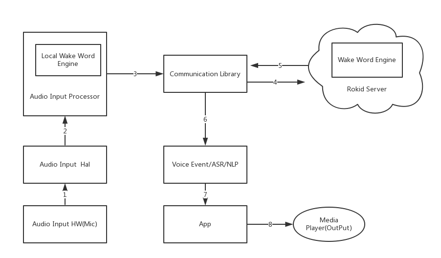

### 目录
* [一、概述](#一、概述)
  * [Rokid全链路通用方案](#rokid全链路通用方案)
  * [软件框架简介](#软件框架简介)
* [二、硬件示例](#二、硬件示例)
* [三、软件架构](#三、软件架构)
  * [SDK目录结构](#sdk目录结构)
    * [config](#config)
    * [doc](#doc)
    * [executable](#executable)
    * [android-libraries文件列表](#android-libraries文件列表)
    * [shared-libraries文件列表](#shared-libraries文件列表)
    * [example](#example)
  * [SystemVoiceDemo说明](#systemvoicedemo说明)
    * [模块功能简介](#模块功能简介)
    * [模块文件树](#模块文件树)
    * [模块主要功能点](#模块主要功能点)
* [四、全链路集成](#四、全链路集成)
  * [前端算法相关配置文件](#前端算法相关配置文件)
  * [mic_array简要实现](#mic_array简要实现)
  * [系统预置sdk](#系统预置sdk)
  * [集成验证](#集成验证)
* [五、API参考](#五、api参考)
  * [VoiceRecognize](#voicerecognize)
  * [内部类](#内部类)
  * [回调接口](#回调接口)
  * [示例代码](#示例代码)


### 一、概述

#### Rokid全链路通用方案

Rokid 全链路系统集成是指选择 Rokid 全链路 SDK 下载后,通过修改Android 源码方式集成SDK,集成 SDK 成功后,可以获取Rokid 前端语音激活/降噪以及 Rokid 语音识别/语音合成服务的相关能力.
  - 前端语音能力
    - 将麦克风阵列中的语音数据转换成对应的前端语音激活/休眠等事件. Rokid 提供的前端语音能力可为合作伙伴提供语音自身音源降噪处理/回声消除/环境噪音降噪处理等
  - 语音识别服务
    - 语音识别可以通过开发者提供的原始语音数据/经过算法处理过的语音数据识别成对应的自然语言(ASR),以及对应的自然语言处理(NLP)信息
  - 语音合成服务(TTS)
    - Rokid语音合成服务可以根据开发者提供的文字合成高质量的音频。

#### 软件框架简介

  - 支持的Android OS
    - 目前SDK支持Android5.0及以上系统
  - SDK下载
    - 请在 https://developer.rokid.com 上下载SDK
  - SDK目录结构
    - [SDK目录结构](#SDK目录结构) 
  - 软件设计框架图
    - 

### 二、硬件示例

可参考Rokid官方提供的开发套件,获取方式: 从[Rokid官网](https://developer.rokid.com/)获取 rokid all in one 全栈语音解决方案 开发套件
目前支持硬件指标为:
  - RAM 512M及以上
  - Mic阵列支持 线2麦/线4麦/圈4麦/圈6麦

### 三、软件架构

#### SDK目录结构

##### config

* workdir_asr_cn目录
  - 前端mic硬件配置以及激活模型文件目录,其中```ctc.xxx.cfg``` 文件为配置激活词信息以及,```device.xxx.cfg``` 文件为麦克风阵列相关配置文件.```workdir_asr_cn```目录中的配置文件一旦生成,不允许私自修改内容及文件名. 需要将这个文件夹放置到 ```/system/```目录下
* openvoice_profile.json
  - RokidAiCloudApp中部分网络 读取 key、secret、deviceTypeId、deviceId 属性的默认配置文件，可以放置在系统的/etc/目录下，保持高得优先级。
* speech_config.json
  - SpeechExecutor service 读取 key、secret、deviceTypeId、deviceId 属性的默认配置文件，可以放置在系统的/etc/目录下，保持高得优先级。
* tts_config.json
  - TtsService service 读取 key、secret、deviceTypeId、deviceId 属性的默认配置文件，可以放置在系统的/etc/目录下，保持高得优先级。


##### doc

* 散落的说明文件
* NlpConsumer
  - NlpConsumer 的 javadoc 文件夹

##### executable

  turenproc   ---- 前端拾音服务 链接mic数据读取以及语音识别服务(speech)模块的可执行进程


##### android-libraries文件列表


* NlpConsumer
  - 存放rokid_nlp_consumer_release_1.0.aar文件，包含Consumer处理类，完成NLP分发给对应的Service或Activity，需要在SystemVoiceDemo中引入。
  - 提供一套NLP拦截机制，可以拦击其中任意一个NLP处理。
* RokidAiCloudApp
  - 存放RokidAiCloudApp.apk文件，此安装软件主要完成实际的云端技能处理，如果想要使用Rokid默认的处理云端机制，必须安装此apk。

##### shared-libraries文件列表

*  armeabi-v7a
  * libc++_shared.so
  * libr2aec.so
  * libr2aliaec.so
  * libr2am.so
  * libr2aud.so
  * libr2base.so
  * libr2bbf.so
  * libr2en.so
  * libr2mvdrbf.so
  * libr2sbbf.so
  * libr2sl.so
  * libr2ssp.so
  * libr2vp.so
  * librasr.so
  * librfe.so
  * librkcodec.so
  * librkvoicerec.so
  * librlog.so
  * librokid_opus_jni.so
  * librokid_speech_jni.so
  * libsourcelocation.so
  * libspeech.so
  * libtensorflow_inference.so
  * libtensorflow_lite.so
  * libtfam.so
  * libtfrtl_lite.so
  * libtfrtl.so
  * libturen.so
  * libturenrpc.so
  * libuWS.so
  * libztvad.so

  说明：
  * common
    * libc++_shared.so
  * 语音识别以及合成服务相关
    * librkcodec.so
    * librkvoicerec.so
    * librokid_opus_jni.so
    * librokid_speech_jni.so
    * libspeech.so
    * libuWS.so

  目前对应turen so 版本：

##### example

  * SystemVoiceDemo
    - 源码示例程序1(android 源码编译集成前端 + speech 的示例程序 ,目录:SystemVoiceDemo),详细模块说明请查看[SystemVoiceDemo说明](#SystemVoiceDemo说明)


#### SystemVoiceDemo说明


##### 模块功能简介
  - 该模块为与前端数据交互的中间桥接模块,源码集成编译全链路```SDK```后,在网络OK并且```turenproc```正常启动后,启动该模块的```SpeechExecutor```的```service```,即可建立与前端的数据通讯,可接收前端的激活/ASR/NLP等事件.

##### 模块文件树
```
├── AndroidManifest.xml
├── assets
│   └── speech_config.json
├── libs
│   └── rokid_nlp_consumer_release_1.0.aar
├── res
├── aidl
│   └── com.rokid.voicerec.IRokidAi.aidl
└── src
    └── com
        └── rokid
            └── voicerec
                ├── MainActivity.java
                ├── ActionToComponent.java
                ├── Constans.java
                ├── ForwardMsg.java
                ├── VoiceApplication.java
                ├── AutoStartReceiver.java
                └── SpeechExecutor.java
```

##### 模块主要功能点
  - ```libs/rokid_nlp_consumer_release_1.0.aar``` 文件
    - 包含Consumer处理类，完成NLP分发给对应的Service或Activity。
    - 提供ServerSocket和ClientSocket基础SDK，未非kenobi用法提供pcm数据跨进程提供能力。
    - 提供Turen Pcm数据收集器，用socket形式不断收集算法处理后的pcm数据。
    - 提供广播方式处理与RokidAiCloudApp交互，完成主动拾音、更新协议栈等功能。
    - 提供一套NLP拦截机制，可以拦击其中任意一个NLP处理。
  - ```assets/speech_config.json``` 文件
    - 此文件在 ```SpeechExecutor.java``` 中通过```loadConfigs()```方法读取,然后通过``` parseSpeechConfig(String json)```方法将配置文件中的配置解析出来,然后初始化```VoiceRecognize```. 此处解析非常重要,如下四处配置,客户需自行配置,如配置有误,会造成语音交互异常
  ```
    'key': '',    ----用户在Rokid开发者网站上申请设备类型时生成的key
    'device_type_id': '',----用户在Rokid开发者网站上申请设备类型时生成的Type ID
    'secret': '',----用户在Rokid开发者网站上申请设备类型时生成的Secret
    'device_id': ''   ----用户设备唯一码,可在SpeechExecutor的源码中parseSpeechConfig函数中根据客户的获取方法进行修改
  ```
    - 关于```speech_config.json```，会默认以先从系统的 ```/system/etc/``` 文件目录下读取，如果文件不存在，则使用assets目录中的speech_config.json文件，为了实现上述变量的动态配置，可以将```speech_config.json```文件放到系统 ```/system/etc/``` 目录下。
    - 此外，```device_id```会默认以系统prop中的"ro.sys.rokid.serialno"属性(Constans.PRODUCT_ID)值为最高优先级。
  - ```src``` 为```SystemVoiceDemo```apk```Java```端实现部分:
  - ```Constans.java``` 一些固定配置。
  - ```MainActivity.java``` Activity，用来测试SpeechExecutor 这个service，使用时替换成自己的。
  - ```ActionToComponent.java``` 为将```exec_config.json```配置的```action```解析成```android```对应```Component```的工具类
  - ``` AutoStartReceiver.java``` 监听开机广播,然后启动```SpeechExecutor```的```service```,在```android M```版本之后```data```下应用无此权限,```system```应用在运行一次后才有此权限.
  - ```SpeechExecutor.java``` 模块逻辑主要实现部分,主要有一下几点:
  ```
      loadConfigs(); ----从文件中读取key/secret等信息,做为参数初始化SDK,另外初始化语音激活事件/ASR/NLP的消费者,具体的消费者需要用户根据实际实现来动态配置exec_config.json
  ```
  ```
	private void initVoiceRecognize(){
		mVoiceRecognize = new VoiceRecognizeBuilder()
				.setHost(mSpeechParam.host)
				.setPort(mSpeechParam.port)
				.setBranch(mSpeechParam.branch)
				.setKey(mSpeechParam.key)
				.setSecret(mSpeechParam.secret)
				.setDeviceTypeId(mSpeechParam.deviceTypeId)
				.setDeviceId(mSpeechParam.deviceId)
				.setCallback(this)
				.build();
	}
  ```
  ```
      创建NlpConsumerManager实例，完成NLP处理传输，配置拦截器，实现INlpConsumerListener回调方法。
  ```
  ```
      返回IRokidAi binder，对外实现使用String asr来向服务器获取相应的Nlp、action功能。
  ```
此初始化动作将前端需要的一些配置(在 ```speech_config.jso``` 配置)传递过去,并建立与前端的通讯.同时设置回调函数接口```VoiceRecognize.Callback```接收前端```Voice```事件以及```ASR/NLP```消息.在建立通讯成功后,即可通过 ```VoiceRecognize.Callback``` 相关的回调接口拿到响应的```Voice/ASR/NLP```事件.

  - VoiceRecognize.Callback
  ```
      void onVoiceEvent(int id,Event event, float sl, float energy); ----接收前端Voice事件,第一个参数Event为具体的event值,第二个参数(sl)为寻向角度,第三个参数(energy)为语音的能量值,此值程序暂时不需要关心,只做调试使用.
  ```
  ```
      void onIntermediateResult(int id,String asr, boolean isFinal); ----接收ASR,第一个参数为ASR的具体内容,第二个参数表示此ASR为中间识别结果 还是最终识别结果.false代表中间识别结果,比如语音输入"今天天气怎么样"时,ASR会阶段性的返回"今天"/"今天天气"/"今天天气怎么样"
  ```
  ```
      void onRecognizeResult(int id,String nlp, String action);  ----nlp的识别结果,第一个参数代表语音命中的具体NLP,如果为本地应用,需要解析此nlp来执行响应动作,如果为云端应用,则需要解析第二个参数(action)来执行对应的协议内容.
  ```
  ```
      void onException(int id,int errCode); ----语音数据交互过程中出现异常,参数为异常的errCode
  ```
以上几个函数定义可参考详细的接口文档介绍[Android全链路接口调用说明](#voicerecognize).


### 四、全链路集成

#### 前端算法相关配置文件

  - 配置 ```ctc.xxx.cfg``` ,其中 ```xxx``` 值为 ```android``` 编译源码是的```${TARGET_DEVICE}```的值
  ```
  phonetable=phonetable
  ctc=rasr.emb.ini
  words=ruoqi,meishile
  asr.line.num=4
  bf.num=12
  ```
  - phonetable: 音素表配置
  - ctc: 激活模型配置
  - words: 激活词配置,如上两个分别对应```workdir_asr_cn```下的 ```word.ruoqi.cfg``` 和 ```word.meishile.cfg```

  - 配置 ```device.xxx.cfg``` , 其中 ```xxx``` 值为android编译源码是的 ```${TARGET_DEVICE}``` 的值
    - audio.rate=48000 // 采样率
    - audio.type=int16 // 采样位(short/int16/float32)
    - mic.num=8  // 麦克风个数,根据实际数量配置
    - in.mics =0,1,2,3,6,7 // 麦克风个数,根据实际输入通道进行配置
    - rs.mics =0,1,2,3 // 重采样通道,根据实际输入通道进行配置, 内容为in.mics配置数组的下标
    - aec.mics=0,1,2,3 // aec声道,根据实际输入通道进行配置, 内容为in.mics配置数组的下标
    - ref.mics=4,5 // 参考声道,根据实际输入通道进行配置, 内容为in.mics配置数组的下标
    - in.mics.big.0 =1 // 0声道采样值放大系数,如无此参数,则表示不放大,默认可以先不配置
    - in.mics.big.1 =1 // 1声道采样值放大系数,如无此参数,则表示不放大,默认可以先不配置
    - in.mics.big.2 =1 // 2声道采样值放大系数,如无此参数,则表示不放大,默认可以先不配置
    - in.mics.big.3 =1 // 3声道采样值放大系数,如无此参数,则表示不放大,默认可以先不配置
    - in.mics.big.4 =1 // 4声道采样值放大系数,如无此参数,则表示不放大,默认可以先不配置
    - in.mics.big.5 =1 // 5声道采样值放大系数,如无此参数,则表示不放大,默认可以先不配置
    - in.mics.big.6 =1 // 6声道采样值放大系数,如无此参数,则表示不放大,默认可以先不配置
    - in.mics.big.7 =1 // 7声道采样值放大系数,如无此参数,则表示不放大,默认可以先不配置
    - bf.mics=0,1,2,3  //波束声道道,根据实际输入通道进行配置
    - mic.pos.0= 0.03000000, 0.00000000, 0.00000000 // 0mic 坐标位置
    - mic.pos.1= 0.00000000, 0.03000000, 0.00000000 // 1mic 坐标位置
    - mic.pos.2= -0.03000000, 0.00000000, 0.00000000 // 2mic 坐标位置
    - mic.pos.3= 0.00000000, -0.03000000, 0.00000000 // 3mic 坐标位置
    - mic.pos.4= 0,0,0 // 4mic 坐标位置
    - mic.pos.5= 0,0,0 // 5mic 坐标位置
    - mic.pos.6= 0,0,0 // 6mic 坐标位置
    - mic.pos.7= 0,0,0 // 7mic 坐标位置
    - mic.delay=0,0,0,0,0,0,0,0  //ref通道不同时延时配置,默认都为0
    - codec=true // 是否opu编码后上传给服务端,默认需要
    - light.angle0=180 // 灯光起始角度
    - light.angle.mul=1 // 灯光角度偏移系数, 1/-1, 顺时针/逆时针

  - 将配置OK的前端配置文件放入 ```SDK``` 的 ```config/workdir_asr_cn/```目录下


#### mic_array简要实现

##### mic_array 要实现的功能

  - mic_array模块要实现麦克风阵列的打开/读取数据功能,然后turenproc进程会根据标准的 ```android hw_module_t``` 的```open/start_stream/read_stream```  等方法读取mic阵列的数据,送给前端算法,进行数据处理.

##### mic_array要实现的接口
  ```
  int (*get_stream_buff_size) (struct mic_array_device_t *dev);
  int (*start_stream) (struct mic_array_device_t *dev);
  int (*stop_stream) (struct mic_array_device_t *dev);
  int (*finish_stream) (struct mic_array_device_t * dev);
  int (*resume_stream) (struct mic_array_device_t *dev);
  int (*read_stream) (struct mic_array_device_t *dev, char *buff, unsigned int frame_cnt);
  int (*config_stream) (struct mic_array_device_t *dev, int cmd, char *cmd_buff);
  ```
  - 如上接口均为audio hal层标准命名接口(可参考  [mic_array.h](extra/mic_array.h) 定义),需要各个厂商根据自己硬件麦克风阵列的打开以及读取方式,实现对应接口

##### mic_array 模块编译参考
  ```
  LOCAL_PATH := $(call my-dir)
  include $(CLEAR_VARS)
  LOCAL_SRC_FILES := mic_array.c
  LOCAL_MODULE_PATH := $(TARGET_OUT_SHARED_LIBRARIES)/hw
  LOCAL_MODULE := mic_array.$(TARGET_DEVICE)
  LOCAL_MODULE_TAGS := optional
  LOCAL_C_INCLUDES += hardware/libhardware \
    external/tinyalsa/include
  LOCAL_SHARED_LIBRARIES := liblog libcutils libtinyalsa
  LOCAL_MODULE_TARGET_ARCH := arm
  include $(BUILD_SHARED_LIBRARY)
  ```
  - 参考如上 ```Android.mk``` 的编写方式,在android源码中编译时,会将 ```mic_array``` 模块编译为 ```mic_array.{TARGET_DEVICE}.so``` ,生成目录为 ```out/target/product/{TARGET_DEVICE}/system/lib/hw/``` 

##### mic_array 几个主要的参数
  ```
  static struct pcm_config pcm_config_in = {
      .channels = 8,
      .rate = 48000,
      .period_size = 1024,
      .period_count = 8,
      .format = PCM_FORMAT_S32_LE,
  };
  ```
  - 配置硬件麦克风阵列的录音参数
    - ```channels``` 为麦克风声道数,表示录音时有几路输入
    - ```rate``` 为麦克风录音时的采样率，即每秒的采样次数，针对帧而言,目前支持最少16000
    - ```period_size``` 每次硬件中断处理音频数据的帧数
    - ```period_count``` 处理完一个buffer数据所需的硬件中断次数
    - ``` format``` 样本长度，音频数据最基本的单位,比如PCM_FORMAT_S32_LE/PCM_FORMAT_S24_LE
    - 麦克风阵列每秒读取的数据大小取决于 ```channels``` / ```rate```/```format```/,比如```format```为```PCM_FORMAT_S32_LE(4 byte)```,```channels``` 为 8 ,```rate``` 为 48000,时,麦克风阵列每秒读取数据大小为 ```48000*8*4 = 1536000(byte)```, 麦克风阵列每一次读取数据的大小为 ```period_count``` * ```period_size``` ,每次读取的数据都是分帧组合,每一帧(```frame_size```)大小取决于```channel``` 以及 ```format```,比如```channel```为 8,```format``` 为 ```PCM_FORMAT_S32_LE```时,每一帧的大小则为 ```8*4 = 32(byte)```,每一次读取的数据帧数 ```frame_cnt``` 即```get_stream_buff_size```方法获取的数据大小为```period_count```*```period_size```/```frame_size```, 此大小建议根据麦克风每秒输入数据总大小进行配置,以```10ms/次```的消费速度消费数据.同时每次读取的数据需要根据```format```和 ```channels```的配置,按照```channels```的顺序进行排列.比如 ```format``` 为 ```PCM_FORMAT_S32_LE```,```channels``` 为 8,则每帧数据格式如下
    ```
    |32byte(mic0)|32byte(mic1)|32byte(mic2)|32byte(mic3)|32byte(mic4)|32byte(mic5)|32byte(mic6)|32byte(mic7)|32byte(mic0)|32byte(mic1)|32byte(mic2)|32byte(mic3)|32byte(mic4)|32byte(mic5)|32byte(mic6)|32byte(mic7)|.|.|.|.|.|.|.|.|
    ```

    ```
    static struct hw_module_methods_t mic_array_module_methods = {
        .open = mic_array_device_open,
    };

    struct mic_array_module_t HAL_MODULE_INFO_SYM = {
        .common = {
            .tag = HARDWARE_MODULE_TAG,
            .version_major = 1,
            .version_minor = 0,
            .id = "mic_array",
            .name = "mic_array",
            .author = "xxxxxxxx",
            .methods = &mic_array_module_methods,
        },
    };
    ```
  - 定义android标准的```HAL_MODULE_INFO_SYM```,其中 ```id``` 和 ```name``` 必须使用 ```mic_array``` ,否则turenproc进程在运行时会提示```[Error] Mic Array init (not found mic_array.xxx.so) : -2``` 


##### 快速验证
  - ```mic_array```的功能实现后,将生成的```out/target/product/{TARGET_DEVICE}/system/lib/hw/mic_array.$(TARGET_DEVICE).so``` 通过 ```adb push``` 命令```push``` 到设备```system/lib/hw/```目录下.
  - 将下载的 ```SDK``` 中 ```shared-libraries/armeabi-v7a```下的 ```so``` 通过 ```adb push``` 的方式 推到设备```/system/lib/```中,比如在SDK解压目录下通过 ```adb push shared-libraries/armeabi-v7a/*.so /system/lib/``` 的命令将 ```so``` 推到设备的```/system/lib/``` 下
  - 将下载的 ```SDK``` 中 ```executable```下的 ```turenproc``` 通过 ```adb push``` 的方式 推到设备```/system/bin/```中,比如在SDK解压目录下通过 ```adb push executable/turenproc /system/bin/```的命令将 ```turenproc``` 推到设备的```/system/bin/``` 下
  - 将下载的 ```SDK``` 中 ```config```下的 ```workdir_asr_cn``` 文件夹通过 ```adb push``` 的方式 推到设备```/system/```中,比如在SDK解压目录下通过 ```adb push config/workdir_asr_cn /system/```的命令将 ```workdir_asr_cn``` 推到设备的```/system/``` 下
  - 按照上边的```adb push ```命令将所需文件推到设备对应目录后,运行如下命令
  ```
  adb root
  adb shell
  turenproc 30000 xxxx($TARGET_DEVICE)
  ```
  将 ```turenproc``` 进程拉起来,查看输出日志是否有 ```Error``` 字样,如果无,则表明 ```turenproc``` 进程可以从集成的```mic_array.xxx.so``` 中读取到```mic``` 数据

#### 系统预置sdk

##### 预置sdk

  * 将解压后的目录放到系统源码中,比如```/vendor/rokid/sdk_v2/``` 目录下,然后在此文件夹下添加如下 [sdk_v2.mk](extra/sdk_v2.mk) ,同时按照以下步骤使sdk能够被系统编译到
  * 在系统源码的```device/{platform}/{product}/*.mk``` 最后(此mk文件可以在编译时被编译到) 中添加如下
  ```
    $(call inherit-product,vendor/rokid/sdk_v2/sdk_v2.mk) 
  ```
  * 在 config 文件夹加下 添加```Android.mk```文件 ,并添加如下内容
  ```
  LOCAL_PATH := $(call my-dir)
  $(shell mkdir -p $(TARGET_OUT))
  $(shell cp -r $(LOCAL_PATH)/workdir_asr_cn $(TARGET_OUT)/)
  ```
  * 在 executable 文件夹 添加 ```Android.mk```,并添加如下内容
  ```
  LOCAL_PATH := $(call my-dir)
  $(shell mkdir -p $(TARGET_OUT)/bin)
  $(shell cp $(LOCAL_PATH)/turenproc $(TARGET_OUT)/bin)
  ```
  * 在 shared-libraries 文件夹下添加 ```Android.mk```,并添加如下内容
  ```
  LOCAL_PATH := $(call my-dir)
  ifeq ($(TARGET_ARCH),arm64)
      $(shell mkdir -p $(TARGET_OUT)/lib64)
      $(shell cp -r $(LOCAL_PATH)/arm64-v8a/* $(TARGET_OUT)/lib64)
  else
      $(shell mkdir -p $(TARGET_OUT)/lib)
      $(shell cp -r $(LOCAL_PATH)/armeabi-v7a/* $(TARGET_OUT)/lib)
  endif
  ```
  * 将预置到```system/bin/turenproc``` 可执行进程加入到工程的```init.*.rc```中,使之能够以 root 权限在开机启动,示例如下:
  ```
    service turenproc /system/bin/turenproc <port> <deviceName>
    class main
    user root
    group root root
  ```
  其中 port 为启动 turenproc 进程启动时所依赖的运行端口号,比如: ```30000```, ```deviceName``` 为对应平台的```TARGET_DEVICE``` 值,``` workdir_asr_cn ``` 文件夹中 ```dnn.{deviceName}.cfg```文件中的```deviceName```必须与之保持一致.比如 ```deviceName``` 为 ```pebble``` ,则需要如下方式启动
  ```
     service turenproc /system/bin/turenproc pebble
     class main
     user root
     group root root
  ```

##### 预置注意事项

  - 提供的```SystemVoiceDemo``` 模块为一个Demo程序,此Demo模块的具体说明请参考[SystemVoiceDemo说明](#SystemVoiceDemo说明).
  - 目前Android全链路前端语音识别部分仅支持32位```armeabi-v7a``` so文件输出,64位支持正在开发中,敬请期待.

##### 接口调用说明

  - 客户集成SDK时,对前端VoiceEvent/ASR/NLP等事件自行开发时,请参考[Android全链路接口调用说明](#voicerecognize) 以及Demo源码进行开发.

#### 集成验证

##### 验证集成结果

   * 提供的 ```SystemVoiceDemo```Demo 包含开机启动,如未能开机启动,请通过```adb shell am startservice com.rokid.voicerec/.SpeechExecutor``` 来启动Demo的service,然后通过Log查看是否有前端语音事件以及asr/nlp相关的log信息,如果有则证明集成OK.如果没有,请参考下边的集成注意事项或者联系我们.

##### 集成注意事项

 * 目前Android全链路前端语音识别部分仅支持32位armeabi-v7a so文件输出,64位支持正在开发中,敬请期待.
 * 由于前端拾音模块需要读取Mic数据,因此各个客户/集成开发者需要在hal层实现mic设备的open以及read等接口,并以```"mic_array"```为```HAL_MODULE_INFO_SYM``` 的 id.具体接口可参考[mic_array集成说明](introduce_mic_array.md),代码实现可参考 [mic_array.c](extra/mic_array.c) & [mic_array.h](extra/mic_array.h) 的实现(请右键另存为 将文件下载保存).目前支持的 mic 阵列数据采集格式至少为```16K/16bit/单通道``` 的数据格式.


### 五、API参考

VoiceRecognize.jar中包含```VoiceRecognize```和```VoiceRecognizeBuilder```两个比较重要的类。
使用```VoiceRecognizeBuilder```设置Rokid账号信息就能得到一个```VoiceRecognize```对象，账号获取方式见[创建设备流程](../rookie-guide/create-device.md)。
下面详细介绍```VoiceRecognize```内部类和接口定义。


#### VoiceRecognize

**方法预览**

返回类型|返回值|方法|备注|
---|---|---|---|
int|成功返回0；失败返回-1|control(Action action)| 控制语音激活
int|成功返回0；失败返回-1|addVtWord(VtWord vtWord)| 添加激活词
int|成功返回0；失败返回-1|remoteVtWord(String content)|删除激活词
ArrayList|成功返回激活词集合；失败返回一个空的集合|getVtWords()|获取激活词
int|成功返回0；失败返回-1|setSkillOption(String skillOption)|同步客户端信息到云端
int|成功返回0；失败返回-1|updateStack(String currAppId,String prevAppId)|更新云端NLP栈信息

**control(Action action)**

**方法说明**

控制语音激活

**参数说明**

字段| 类型 | 描述
---|---|---|
action|Action|控制意图

**返回说明**

类型|  描述
---|---|
int|成功返回0；失败返回-1

**addVtWord(VtWord vtWord)**

**方法说明**

添加激活词

**参数说明**

字段| 类型 | 描述
---|---|---|
vtWord|VtWord|激活词信息

**返回说明**

类型|  描述
---|---|
int|成功返回0；失败返回-1

**remoteVtWord(String content)**

**方法说明**

删除激活词

**参数说明**

字段| 类型 | 描述
---|---|---|
content|String|需要删除的激活词utf-8字符串

**返回说明**

类型|  描述
---|---|
int|成功返回0；失败返回-1

**getVtWords()**

**方法说明**

获取激活词

**返回说明**

类型|  描述
---|---|
ArrayList|成功返回激活词集合；失败返回一个空的集合

**setSkillOption(String skillOption)**

**方法说明**

同步客户端信息到云端

**参数说明**

字段| 类型 | 描述
---|---|---|
skillOption|String|当前skill运行状态信息

**返回说明**

类型|  描述
---|---|
int|成功返回0；失败返回-1

**updateStack(String currAppId,String prevAppId)**

**方法说明**

更新云端NLP栈信息

**参数说明**

字段| 类型 | 描述
---|---|---|
currAppId|String|执行当前语音命令的应用AppId
prevAppId|String|执行上一条语音命令的应用AppId

**返回说明**

类型|  描述
---|---|
int|成功返回0；失败返回-1

#### 内部类
|类型|名称|描述|
|:--:|:--|:--|
|enum|Action|语音控制意图枚举定义：<br> `ACTION_SET_STATE_AWAKE` 设置当前从休眠状态进入激活状态，此时不用说激活词直接语音命令即可，也可以通过说休眠词进入休眠状态<br>`ACTION_SET_STATE_SLEEP` 设置当前从激活状态进入休眠状态，此时可以通过唤醒词再次进入激活状态<br>`ACTION_OPEN_MIC` 打开麦克风，此时可以通过唤醒词进入激活状态<br>`ACTION_CLOSE_MIC` 关闭麦克风，需要打开麦克风才能通过唤醒词唤醒|
|enum|Event|语音唤醒事件枚举定义：<br>`EVENT_VOICE_COMING` 激活即将开始<br>`EVENT_VOICE_LOCAL_WAKE` 本地已经激活<br>`EVENT_VOICE_START` 开始上传VAD<br>`EVENT_VOICE_NONE` 二次确认结果为空，只出于已经在激活状态下，直接说语音命令<br>`EVENT_VOICE_ACCEPT` 云端二次确认通过<br>`EVENT_VOICE_REJECT` 云端二次确认不通过<br>`EVENT_VOICE_CANCEL` 取消当前上传VAD<br>`EVENT_VOICE_LOCAL_SLEEP` 通过休眠词从激活状态进入休眠状态|
|class|VtWord|激活词信息：`type` 激活词类型，`word`激活词中文字符表示形式，`pinyin`激活词拼音字符+音调表示形式(例：若琪 ruo4qi2，ruo为四声，qi为二声)|
|enum|Type|激活词类型枚举定义：`AWAKE`唤醒词，`SLEEP`休眠词，`HOTWORD`热词，`OTHER`保留|
|interface|Callback|接收识别结果的回调接口定义，详细介绍见第3节Callback接口说明|


#### 回调接口
#####  VoiceRecognize.Callback

返回类型|方法|备注|
---|---|---|
void | onVoiceEvent(int id,Event event,float sl,float energy) | 语音事件回调接口
void | onIntermediateResult(int id,String asr，boolean isFinal)| 语音识别中间结果，可能回调多次
void | onRecognizeResult(int id,String nlp,String action)|最终语音识别回调接口
void | onException(int id,int errCode)|语音识别出错

**onVoiceEvent(intid,Event event,float sl,float energy))**

**方法说明**

语音事件回调接口

**参数说明**

字段| 类型 | 描述
---|---|---|
id | int |voiceEvent的会话id,在EVENT_VOICE_COMING/EVENT_VOICE_LOCAL_WAKE时还没有生成id,此时为-1,其他voiceEvent事件时为>=0的int值
event| Event  | 语音事件
sl|float|当前唤醒角度(0到360度之间)
energy|float|当前说话能量值(0到1之间的浮点数)

**onIntermediateResult(int id,String asr，boolean isFinal)**

**方法说明**

语音识别中间结果，可能回调多次

**参数说明**

字段| 类型 | 描述
---|---|---|
id | int |asr事件id,与onVoiceEvent获取到有效id一一对应,可以用来判断事件回调是否属于同一次会话
asr|String|语音转文字结果
isFinal|boolean|是否是最终完整的语音转文字结果

**onRecognizeResult(int id,String nlp,String action)**

**方法说明**

最终语音识别回调接口

**参数说明**

字段| 类型 | 描述
---|---|---|
id|int|nlp事件id,与onVoiceEvent获取到有效id一一对应,可以用来判断事件回调是否属于同一次会话
nlp|String|自然语义解析结果
action|String|云端skill结果

**onException(int id,int errCode)**

**方法说明**

语音识别出错

**参数说明**

字段| 类型 | 描述
---|---|---|
id|int|error事件id,与onVoiceEvent获取到有效id一一对应,可以用来判断事件回调是否属于同一次会话
errCode|int|错误码

**错误码说明**
  
| 值 | 错误描述 |
| ---|---|
| 0 | 成功 |
| 3 | 与服务器连接数量过多 |
| 4 | 服务器资源不足 |
| 5 | 服务器忙 |
| 6 | 服务器内部错误 |
| 7 | 语音识别超时 |
| 101 | 无法连接到服务器 |
| 103 | 语音请求服务器超时未响应 |
| 104 | 未知错误 |

#### 示例代码

```java
import android.util.Log;   
import com.rokid.voicerec.VoiceRecognize;
import com.rokid.voicerec.VoiceRecognizeBuilder;

public class MainService extends android.app.Service implements VoiceRecognize.Callback{

    private String TAG = getClass().getSimpleName();
    private VoiceRecognize mVoiceRecognize = null;

    @Override
    public void onCreate(){
        VoiceRecognizeBuilder builder = new VoiceRecognizeBuilder();
        mVoiceRecognize = builder.setHost("apigwws.open.rokid.com")
            .setPort(443)
            .setBranch("/api")
            .setKey("your key")
            .setSecret("your secret")
            .setDeviceTypeId("your device_type_id")
            .setDeviceId("your device_id")
            .setCallback(this)
            .build();

        //mVoiceRecognize.control(VoiceRecognize.Action.ACTION_OPEN_MIC);
    }   

    @Override
    public void onVoiceEvent(int id,VoiceRecognize.Event event, float sl, float energy) {
        Log.d(TAG, "onVoiceEvent   id" + id + ", event " + event + ", sl " + sl + ", energy " + energy);
    }   
    
    @Override
    public void onIntermediateResult(int id, String asr, boolean isFinal) {
        Log.d(TAG, "onIntermediateResul id" + id + ", asr " + asr);
    }   
    
    @Override
    public void onRecognizeResult(int id, String nlp, String action) {
        Log.d(TAG, "onRecognizeResult id" + id + ", nlp " + nlp + ", action " + action);
    }   
    
    @Override
    public void onException(int id, int errCode) {
        Log.d(TAG, "onException id" + id + ",  errCode " + errCode);
    }   

    @Override
    public android.os.IBinder onBind(android.content.Intent intent) {
        return null;
    }   
}
    
```
