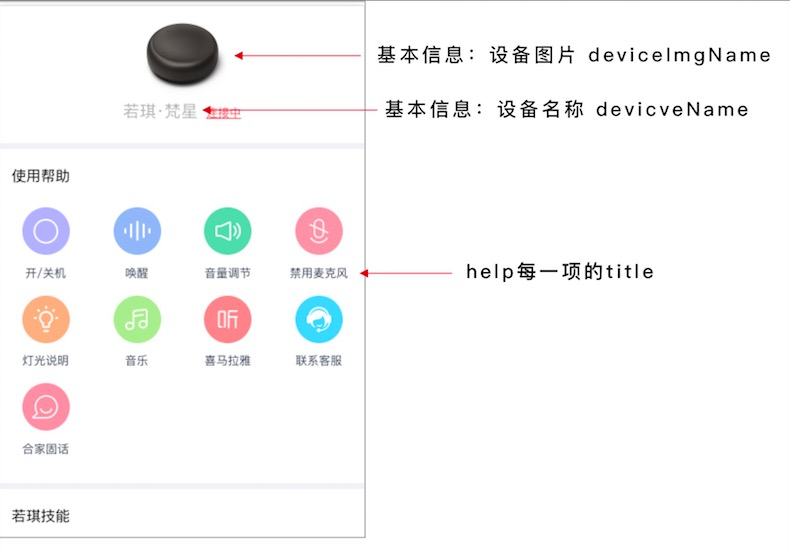
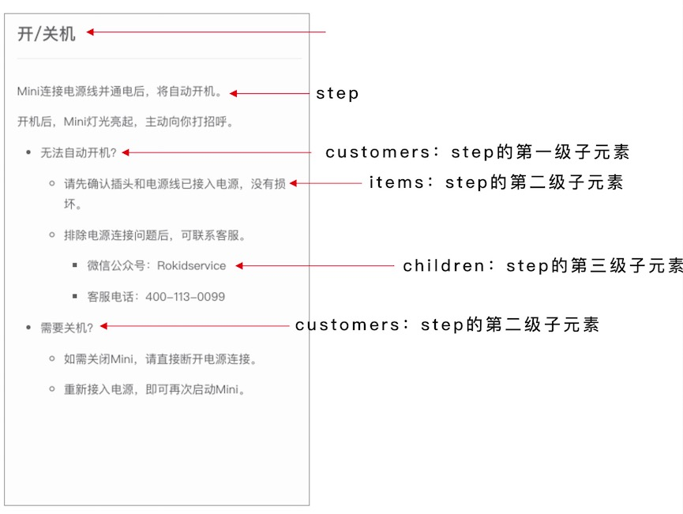
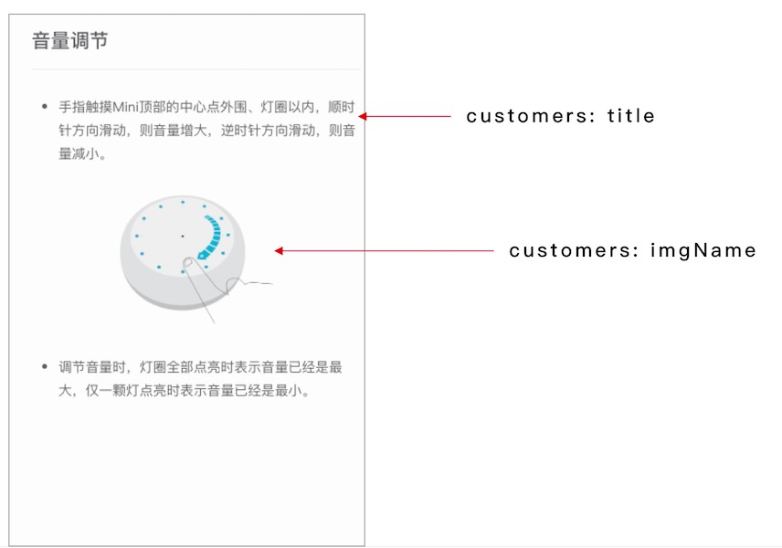

# 若琪-移动和家亲 H5 接入文档

### 介绍：
移动杭研和家亲 H5 页面开发采用的是 vue.js，代码编译使用 npm 和 webpack。

### 代码目录结构

```
apps --- 业务文件
    |  --- assets --- 静态资源等
    | --- | --- pc
    | --- | --- h5
    |  --- components --- 通用组件
    | --- |  --- pc --- pc组件
    | --- | --- h5 --- h5组件
    | --- modules  --- 页面目录
    | --- |  ---  program1
    | --- | --- | --- pc
    | --- | --- | --- h5
    | --- |  ---  program2
    | --- | --- | --- pc
    | --- | --- | --- h5
    |
build --- 本地服务、webpack配置文件等
    |
dist  ---   压缩
    |
mock --- 接口数据模拟
    |
node_modules --- 第三方包
```

下面是具体的操作流程

### Step1: 下载代码包
代码包地址，新接入的厂商请使用最新版本，以后的新功能也将只支持2.0版本：

* v2.0 版本：https://p.rokidcdn.com/web/cmcc/rokid-h5_v2.0.tar

* v1.0版本：https://p.rokidcdn.com/web/cmcc/rokid-h5.tar

下载完成后解压代码到本地

### Step2: 安装 npm 包
如果你本地没有安装 node， 请先到 node 官网安装。成功安装 node 之后执行如下命令：

```
cd rokid-h5
npm install
```

### Step3: 运行本地代码
你可以在本地开发多个项目，代码包中默认会有`cmcc/h5`相关的页面，如果你想开发多个设备的H5页面，复制 `apps/modules/cmcc` 文件到 `apps/modules` 并修改 `cmcc` 文件夹的名字为对应项目名称[name]即可（**文档中的[name]均表示项目名称**）。然后执行如下的命令运行本地代码：

```
npm run dev [name]-h5
```
该命令会生成一个 http 链接的地址和一个 https 链接的地址，会默认在浏览器中打开 http 链接的页面。

### Step4: 修改页面内容

#### v2.0 版本
新版本中对需要修改的文件做了提取，以配置文件的形式放在 `apps/modules/${name}/h5/config` 文件夹下

* basic 文件，basic文件中主要管理基本信息，具体字段说明：

```
deviceName: 设备名称,
deviceImgName: 图片名称，所有的图片都放在对应项目的 img 文件夹下面
```
* help 文件，所有帮助页面的内容，如果不需要某个帮助页面只要把help文件中对应的那一项删除即可。下面是 help 文件中字段的说明，为了帮助理解，后面会有对应的图文说明。

```
 // 这里我们以开关机这一项来举例，每一项在文件中都有注释说明其对应的帮助页面
  startup: {
    title: '开/关机',
    pageName: '开/关机', // 如果 pageName 与 title 相同则不需要写
    steps: [            // 帮助页面一级子元素
      {
        title: 'Mini连接电源线并通电后，将自动开机。'
      },
      {
        title: '开机后，Mini灯光亮起，主动向你打招呼。 ',
        customers: [   // 帮助页面二级子元素
          {
            title: '无法自动开机？ ',
            items: [{     // 帮助页面三级子元素，最多只支持三级
              title: '请先确认插头和电源线已接入电源，没有损坏。',
              imgName: 'mini.png'
            }, {
              title: '排除电源连接问题后，可联系客服。',
              children: ['微信公众号：Rokidservice', '客服电话：400-113-0099']
            }]
          },
          {
            title: '需要关机？',
            items: [{
              title: '如需关闭Mini，请直接断开电源连接。'
            }, {
              title: '重新接入电源，即可再次启动Mini。'
            }]
          }
        ]
      }
    ]
  },
```
图文描述：





#### V1.0版本（新接入的厂商请使用2.0版本）
现在生成的H5页面的内容是针对 若琪-繁星 设备的，因此页面中的部分文案需要做修改：

| 页面        | 修改         | 文件地址 |
| ------------- |:-------------:| -------------:|
| 页面名称     | 在 index.html 文件中修改 title 为对应的设备名称 | apps/modules/${name}/h5/index.html |
| 首页      | 修改头部设备图片和设备名称 | apps/modules/${name}/h5/index.html |
| 开/关机      | 页面内的文案 | apps/modules/${name}/h5/components/help/startup.vue |
| 唤醒 | 页面内的文案 | apps/modules/${name}/h5/components/help/wakeup.vue |
| 音量调节 | 页面内的文案 | apps/modules/${name}/h5/components/help/voice.vue |
| 禁用麦克风 | 页面内的文案 | apps/modules/${name}/h5/components/help/microphone.vue |
| 灯光说明 | 页面内的文案 | apps/modules/${name}/h5/components/help/light.vue |
| 音乐 | 页面内的文案 | apps/modules/${name}/h5/components/help/qq.vue |
| 喜马拉雅 | 页面内的文案 | apps/modules/${name}/h5/components/help/xmly.vue |
| 联系客服| 页面内的文案 | apps/modules/${name}/h5/components/help/service.vue |

### Step5: 页面打包上传

H5页面需要打包后上传到移动杭研的系统，本地打包命令：

```
// 测试环境打包
npm run publish-dev [name]-h5

// 线上打包
npm run publish-online [name]-h5
```
打包成功后会在 `dist/app/[name]/h5` 目录下生成：

* index.html:  html 文件
* static 文件夹: 存放所有js、css 和 图片
* production.zip: 代码压缩包

打包完成后，将production.zip文件上传到移动杭研系统即可。