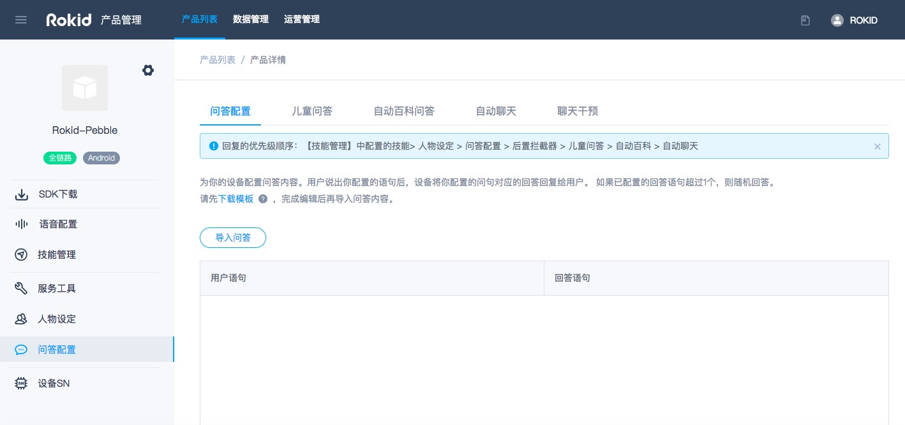
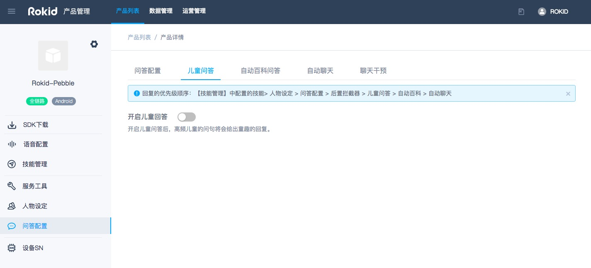
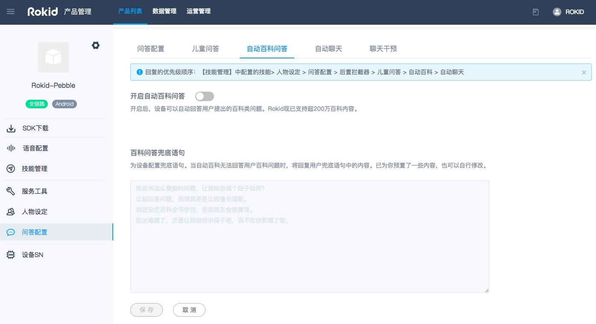
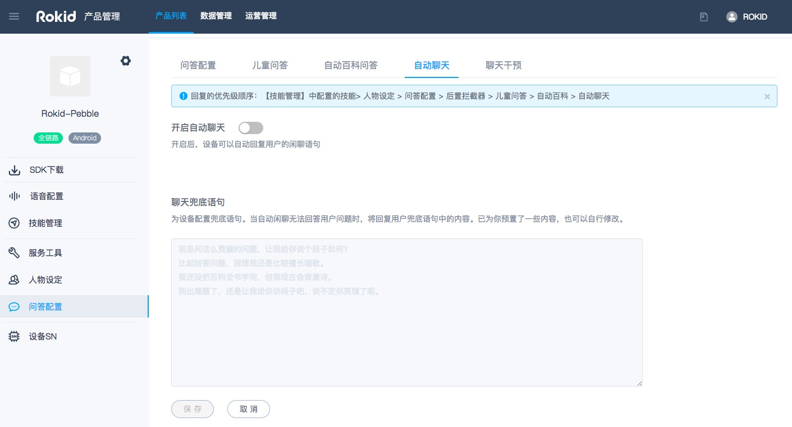
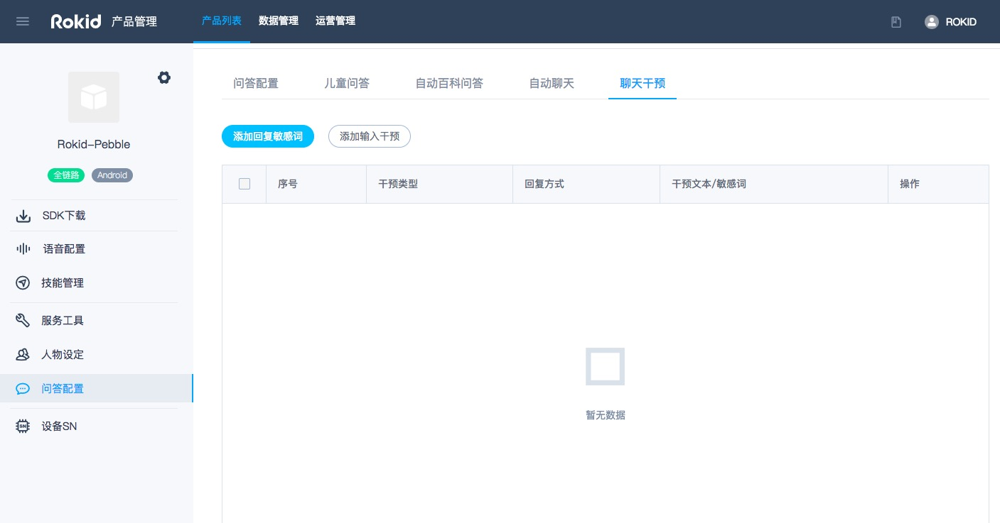
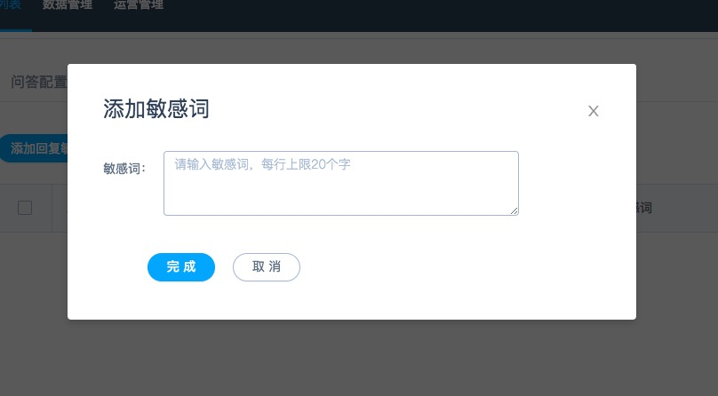
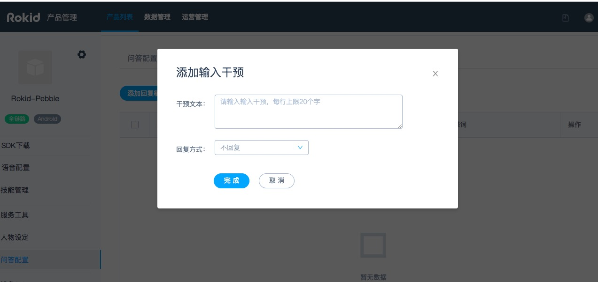

## 目录

B端用户既可以根据不同的设备接入相同的人工语料引擎，也可以通过人设引擎进行自定义差异化，还可以自主选择是否接入Rokid 百科文档引擎和自动聊天引擎。

* [一、人物设定](#一、人物设定)
* [二、问答配置](#二、问答配置)

### 人物设定

为你的设备进行人物设定。可点击【示例】查看设备将如何使用你输入的属性来回答用户的问题。

### 问答配置

分五部分：问答配置、儿童问答、自动百科问答、自动聊天、聊天干预

回复的优先级顺序：【技能管理】中配置的技能> 人物设定 > 问答配置 > 后置拦截器 > 儿童问答 > 自动百科 > 自动聊天

- 问答配置

为你的设备配置问答内容。用户说出你配置的语句后，设备将你配置的对应回答回复给用户。如果已配置的回答超过1个，则随机回复。

操作步骤：下载模版，按照模版的要求进行编辑，编辑好后，导入即可。

注意事项：
1. 问答内容分组上限为1000个，每组问答的问题上限为100个，回答上限为50个；
2. 分组内添加多个语义相近的用户语句，可以让机器人能理解更多的问法；
3. 分组内添加多个语义相近的回答语句，可以让用户感知到机器人不机械、有更多新鲜感；
4. 建议用户语句长度保持在50个汉字以内，回答语句在300个汉字以内；
5. 上传文件前请确认格式符合原模板。

- 儿童问答

开启儿童问答后，高频儿童的问句将会给出童趣的回复。

- 自动百科问答

开启后，设备可以自动回答用户提出的百科类问题。Rokid现已支持超200万百科内容。
百科兜底语句为设备配置兜底语句。当自动百科无法回答用户百科问题时，将回复用户兜底语句中的内容。已为你预置了一些内容，也可以自行修改。

- 自动聊天

开启后，设备可以自动回复用户的闲聊语句
聊天兜底语句为设备配置兜底语句，当自动闲聊无法回答用户问题时，将回复用户兜底语句中的内容。Rokid已为你预置了一些内容，也可以自行修改。

- 聊天干预

该功能可以针对敏感词和特定的用户语句进行干预，设备回复的优先级是聊天干预> 人物设定 > 问答配置 > 儿童问答 > 自动百科 > 自动聊天

点击【添加回复敏感词】，输入敏感词，注意敏感词的上线是20个字，输入完成后，点击页面的【完成】后，立马生效，当用户对设备说该句敏感词时，会进入聊天兜底。

点击【添加输入干预】，输入需要干预的文本，注意文本的上线是20个字，输入完成后，选择回复方式，目前回复的方式有三种选项：不回复、聊天兜底、百科兜底，可按照实际需求选择，点击页面的【完成】后，立马生效。

