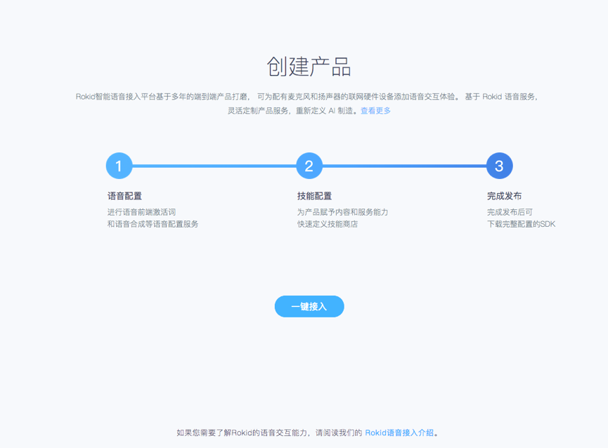
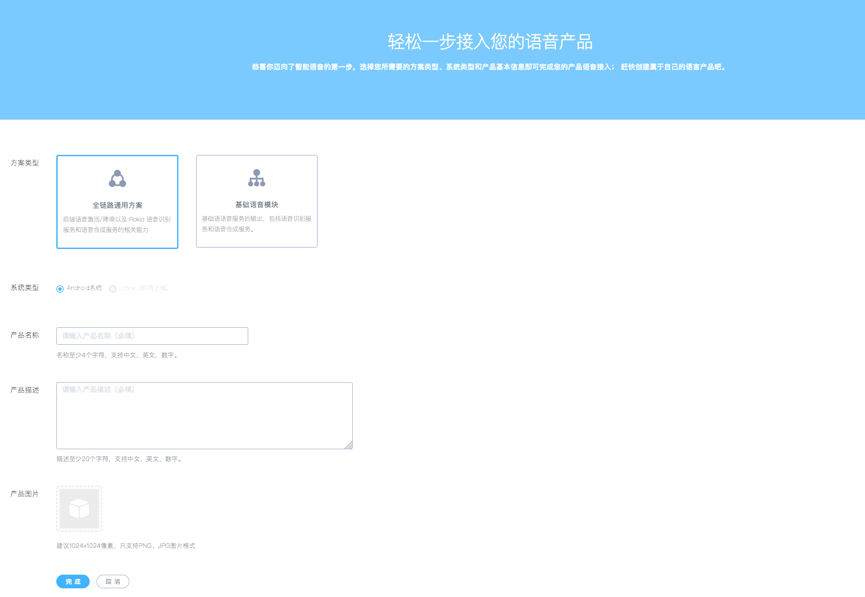
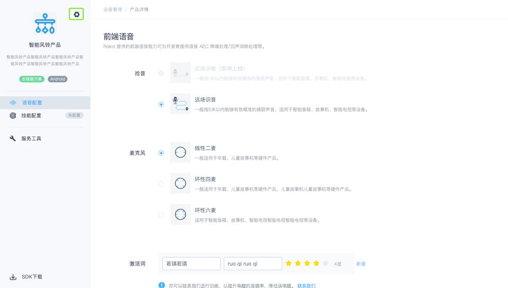
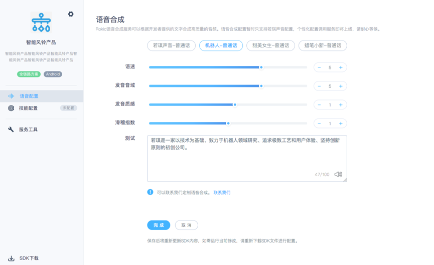

1. 登陆[开放平台](https://developer.rokid.com/#/)后，选择语音接入，单击「一键接入」开始创建，若账号下已创建产品，可以点击右上角“一键接入”进行创建产品。

2. 填写产品基本的信息，包括：方案类型，系统类型，产品名称，产品秒速，产品图片，填写完成后，可以进入语音配置。 

3. 可以进行前端配置，包括拾音方式的选择，麦克风阵列的选择、激活词的设置，激活词默认为「若琪若琪」，测试时为了保障效果建议使用「若琪若琪」。
可以通过设置按钮查看产品的基本信息。

4. Rokid语音合成服务可以根据开发者提供的文字合成高质量的音频。语音合成配置暂时只支持若琪声音配置，个性化配置调用服务即将上线，请耐心等候。

5. 可以进行服务工具的配置，包括热词和拦截器配置。

6. 如下图所示，点击页面左下角的「 SDK 下载」，可查看到 Key、Secret、公司/个人ID、TypeID。可以进行在线测试、获取SN号。

