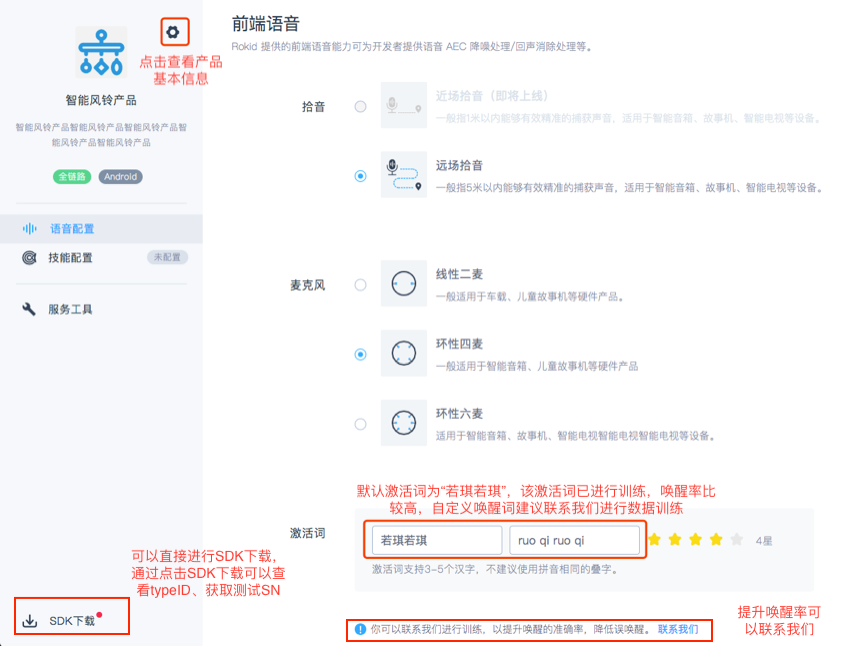
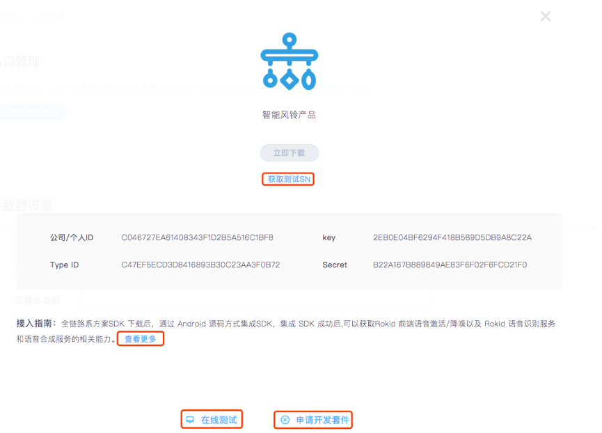
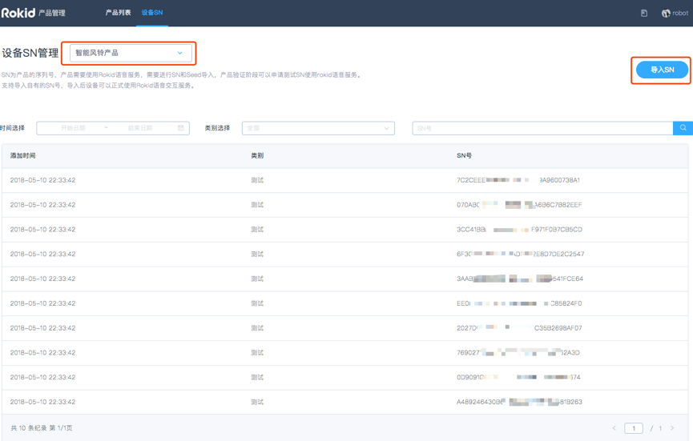

1. 登陆[开放平台](https://developer.rokid.com/#/)后，选择语音接入，单击「一键接入」开始创建，若账号下已创建产品，可以点击右上角“一键接入”进行创建产品。

2. 填写产品基本的信息，包括：方案类型，系统类型，产品名称，产品秒速，产品图片，填写完成后，可以进入语音配置。 

3. 可以进行前端配置，包括拾音方式的选择，麦克风阵列的选择、激活词的设置，激活词默认为「若琪若琪」，测试时为了保障效果建议使用「若琪若琪」。
可以通过设置按钮查看产品的基本信息。

4. Rokid语音合成服务可以根据开发者提供的文字合成高质量的音频。语音合成配置暂时只支持若琪声音配置，个性化配置调用服务即将上线，请耐心等候。

5. 可以进行技能配置，添加 Rokid 开放平台的技能，公有技能可以直接进行添加；私有技能需要申请，申请后需要技能开发者同意后才可使用。

6. 可以进行服务工具的配置，包括热词和拦截器配置。热词主要为了提升识别率；拦截器主要适用于兜底聊天和技能家居服务。

7. 如下图所示，点击页面左下角的「 SDK 下载」，可查看到 Key、Secret、公司/个人ID、TypeID。可以进行在线测试。

8. B 端厂商可在 [SDK 下载处](https://developer.rokid.com/voice/#/product/configuration/voice/7E5477C7F61449969E8A78800976CECE)获取测试 SN，可以通过筛选框，查看不同产品的测试 SN，产品验证阶段可以申请测试SN，使用rokid语音服务。产品上线时，需要联系商务签订合同并确认导入数量。每个产品默认有10个测试SN。测试SN的语音调用次数为2000次/日,SN（同device id）为设备的序列号，设备的唯一标识项。用于进行Rokid设备认证和Rokid平台服务认证的基础参数。
