## 目录

数据管理，在线查看登录账号下的产品统计数据，包括设备统计、语音交互和设备信息查询，其中设备统计又包含：累计激活设备、新增与留存、活跃与留存、版本分布。
备注：以下截图中的账号数据均为测试数据。

* [一、设备统计](#一、设备统计)
  * [累计激活设备](#1.1 累计激活设备)
  * [新增与留存](#1.2 新增与留存)
  * [活跃与留存](#1.3 活跃与留存)
  * [版本分布](#1.4 版本分布)
* [二、语音交互](#二、语音交互)
* [三、设备信息查询](#三、设备信息查询)

### 一、设备统计

#### 1.1累计激活设备

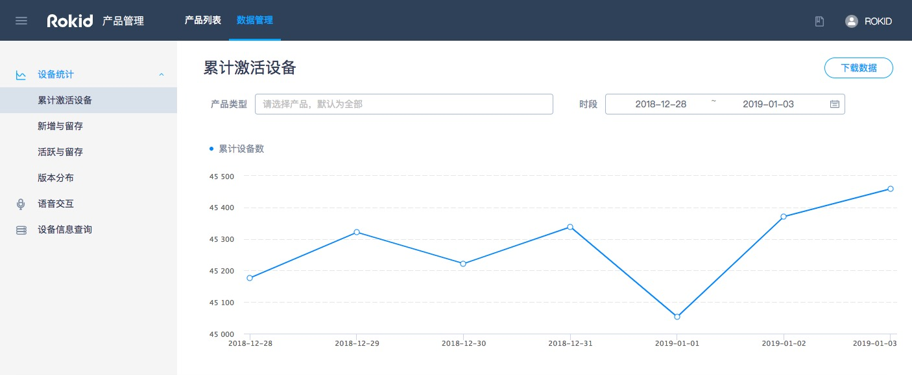

累计激活设备，用于统计登录账户下的某个时间段内的每日累计激活设备数。可以根据产品类型、时间段进行查询，支持即时查询即时反馈结果，默认展示全部产品最近一周的数据信息。除了直接查看数据，还可以点击“下载数据”按钮，下载查询结果数据进行分析。

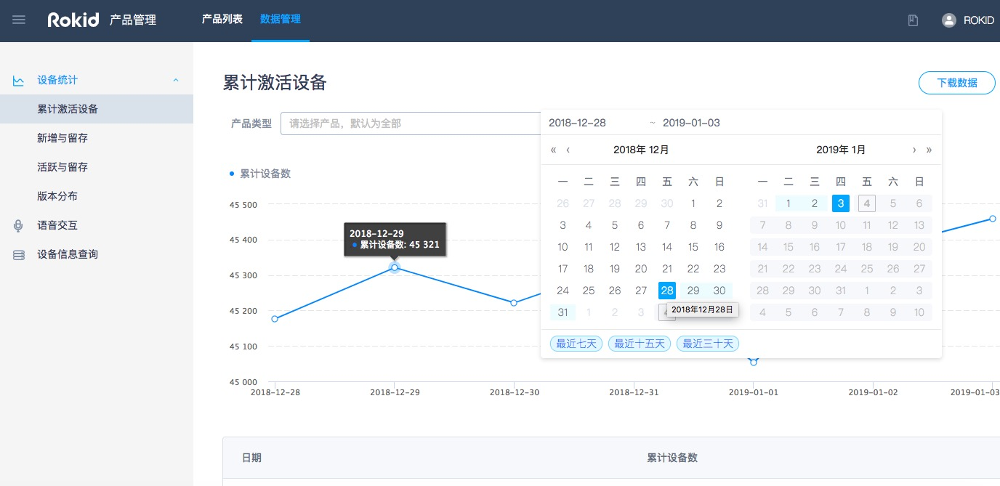

按时间段查询时，可以自主选择起始结束日期，也可以选择最近7天、最近15天、最近30天进行快速查询。

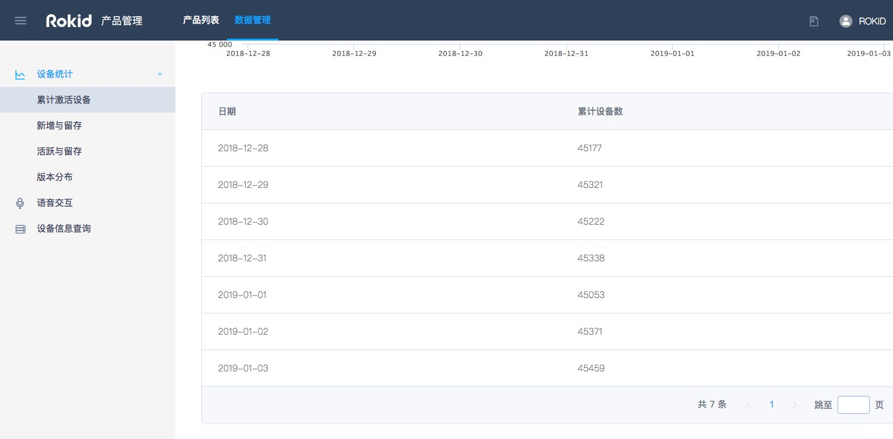

展示结果除了折线趋势图外，在趋势图下方还可以直接查看每日的具体数值。

 
#### 1.2 新增与留存

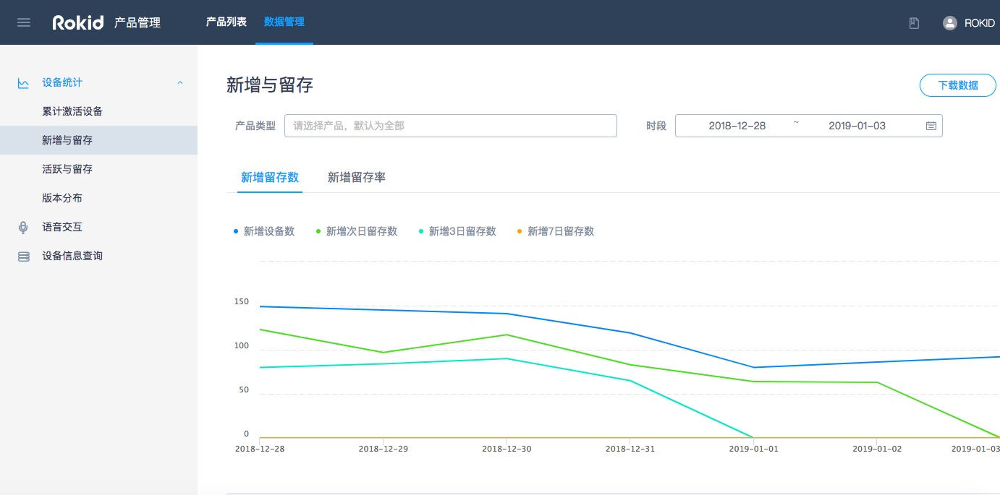

新增与留存，用于统计每日新增设备及其留存情况。次日留存数，是指前1天新增的用户，在第2天仍有访问交互的用户数；3日留存数，是指2天前新增的用户，在第3天仍有访问交互的用户数；7日留存数，是指6天前新增的用户，在第7天仍有访问交互的用户数。

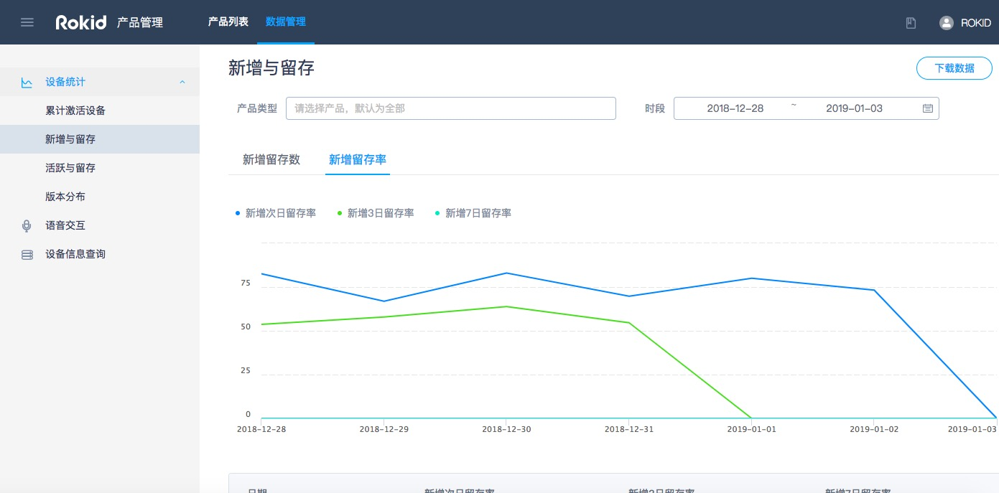

次日留存率，是指前1天新增的用户，在第2天仍有访问交互的用户占比；3日留存率，是指2天前新增的用户，在第3天仍有访问交互的用户占比；7日留存率，是指6天前新增的用户，在第7天仍有访问交互的用户占比。

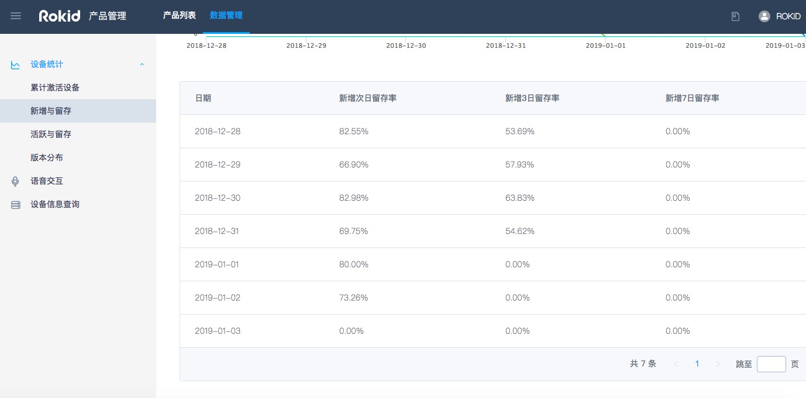

展示结果除了折线趋势图外，在趋势图下方还可以直接查看每日的具体数值。

#### 1.3 活跃与留存

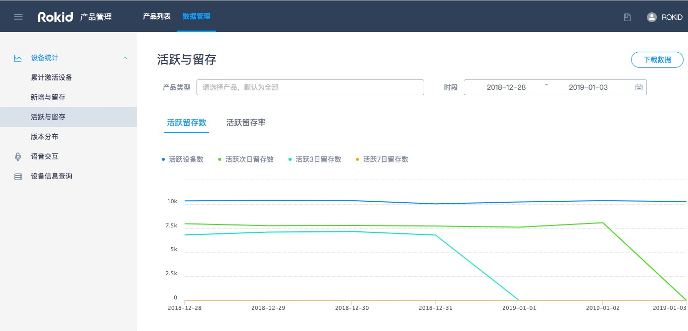

活跃与留存，用于统计每日活跃设备及其留存情况。次日留存数，是指前1天活跃的用户，在第2天仍有访问交互的用户数；3日留存数，是指2天前活跃的用户，在第3天仍有访问交互的用户数；7日留存数，是指6天前活跃的用户，在第7天仍有访问交互的用户数。

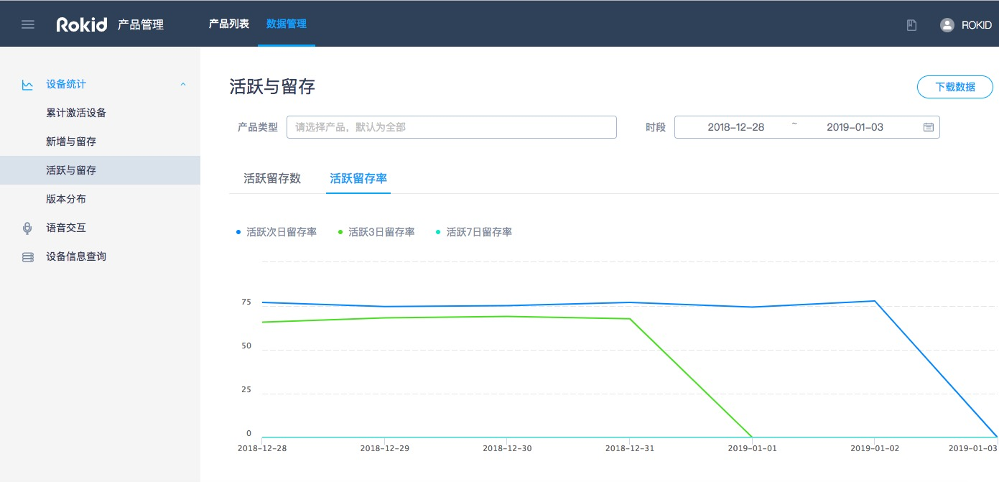

次日留存率，是指前1天活跃的用户，在第2天仍有访问交互的用户占比；3日留存率，是指2天前活跃的用户，在第3天仍有访问交互的用户占比；7日留存率，是指6天前活跃的用户，在第7天仍有访问交互的用户占比。

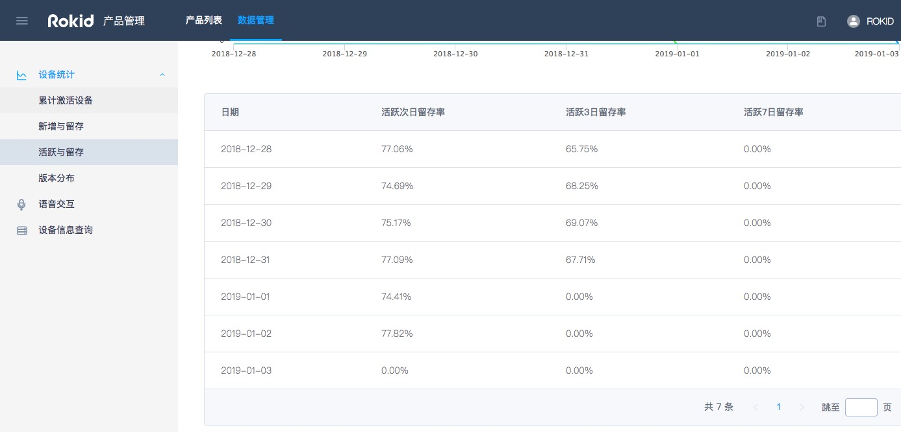

展示结果除了折线趋势图外，在趋势图下方还可以直接查看每日的具体数值。

#### 1.4 版本分布

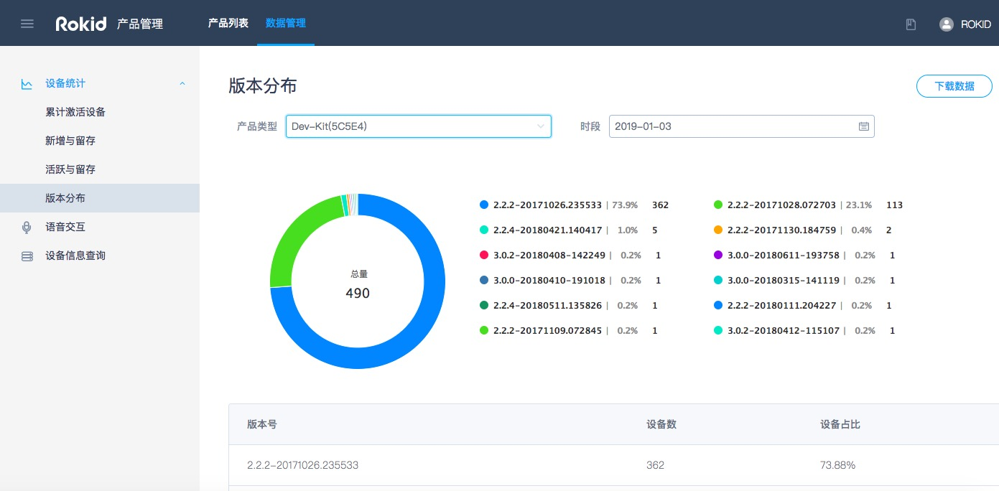

版本分布，用于统计某个产品类型，在某在截止日期的各版本占比情况。

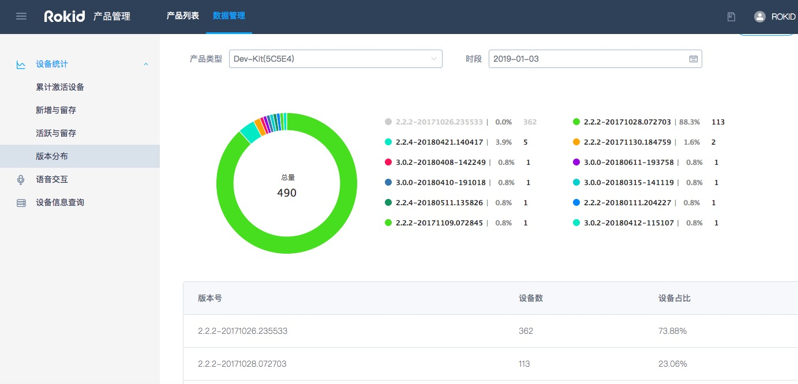

可以通过点击环形图右边的版本名称，进行取消版本（取消版本后，左边的环形图随之去除该版本，重新计算占比数据），再次点击则添加（添加版本后，左边的环形图随之增加该版本，重新计算占比数据）。

### 二、语音交互

可以根据设备的信息查询用户的语音交互的记录。

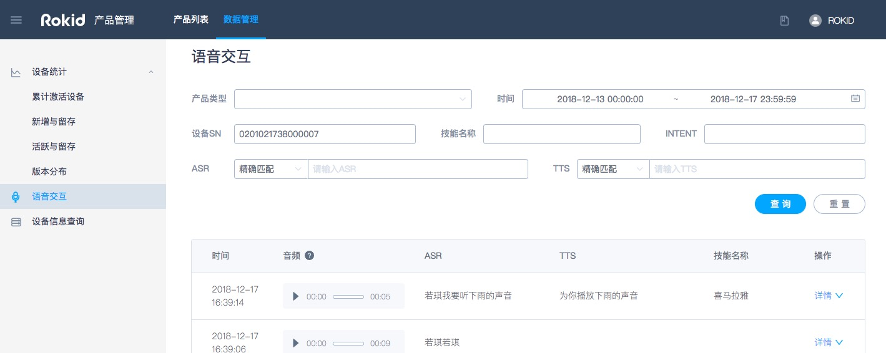

### 三、设备信息查询

可以根据设备的信息查询用户信息，也可以根据用户信息查询设备信息。

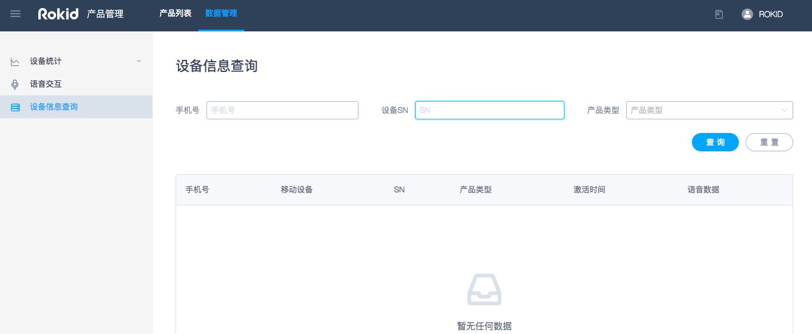

