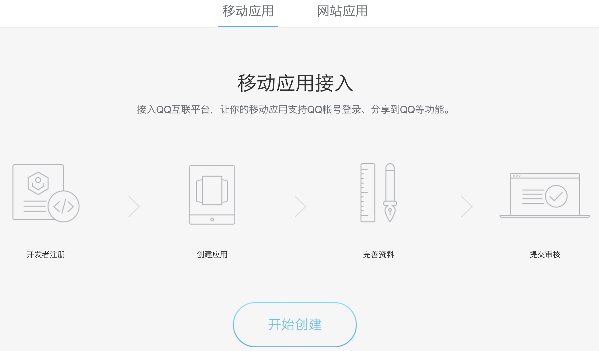
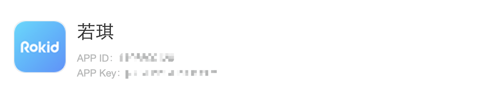

## 叮当音乐 Skill 接入流程

本文旨在介绍叮当音乐技能的接入流程，方便B端厂商快速接入叮当音乐优质的资源内容。

* [一、叮当音乐skill介绍](#一、叮当音乐skill介绍)
* [二、叮当音乐skill通用流程](#二、叮当音乐skill接入通用流程介绍)
* [三、叮当音乐skill接入流程](#三、叮当音乐skill接入流程)

  
### 一、叮当音乐skill介绍

#### 1.1 叮当音乐skill内容介绍

<table><tbody>
<tr style="font-weight:bold">  <td style="width: 100px">技能名称</td>  <td style="width: 180px">介绍</td>  <td style="width: 180px">价格</td> <<td style="width: 180px">>头部内容</td><td>内容数量</td></tr>
<tr>  <td>叮当音乐</td>  <td>容来自腾讯QQ音乐，API方式接入，需要和腾讯叮当进行商务合作</td>  <td>15元／台／年以上</td> <td>歌手：周杰伦、陈奕迅、王菲、张学友、刘德华、林俊杰、李荣浩、邓紫棋、艾伦.沃克、张杰、杨宗纬、李宇春、陈粒、赵雷、张靓颖、吴亦凡、金志文、胡彦斌、TFboys、胡66、华晨宇、周笔畅等
歌单&专辑：抖音神曲、中国好声音、中国新说唱、明日之子等</td> <td>歌曲数1700W
腾讯QQ音乐音箱端版权所有歌曲</td> </tr>

#### 1.2 叮当音乐skill功能列表

<table>
    <tr>
        <td>功能</td> 
        <td>示例</td> 
        <td>备注</td> 
   </tr>
    <tr>
        <td >歌手点播</td>    
        <td >我要听刘德华的歌</td>  
        <td></td>
    </tr>
    <tr>
        <td >歌曲点播</td> 
        <td >我要听冰雨</td> 
         <td></td> 
    </tr>
     <tr>
        <td >歌手+歌曲点播</td> 
        <td >我要听刘德华的冰雨</td>  
          <td></td> 
    </tr>
     <tr>
        <td >播放我的收藏</td> 
        <td >播放我的收藏歌曲</td>
          <td></td>  
    </tr>
     <tr>
        <td >点播专辑</td> 
        <td >播放周杰伦的专辑范特西</td> 
          <td></td> 
    </tr>
     <tr>
        <td >播放榜单歌曲</td> 
        <td >我要听新歌榜</td> 
          <td></td>
    </tr>
     <tr>
        <td >若琪推荐</td> 
        <td >播放音乐</td> 
          <td></td>
    </tr>
     <tr>
        <td >年代、场景、情绪点播</td> 
        <td >播放睡前音乐</td> 
        <td></td>
    </tr>
     <tr>
        <td >语言点播</td> 
        <td >我要听中文歌</td> 
         <td></td>
    </tr>
     <tr>
        <td >点播播放历史</td> 
        <td >播放我最近听过的歌</td> 
         <td></td>
    </tr>
     <tr>
        <td >歌手类别点播</td> 
        <td >我要听华语歌手的歌 / 我要听男歌手的歌</td> 
         <td></td>
    </tr>
     <tr>
        <td >下一首/td> 
        <td >下一首</td> 
        <td></td>
    </tr>
     <tr>
        <td >上一首</td> 
        <td >上一首</td> 
        <td></td>
    </tr>
     <tr>
        <td >停止播放</td> 
        <td >别放了</td> 
        <td></td>
    </tr>
     <tr>
        <td >继续播放</td> 
        <td >继续播放</td> 
         <td></td>
    </tr>
     <tr>
        <td >暂停</td> 
        <td >暂停播放</td> 
         <td></td>
    </tr>
     <tr>
        <td >取消循环</td> 
        <td >取消单曲循环</td> 
        <td></td>
    </tr>
     <tr>
        <td >单曲循环</td> 
        <td >单曲循环</td> 
        <td></td>
    </tr>
     <tr>
        <td >从头播放</td> 
        <td >再放一遍</td> 
        <td></td>
    </tr>
     <tr>
        <td >收藏/我喜欢</td> 
        <td >我喜欢这首歌 / 收藏</td> 
        <td>需要接入账号绑定才支持收藏</td>
    </tr>
    <tr>
        <td >歌曲黑名单</td>    
        <td >我不喜欢这首歌</td>  
        <td></td>
    </tr>
    <tr>
        <td >不取消收藏</td> 
        <td >取消收藏</td>  
        <td></td>
    </tr>
     <tr>
        <td >帮助</td>    
        <td >介绍下音乐功能</td>  
        <td></td>
    </tr>
     <tr>
        <td >取消订阅专辑</td> 
        <td >取消订阅</td> 
    </tr>
     <tr>
        <td rowspan="2">喜欢</td>    
        <td >喜欢某个声音</td>  
        <td>喜欢</td>
    </tr>
     <tr>
        <td >询问歌曲信息</td> 
        <td >这是什么歌/这首歌谁唱的</td> 
    </tr>
</table>

### 二、叮当音乐skill接入通用流程介绍

需要合作方和若琪商务（rokidopen@rokid.com）、叮当音乐商务确定合作，确定商务协议后，进行叮当音乐skill的接入，需要进行的步骤: 

#### 2.1.获取叮当音乐App key和App secret：详细见3.1描述 

#### 2.2.若琪开放平台授权叮当音乐相关 skill：详细见3.2描述   

#### 2.3.移动端 App 内容展示/点播：详细见3.3描述  

需要手机App进行内容展示时需要开发，如不需App内容展示，则无需开发。

#### 2.4.QQ音乐账号oauth流程：详细见3.4描述    

接入QQ音乐账号登录后，则合作方用户可关联其已有QQ音乐账号下的收藏歌曲，并支持收藏相关功能，如不需要QQ音乐账号登陆，则无需开发。

### 三、叮当音乐skill接入流程

#### 3.1 获取叮当音乐的App key和App Secret

每个合作商在商务流程确认后，腾讯叮当会给到该厂商持有的App Key和APP Secret，用来申请音乐资源。

#### 3.2 若琪开放平台授权叮当音乐相关 skill

联系对接的商务进行授权。并将在叮当音乐商务给到的 App Key 和 App Secret 给到对应的商务。

#### 3.3 移动端 App 内容展示/点播

目前叮当音乐还未开放资源展示页面，正在开发中，后续再提供移动端App内容展示界面。

#### 3.4 QQ音乐账号oauth流程

叮当音乐未登录QQ音乐账号时可以进行点播、控制功能，但只有绑定了QQ音乐账号后，才可以享受个性化音乐推荐，使用收藏功能。

3.4.1.合作方需要在[QQ互联平台](https://connect.qq.com/index.html)创建移动应用

备注：目前腾讯已不开放微信登录能力，厂商新申请的微信登录的ID是不能打通微信登录的，只能使用QQ账号登录。

3.4.2.在QQ互联平台-应用管理-移动应用-查看处获取App ID 和 App Key，用于QQ音乐账号 oauth

3.4.3.将从QQ互联平台获取的App ID 和 App Key 给到对应的商务。

3.4.4.提供两种oauth流程接入方式：

1）公版APP方式：
如果是通过公版APP的方式接入，已包含oauth鉴权的流程和页面，只需在开放平台创建一个APP即可：[开放平台APP配置](https://account.rokid.com/account.html#/login?redirect=https%3A%2F%2Fdeveloper.rokid.com%2Fvoice%2F%23%2Fproduct%2Fcreate%2Flist)。
 
2）SDK方式：

如果是通过SDK方式接入，则需要按照以下文档开发完成SDK接入才可以完成喜马拉雅账号oauth鉴权：

IOS：[IOS端QQ音乐账号授权接入文档](https://rokid.github.io/mobile-sdk-ios-docs/res/skill/media_thrid_qq.html)

Android：[Android端QQ音乐账号授权接入文档](https://rokid.github.io/mobile-sdk-android-docs/res/skill/media_thrid_qq.html)

再次提醒下，目前腾讯已不开放微信登录能力，合作商新申请的微信登录的ID是不能打通微信登录的，只能使用QQ账号登录，所以不用开发微信登录。

 

