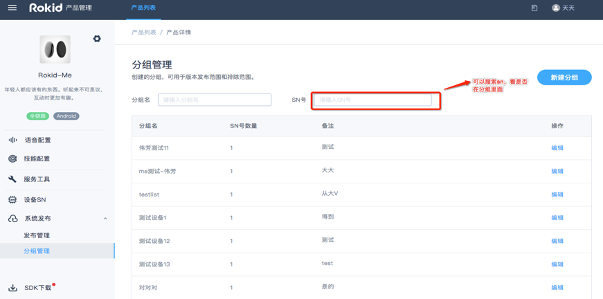
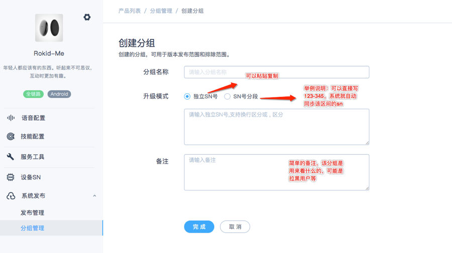

## 目录

本文介绍如何通过“Rokid开放平台”对设备进行系统升级。

* [一、系统发布服务](#一、系统发布服务)
* [二、系统发布流程](#二、系统发布流程)
* [三、分组管理](#三、分组管理)

### 系统发布服务

- 集中管理上传镜像、版本、设备、分组，用户可以在该页面查询历史系统版本，也可以发布系统版本。目前这个功能需要联系商务（商务邮箱：rokidopen@rokid.com）进行申请。

### 系统发布流程

- 点击页面【新建版本】，即可进入系统版本发布的页面。按照页面的要求，填写好发布对象、文档路径、MD5值等。

MD5的典型应用是对一段Message(字节串)产生fingerprint(指纹)，以防止被“篡改”。举个例子，你将一段话写在一个叫 readme.txt文件中，并对这个readme.txt产生一个MD5的值并记录在案，然后你可以传播这个文件给别人，别人如果修改了文件中的任何内容，你对这个文件重新计算MD5时就会发现（两个MD5值不相同）。
发布完成后，若用户设备在线的时候，如果我们强制升级的话，设备会自动进行升级，如果用户设备没有在线，重新配网的同时，自动升级。

### 分组管理

- 分组管理是用来管理用户的，可以通过分组管理针对部分用户进行灰度或者测试。

