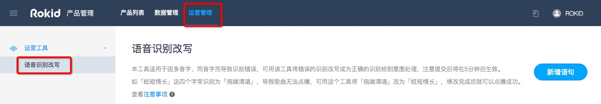
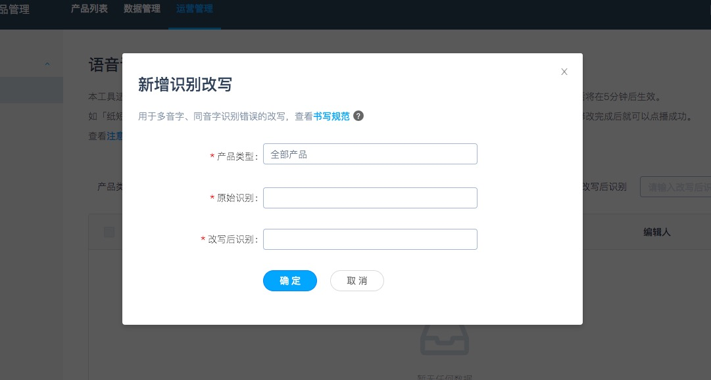

## 目录

本工具适用于因多音字、同音字而导致识别错误，可用该工具将错误的识别改写成为正确的识别给到意图处理，注意提交后将在5分钟后生效。
如「纸短情长」这四个字常识别为「指端清唱」，导致歌曲无法点播，可用这个工具将「指端清唱」改为「纸短情长」，修改完成后就可以点播成功。

备注：该功能暂未对外开放，如需要此功能，需要联系商务（商务邮箱：rokidopen@rokid.com）进行申请。

### 功能操作路径

登陆[Rokid开放平台](https://developer.rokid.com/#/)，选择【控制台】-【语音整体方案】-【运营管理】

  
### 选择适用的产品

### 操作改写

点击页面的【新增改写】，进入改写的页面，填写原始识别和改写后的识别。

### 注意事项：

- 该工具并不是直接修改的语音识别结果，而是介于ASR（语音识别）和NLP（意图处理）之间，将错误的识别转写称为正确的识别给到意图处理。
- 该工具是将所有ASR（语音识别）中的「原始识别」全部批量替换为「改写后识别」，如若将「上一」改写为「下一」，所有包含“上一”的内容都会被改写，如「上一首」「爱上一个人」都会被改写为「下一首」「爱下一个人」进入NLP（意图处理）将得到完全错误的结果。
- 严禁用于其它问题的改写。

### 书写规范：

简体中文

- 不支持阿拉伯数字，必须转换为简体中文，例如：晓说2018→晓说二零一八或者二零幺八；
- 不支持繁体中文；

英文

- 不支持标点符号，但是it’s中的 ’ 可以存在。

