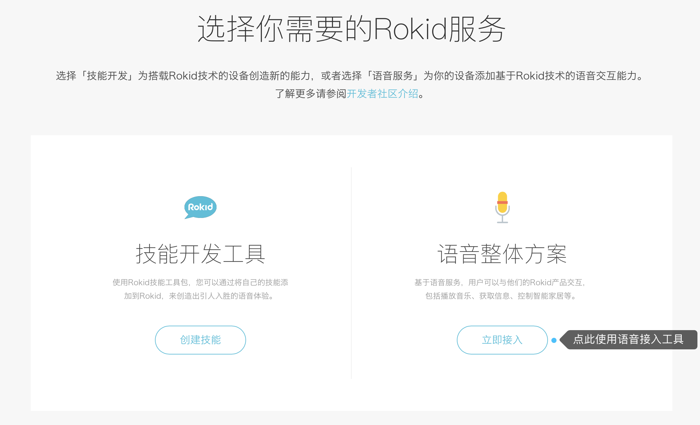

#### 概要

本文介绍如何通过“Rokid开放平台”如何接入我们的语音能力。

* [一、登录平台账号](#一、登录平台账号)
* [二、创建产品](#二.创建产品)
* [三、获得配置语音产品配置信息](#三、获得配置语音产品配置信息)
* [四、技能配置](#四、技能配置)
* [五、开始对接Rokid语音能力接口](#五、开始对接Rokid语音能力接口)


#### 一、登录平台账号

**若没有账号请先注册，再登录**

使用Rokid开放平台的语音整体方案，请先点击“[Rokid开放平台](https://developer.rokid.com/#/)”首页右上方的【登录】按钮，登录“Rokid开放平台”。如果未有账号，则点击旁边的【注册】按钮进行注册。如下图所示。


登录后，进入“Rokid开放平台”的控制台。首先阅读《开发者社区服务协议》，同意该协议则勾选【同意并接受该协议所有内容】，点击【确定】。如下图所示。


在【语音整体方案】板块，点击【立即接入】，即可开始使用语音接入工具。如下图所示。




#### 二.创建产品

产品是指您想要接入Rokid语音服务的一种实体设备，一个产品只对应一种语音配置。如您想要实现多种语音配置效果，需要创建多个产品。

注册完成后，在“[**Rokid开放平台官网**](https://developer.rokid.com/#/)”点击【语音接入】后，就可以进入创建产品的页面。

- 首次创建产品，可以查看到【创建流程】，点击【一键接入】即可进行创建产品。 如下图所示。
  

- 若账号下已有创建过的产品，若想直接编辑已有产品，点击图标为笔的按钮；若想创建新的产品，点击页面右上角的【一键接入】即可。如下图所示。

  


#### 三、获得配置语音产品配置信息

```
每个语音产品建立完成后，都会分配10个测试sn提供调试测试使用
```

 
 
 
 
 
 
#### 四、技能配置
```
在语音产品创建完成后，rokid开放平台会默认配置一些常用的技能到语音产品类型下，也可以自行移除或添加
```


技能配置详见[技能开通文档](https://developer.rokid.com/docs/5-enableVoice/rokid-vsvy-sdk-docs/rookie-guide/skillstore.html)

#### 五、开始对接Rokid语音能力接口
[开始对接语音接口](https://developer.rokid.com/docs/3-ApiReference/openvoice-api.html)
