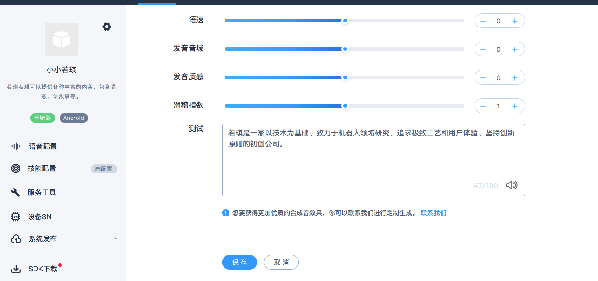
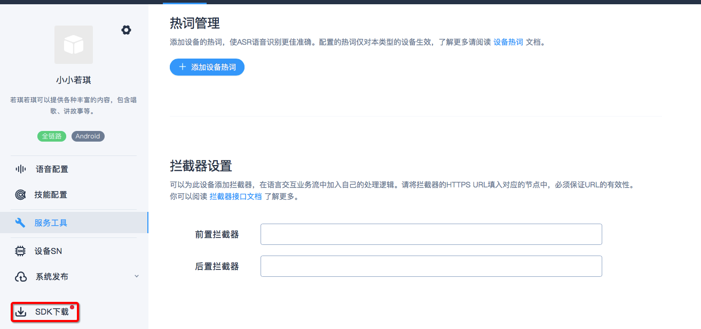
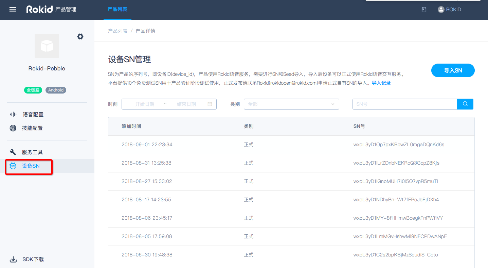
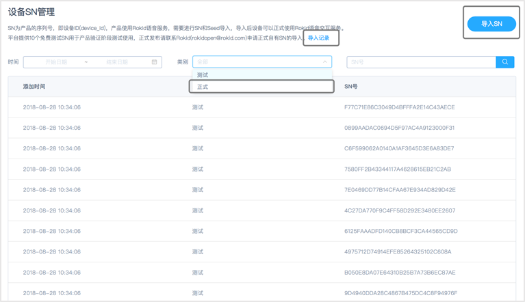
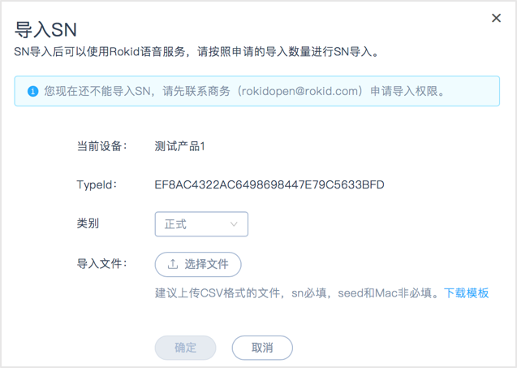

## 目录

本文介绍如何通过“Rokid开放平台”如何创建产品，获取SDK、导入sn。

* [一、创建和配置产品](#创建和配置产品)
  * [登录平台账号](#登录平台账号)
  * [创建产品](#创建产品)
  * [配置产品](#配置产品)
* [二、获取SDK](#获取sdk)
* [三、设备SN导入和管理](#设备SN导入和管理)
  * [正式与测试SN](#正式与测试SN)
  * [导入正式SN](#导入正式SN)
  
### 创建和配置产品

#### 登录平台账号

**若没有账号请先注册，再登录**

使用Rokid开放平台的语音整体方案，请先点击“[Rokid开放平台](https://developer.rokid.com/#/)”首页右上方的【登录】按钮，登录“Rokid开放平台”。如果未有账号，则点击旁边的【注册】按钮进行注册。如下图所示。

登录后，进入“Rokid开放平台”的控制台。首先阅读《开发者社区服务协议》，同意该协议则勾选【同意并接受该协议所有内容】，点击【确定】。如下图所示。

在【语音整体方案】板块，点击【立即接入】，即可开始使用语音接入工具。如下图所示。

#### 创建产品

产品是指您想要接入Rokid语音服务的一种实体设备，一个产品只对应一种语音配置。如您想要实现多种语音配置效果，需要创建多个产品。

注册完成后，在“[**Rokid开放平台官网**](https://developer.rokid.com/#/)”点击【语音接入】后，就可以进入创建产品的页面。

- 首次创建产品，可以查看到【创建流程】，点击【一键接入】即可进行创建产品。 如下图所示。
  

- 若账号下已有创建过的产品，若想直接编辑已有产品，点击图标为笔的按钮；若想创建新的产品，点击页面右上角的【一键接入】即可。如下图所示。

  

##### 填写产品基本信息

填写产品相关的【方案类型】、【系统类型】、【产品名称】、【产品描述】、【产品图片】等基本信息。

**注意：**【方案类型】分为 [**全链路通用方案**](./fullLink/fulllink.md) 和 [**基础语音模块**](./speechTTS/speechtts.md) 两种。两者的主要区别是：全链路方案会包含前端模块（拾音方式和MIC阵列），基础语音模块不包含前端模块（拾音方式和MIC阵列）。

#### 配置产品

#### 语音配置

#### **1)前端语音配置**

可根据硬件产品选择【拾音方式】、【麦克风阵列】，并设置【激活词】。如下图所示。

##### 激活词

**`激活词`**即**`唤醒词`**，默认为“若琪”，该激活词已经进行训练，唤醒率比较高，测试时为了保障效果建议使用“若琪”。

设置自定义激活词，请单击**`激活词`**输入框输入想要的激活词；**`激活词`**支持4～5个汉字，不建议使用拼音相同的叠字或带有“若琪”字眼的词语，**`激活词`**的评分需在3星以上才能保存。

若您选择了自定义**`激活词`**，且要求优秀的唤醒效果，建议联系商务（商务邮箱：rokidopen@rokid.com）申请数据训练。

#### **2)语音合成配置**

当前页面下拉，编辑“语速”、“发音音域”等可自定义配置语音合成效果。目前只支持【若琪声音-普通话】的调用。其他类型合成音只提供在线试听，暂不可应用到设备，后期会实现应用至设备端。 

##### 服务工具配置

服务工具的配置，包括热词和拦截器配置。热词主要为了提升识别率；拦截器主要适用于兜底聊天和技能家居服务。 具体参照以下指南：

[热词管理接入指南](https://developer.rokid.com/docs/5-enableVoice/rokid-vsvy-sdk-docs/important-concept.html)

[拦截器设置接入指南](https://developer.rokid.com/docs/3-ApiReference/rokid-interceptor.html)

### 获取SDK

完成产品的创建和配置后，即可获取产品的SDK。获取SDK有如下两种方式。

#### 方式一

在【产品列表】页面下，选择相应的产品选项卡，点击选项卡右下角的下载图标，即可下载产品SDK。如下图所示。

#### 方式二

在产品的编辑页面，点击页面左下角【SDK下载】即可获取产品的SDK。

点击后会弹出如下页面，可选择下载SDK、获取测试序列号或在线测试产品等。如下图所示。

### 产品SN导入

#### 正式与测试SN

- 什么是SN和测试SN
SN为产品的序列号，即设备ID(device_id)，产品使用Rokid语音服务，需要进行SN（仅支持数字、字母和下划线"_")和Seed（仅支持数字、字母)导入，导入后设备可以正式使用Rokid语音交互服务。平台提供10个免费测试SN用于产品验证阶段测试使用，正式发布请联系Rokid(rokidopen@rokid.com)申请正式自有SN的导入。

SN为厂商根据自己的实际情况来定义，支持数字、字母，且字母区分大小写（比如SN00001和sn00001，为两个不同的sn号）。

测试SN是用于测试期间使用Rokid设备认证和获取平台服务的设备的SN号。

平台提供10个免费测试SN用于产品验证阶段测试使用。正式发布请联系Rokid(rokidopen@rokid.com)，以申请自有设备SN的导入权限。

- 设备TypeID和设备ID(device_id，即SN)的区别

设备typeID是同一类型硬件产品的ID，而设备ID则为该类型产品下单个设备的唯一ID。技能授权仅与typeID有关，与设备ID无关。用户提供typeID获取了技能授权后，该typeID下的所有设备均可使用这些技能。

如：Rokid Pebble的typeID为95XXXXXX，但每一台pebble都有自己的id（SN号）。

- 什么是seed？在什么情况下需要使用seed？

seed为设备登录换取设备类型的key和secret的密钥。如果厂商不使用设备登录模块，这可以不依赖seed。

- 获取测试SN

产品管理页面，点击左侧导航中的【设备SN】，即可看到10个默认提供的测试SN号。

###### 每个测试SN号对应的seed，可以通过点击【导入记录】来下载。

若想要申请更多的测试序列号，请联系商务（商务邮箱：rokidopen@rokid.com）。

#### 导入正式SN

测试完成后，若想正式使用Rokid服务，需要导入正式SN。

正式序列号需要联系商务（商务邮箱：rokidopen@rokid.com），签订合同后才能获取导入资格。
**邮件内容请写明：公司名称、联系方式、申请导入SN数量。**商务授权后即可导入正式 SN。导入正式序列号后，Rokid 开放平台即对这批SN设备进行授权，这批设备即可正式使用 Rokid 语音交互服务。

- 具体操作

进入【产品列表】页面的产品页面，点击【设备SN】，并按照指定模板导入即可。如下图所示：

下载模板，按照模板格式来编写文件。模板中，有三列，分别为SN、Seed、Mac，且提供了一个例子。其中，SN列，必填；Seed列，当您无seed或者不需要seed时，此列可不必填写，Rokid会为sn生成对应的Seed（在导入记录中下载）；Mac列，非必填，当业务需要时填写。
导入完成后，页面会提示导入是否成功。同时，在【导入记录】中也会新增每次导入的记录和错误反馈。导入成功的10分钟后，该批设备即可使用Rokid平台的语音服务。客户可以在页面的【类别选择】中选择【正式】类别查看自己导入的SN号。

**注意：**当Seed不填为空时，依旧保留该列，保留占位符，方便正确读取每列的信息。若导入的sn号有重复，系统会自动对其进行去重，重复的sn号不计算在总的sn号数量里。一次最多支持5万个sn号的导入。

