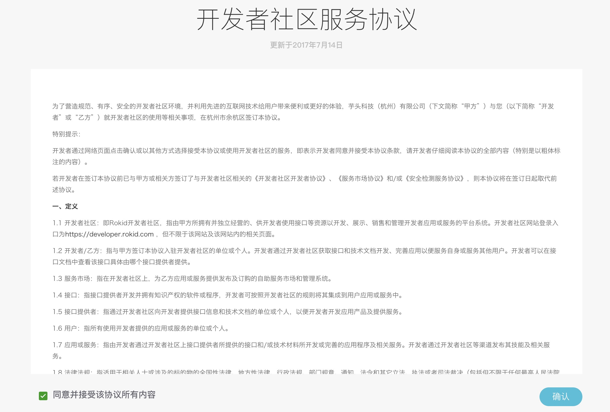
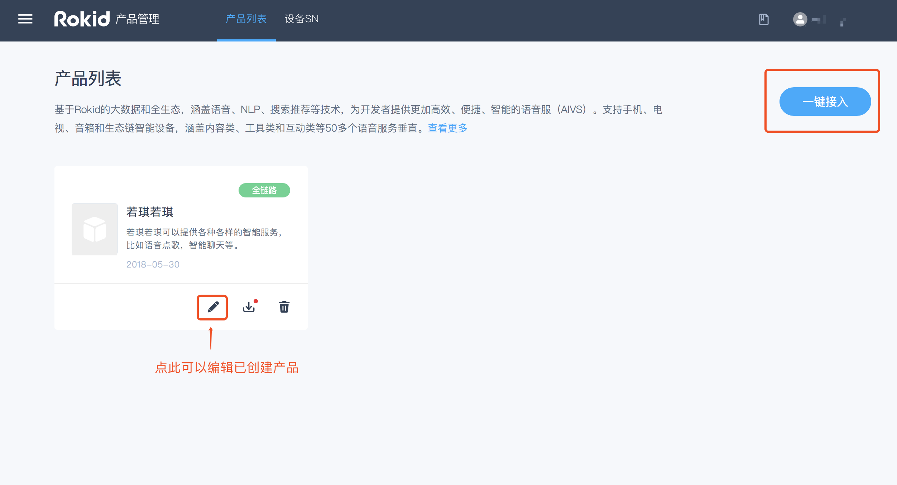

## 目录

本文介绍如何通过“Rokid开放平台”获取SDK、配置产品技能、聊天以及对设备进行系统升级。

* [一、创建和配置产品](#一、创建和配置产品)
  * [登录平台账号](#登录平台账号)
  * [创建产品](#创建产品)
  * [配置产品](#配置产品)
* [二、获取SDK](#二、获取sdk)
* [三、设备SN导入和管理](#三、设备SN导入和管理)
  * [获取测SN](#设备SN获取)
  * [导入正式SN](#导入正式SN)
* [四、系统发布服务](#四、系统发布服务)
* [五、聊天功能配置](#五、聊天功能配置)
  
### 一、创建和配置产品

#### 1. 登录平台账号

**若没有账号请先注册，再登录**

使用Rokid开放平台的语音整体方案，请先点击“[Rokid开放平台](https://developer.rokid.com/#/)”首页右上方的【登录】按钮，登录“Rokid开放平台”。如果未有账号，则点击旁边的【注册】按钮进行注册。如下图所示。

登录后，进入“Rokid开放平台”的控制台。首先阅读《开发者社区服务协议》，同意该协议则勾选【同意并接受该协议所有内容】，点击【确定】。如下图所示。

在【语音整体方案】板块，点击【立即接入】，即可开始使用语音接入工具。如下图所示。

#### 2. 创建产品

产品是指您想要接入Rokid语音服务的一种实体设备，一个产品只对应一种语音配置。如您想要实现多种语音配置效果，需要创建多个产品。

注册完成后，在“[**Rokid开放平台官网**](https://developer.rokid.com/#/)”点击【语音接入】后，就可以进入创建产品的页面。

- 首次创建产品，可以查看到【创建流程】，点击【一键接入】即可进行创建产品。 如下图所示。
  

- 若账号下已有创建过的产品，若想直接编辑已有产品，点击图标为笔的按钮；若想创建新的产品，点击页面右上角的【一键接入】即可。如下图所示。

  

##### 填写产品基本信息

填写产品相关的【方案类型】、【系统类型】、【产品名称】、【产品描述】、【产品图片】等基本信息。

**注意：**【方案类型】分为 [**全链路通用方案**](./fullLink/fulllink.md) 和 [**基础语音模块**](./speechTTS/speechtts.md) 两种。两者的主要区别是：全链路方案会包含前端模块（拾音方式和MIC阵列），基础语音模块不包含前端模块（拾音方式和MIC阵列）。

#### 3. 配置产品

##### 语音配置

##### **1)前端语音配置**

可根据硬件产品选择【拾音方式】、【麦克风阵列】，并设置【激活词】。如下图所示。

##### 激活词

**`激活词`**即**`唤醒词`**，默认为“若琪”，该激活词已经进行训练，唤醒率比较高，测试时为了保障效果建议使用“若琪”。

设置自定义激活词，请单击**`激活词`**输入框输入想要的激活词；**`激活词`**支持4～5个汉字，不建议使用拼音相同的叠字或带有“若琪”字眼的词语，**`激活词`**的评分需在3星以上才能保存。

若您选择了自定义**`激活词`**，且要求优秀的唤醒效果，建议联系商务（商务邮箱：rokidopen@rokid.com）申请数据训练。

##### **2)语音合成配置**

当前页面下拉，编辑“语速”、“发音音域”等可自定义配置语音合成效果。目前只支持【若琪声音-普通话】的调用。其他类型合成音只提供在线试听，暂不可应用到设备，后期会实现应用至设备端。 

##### **技能配置**

为了丰富设备的功能，可以按照自有产品的特性，选择平台上丰富的技能。

#####**技能分类**

Rokid平台上的技能根据开放性的不同，可以分为**`公开技能`**和**`私有技能`**。

<table>
    <tr>
        <th>技能分类</th>
        <th>技能描述</th>
    </tr>
    <tr>
        <td width="30%" align="center">公开技能</td>
        <td width="70%">公开技能将会对所有搭载Rokid语音解决方案的设备开放，用户可以通过技能商店轻松开启公开技能</td>
    </tr>
    <tr>
        <td width="30%" align="center">私有技能</td>
        <td width="70%" word-wrap: break-word;word-break:break-all;>私有技能无法向所有用户开放，需要申请授权。待Rokid平台操作授权后，才能正常使用。本服务需联系商务（rokidopen@rokid.com)进行申请</td>
    </tr>
</table>

<h6 id="1-3-2-2">技能配置页面介绍

技能配置页面，共有【技能商店】、【我创建的技能】、【已选技能】部分。

##### 技能商店

【技能商店】是平台展示各类技能的地方。目前只展示公有技能和 Rokid 私有技能。您可以添加公有技能，也可以添加自己创建的技能。若添加 Rokid 私有技能，需要联系商务(商务邮箱:rokidopen@rokid.com)授权。

##### 我创建的技能

【我创建的技能】为当前账号创建的已发布的技能，您可以添加自己发布的技能。
若您的技能是私有技能，您需要技能创建的发布页面，添加设备typeid，再前往语音接入的服务配置页面，接受授权；若为公有技能，直接在语音接入的服务配置页面添加自己创建的技能。

##### 已选技能

【已选技能】为当前账号添加的所有技能，包括技能商店申请添加的技能和自己创建的技能。在这里您可以查看申请技能的状态，以及选择启用或禁用某技能。

##### 具体配置操作

- 公有技能可以直接进行添加。

- 页面上展示的Rokid私有技能，您可以在页面上提出申请，由商务（商务邮箱:rokidopen@rokid.com）同意授权后即可使用。

- 若想使用技能配置页面上未显示的Rokid私有技能（系统技能），请您提供typeID（typeID是该类型产品的唯一标识，可以在sdk下载的地方查看）给商务（商务邮箱:rokidopen@rokid.com），商务协助人工授权。授权后您同意授权即可使用。

 **注意**：

- 添加的本地技能（包括系统技能），需要设备厂商进行二次开发；

  > 如：计时器、闹钟、提醒、定时休眠、系统音量、系统电量、系统设置、系统灯光、系统升级、系统powermanager（休眠指令）、系统语音开关、系统引导、系统蓝牙等。

- 若同时添加了两个功能相同的技能，如若琪故事、故事、若琪儿歌、儿歌、音乐、QQ音乐、时间、云端时间等，需要在【已选技能】里面设置其中的一个为默认核心技能，否则部分内容是点播不出来的；

- 智能联动技能授权完成后，需要在服务工具中配置前置拦截器才可以正常使用，配置方法见下方【服务工具配置】；

- 喜马拉雅技能授权完成后，需要前往喜马拉雅开放平台获取key。

##### 服务工具配置

服务工具的配置，包括热词和拦截器配置。热词主要为了提升识别率；拦截器主要适用于兜底聊天和技能家居服务。 具体参照以下指南：

[热词管理接入指南](https://developer.rokid.com/docs/5-enableVoice/rokid-vsvy-sdk-docs/important-concept.html)

[拦截器设置接入指南](https://developer.rokid.com/docs/3-ApiReference/rokid-interceptor.html)

### 二、获取SDK

完成产品的创建和配置后，即可获取产品的SDK。获取SDK有如下两种方式。

#### 方式一

在【产品列表】页面下，选择相应的产品选项卡，点击选项卡右下角的下载图标，即可下载产品SDK。如下图所示。

#### 方式二

在产品的编辑页面，点击页面左下角【SDK下载】即可获取产品的SDK。

点击后会弹出如下页面，可选择下载SDK、获取测试序列号或在线测试产品等。如下图所示。

### 三、设备SN导入和管理

#### 1. 设备测试SN获取
- 什么是SN和测试SN

SN为产品的序列号，即设备ID(device_id),设备的唯一标识项，是进行Rokid设备认证和Rokid平台服务认证的基础参数。产品使用Rokid语音服务，需要导入设备SN进行授权。授权成功后，设备可以正式使用Rokid语音交互服务。

SN为厂商根据自己的实际情况来定义，支持数字、字母，且字母区分大小写（比如SN00001和sn00001，为两个不同的sn号）。

测试SN是用于测试期间使用Rokid设备认证和获取平台服务的设备的SN号。

平台提供10个免费测试SN用于产品验证阶段测试使用。正式发布请联系Rokid(rokidopen@rokid.com)，以申请自有设备SN的导入权限。

- 设备TypeID和设备ID(device_id，即SN)的区别

设备typeID是同一类型硬件产品的ID，而设备ID则为该类型产品下单个设备的唯一ID。技能授权仅与typeID有关，与设备ID无关。用户提供typeID获取了技能授权后，该typeID下的所有设备均可使用这些技能。

如：Rokid Pebble的typeID为95XXXXXX，但每一台pebble都有自己的id（SN号）。

- 什么是seed？在什么情况下需要使用seed？

seed为设备登录换取设备类型的key和secret的密钥。如果厂商不使用设备登录模块，这可以不依赖seed。

- 获取测试SN

产品管理页面，点击左侧导航中的【设备SN】，即可看到10个默认提供的测试SN号。

###### 每个测试SN号对应的seed，可以通过点击【导入记录】来下载。

若想要申请更多的测试序列号，请联系商务（商务邮箱：rokidopen@rokid.com）。

#### 2. 导入正式SN

测试完成后，若想正式使用Rokid服务，需要导入正式SN。

正式序列号需要联系商务（商务邮箱：rokidopen@rokid.com），签订合同后才能获取导入资格。
**邮件内容请写明：公司名称、联系方式、申请导入SN数量。**商务授权后即可导入正式 SN。导入正式序列号后，Rokid 开放平台即对这批SN设备进行授权，这批设备即可正式使用 Rokid 语音交互服务。

- 具体操作

进入【产品列表】页面的产品页面，点击【设备SN】，并按照指定模板导入即可。如下图所示：

下载模板，按照模板格式来编写文件。模板中，有三列，分别为SN、Seed、Mac，且提供了一个例子。其中，SN列，必填；Seed列，当您无seed或者不需要seed时，此列可不必填写，Rokid会为sn生成对应的Seed（在导入记录中下载）；Mac列，非必填，当业务需要时填写。
导入完成后，页面会提示导入是否成功。同时，在【导入记录】中也会新增每次导入的记录和错误反馈。导入成功的10分钟后，该批设备即可使用Rokid平台的语音服务。客户可以在页面的【类别选择】中选择【正式】类别查看自己导入的SN号。

**注意：**当Seed不填为空时，依旧保留该列，保留占位符，方便正确读取每列的信息。若导入的sn号有重复，系统会自动对其进行去重，重复的sn号不计算在总的sn号数量里。一次最多支持5万个sn号的导入。

### 四、系统发布服务

#### 1. 系统发布服务

- 集中管理上传镜像、版本、设备、分组，用户可以在该页面查询历史系统版本，也可以发布系统版本。目前这个功能需要联系商务（商务邮箱：rokidopen@rokid.com）进行申请。

#### 2. 系统发布流程

- 点击页面【新建版本】，即可进入系统版本发布的页面。按照页面的要求，填写好发布对象、文档路径、MD5值等。

MD5的典型应用是对一段Message(字节串)产生fingerprint(指纹)，以防止被“篡改”。举个例子，你将一段话写在一个叫 readme.txt文件中，并对这个readme.txt产生一个MD5的值并记录在案，然后你可以传播这个文件给别人，别人如果修改了文件中的任何内容，你对这个文件重新计算MD5时就会发现（两个MD5值不相同）。
发布完成后，若用户设备在线的时候，如果我们强制升级的话，设备会自动进行升级，如果用户设备没有在线，重新配网的同时，自动升级。

#### 3. 分组管理

- 分组管理是用来管理用户的，可以通过分组管理针对部分用户进行灰度或者测试。

### 五、聊天功能配置

B端用户既可以根据不同的设备接入相同的人工语料引擎，也可以通过人设引擎进行自定义差异化，还可以自主选择是否接入Rokid 百科文档引擎和自动聊天引擎。

#### 配置流程

#### 1. 人物设定

为你的设备进行人物设定。可点击【示例】查看设备将如何使用你输入的属性来回答用户的问题。

#### 2. 问答配置
分三部分：问答配置、自动百科问答、自动聊天

- 问答配置

为你的设备配置问答内容。用户说出你配置的语句后，设备将你配置的对应回答回复给用户。如果已配置的回答超过1个，则随机回复。

注意事项：
1. 问答内容分组上限为1000个，每组问答的问题上限为100个，回答上限为50个；
2. 分组内添加多个语义相近的用户语句，可以让机器人能理解更多的问法；
3. 分组内添加多个语义相近的回答语句，可以让用户感知到机器人不机械、有更多新鲜感；
4. 建议用户语句长度保持在50个汉字以内，回答语句在300个汉字以内；
5. 上传文件前请确认格式符合原模板。

- 自动百科问答

开启后，设备可以自动回答用户提出的百科类问题。Rokid现已支持超200万百科内容。
百科兜底语句为设备配置兜底语句。当自动百科无法回答用户百科问题时，将回复用户兜底语句中的内容。已为你预置了一些内容，也可以自行修改。

- 自动聊天

开启后，设备可以自动回复用户的闲聊语句
聊天兜底语句为设备配置兜底语句，当自动闲聊无法回答用户问题时，将回复用户兜底语句中的内容。Rokid已为你预置了一些内容，也可以自行修改。

以上内容配置完成后，需要在服务配置中，配置后置拦截器URL：https://device-custom-chat.rokid.com/entry/process
如下图，填写完成后立即生效。

