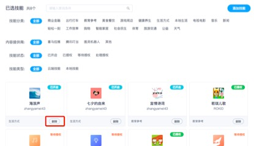

## 目录

为了丰富设备的功能，可以按照自有产品的特性，选择平台上丰富的技能。你可以为设备配置Rokid提供的技能，为了让设备拥有更好的语音交互体验，建议每个设备开启50-100个技能。

* [一、技能商店介绍](#一、技能商店介绍)
* [二、添加技能](#二、添加技能)
* [三、下架技能](#三、下架技能)
* [四、注意事项](#四、注意事项)

### 技能商店介绍

该分类下面的技能是平台上面的精品技能，包含喜马拉雅技能、图灵机器人技能、腾讯叮当技能、兔小贝技能、美食天下、乐听新闻等。该部分技能是需要联系商务(商务邮箱:rokidopen@rokid.com)授权。

技能配置页面，共有【技能分类】、【内容提供商】、【技能状态】、【技能类型】4个部分。

#### 技能配置页面，共有【技能分类】、【内容提供商】、【技能状态】、【技能类型】4个部分。

##### 技能分类

【技能分类】目前平台共有20个分类，如：商业金融、出行打车、教育参考、美食餐饮、游戏周边、健康生活、生活方式、本地生活、电视电影、音乐、新闻、轻松一刻、工作效率、购物、智能家居、社会民生、体育、旅游交通、公益、天气。用户可以按照技能分类进行选择自己配置的技能。

##### 内容提供商

【内容提供商】版块为平台优质的内容提供商提供的技能，包含喜马拉雅、图灵机器人、腾讯叮当、兔小贝、美食天下等。该部分技能是需要联系商务(商务邮箱:rokidopen@rokid.com)授权。

##### 技能状态

【技能状态】为当前申请技能的状态
【已开启】标签下的技能是指用户可以直接使用的技能列表；
【已授权】标签下的技能是指已经获得了开发者授权的技能列表，特指私有技能；
【等待授权】标签下的技能是指申请的私有技能，但是开发者未操作授权的技能列表；
【处理授权】标签下的技能是指开发者授权给到了你的设备类型，需要接受授权的技能列表。

##### 技能类型

【技能类型】为当前技能类型，目前分为云端技能和本地技能，创建「本地技能」，需要编写一个apk推送到设备上（具体参照：https://github.com/Rokid/NewsDemo ); 「云端技能」，则该技能的后台配置服务不在设备上而是在另外搭建的服务端上。 不管本地还是云端，都应遵守「Rokid开放平台」的协议格式进行通信。

### 添加技能

可以在技能配置页面的右上角处添加新的技能，进入添加技能的列表后，可以按照「精品技能」、「开放技能」和「我创建的」三个分类进行选择，也可以选择批量添加。

批量参加技能的路径如下：选择页面右上角的批量添加，然后选择页面的全选即可。

### 下架技能

如技能需要下架，在已选技能处，点击删除按钮即可。

### 注意事项

- 公有技能可以直接进行添加，公有技能是由开发者创建的，厂商可以自行评估是否需求添加。

- 页面上展示的Rokid私有技能，您可以在页面上提出申请，由商务（商务邮箱:rokidopen@rokid.com）同意授权后即可使用。

- 添加的本地技能（包括系统技能），需要设备厂商进行二次开发；

  > 如：计时器、闹钟、提醒、定时休眠、系统音量、系统电量、系统设置、系统灯光、系统升级、系统powermanager（休眠指令）、系统语音开关、系统引导、系统蓝牙等。

- 若同时添加了两个功能相同的技能，如若琪故事、故事、若琪儿歌、儿歌、音乐、QQ音乐、时间、云端时间等，需要在【已选技能】里面设置其中的一个为默认核心技能，否则部分内容是点播不出来的；

操作路径：点击页面的「优先级配置」，选择两个冲突的技能里面其中的一个为优先技能，点击完成。

- 智能联动技能授权完成后，需要在服务工具中配置前置拦截器才可以正常使用。

- 喜马拉雅技能授权完成后，需要与前往喜马拉雅开放平台获取key，并联系商务，邮箱:rokidopen@rokid.com 沟通付费模式。

- QQ音乐技能授权完成后，需联系商务，邮箱:rokidopen@rokid.com 沟通付费模式。
