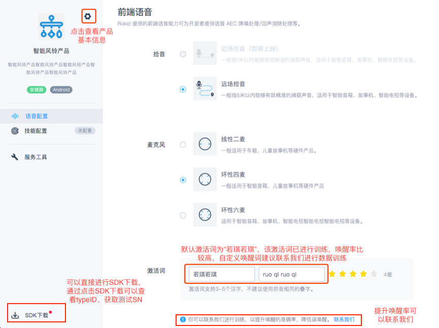
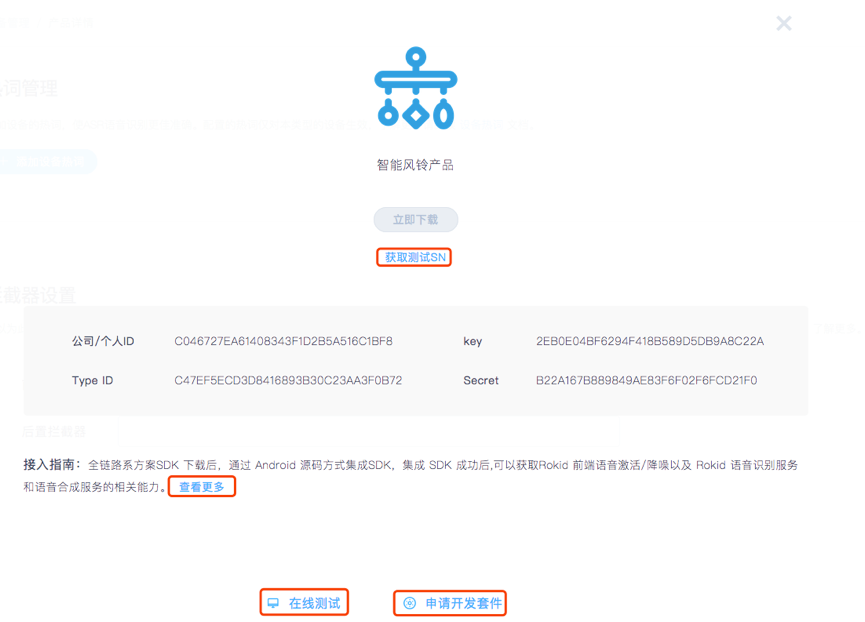
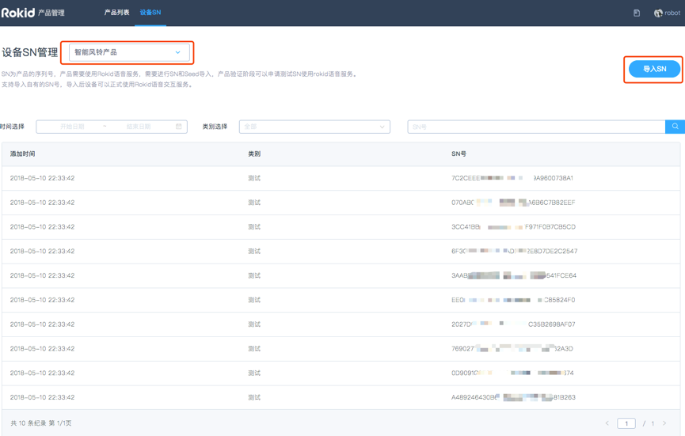

### 获取测试 SN（同device id）

B 端厂商可在 [SDK 下载处](https://developer.rokid.com/voice/#/product/configuration/voice/7E5477C7F61449969E8A78800976CECE)点击获取测试 SN，可以通过筛选框，查看不同产品的测试 SN，产品验证阶段可以申请测试SN使用rokid语音服务，每个产品默认有10个测试SN。测试SN的语音调用次数为2000次/日,SN（同device id）为设备的序列号，设备的唯一标识项。用于进行Rokid设备认证和Rokid平台服务认证的基础参数。

### 导入 SN

产品上线时，需要联系商务签订合同并确认导入数量。导入数量确认后，B 端厂商可以点击【导入 SN】，进行 SN 的导入，完成导入后，该批设备就 可以使用 Rokid 平台服务。
