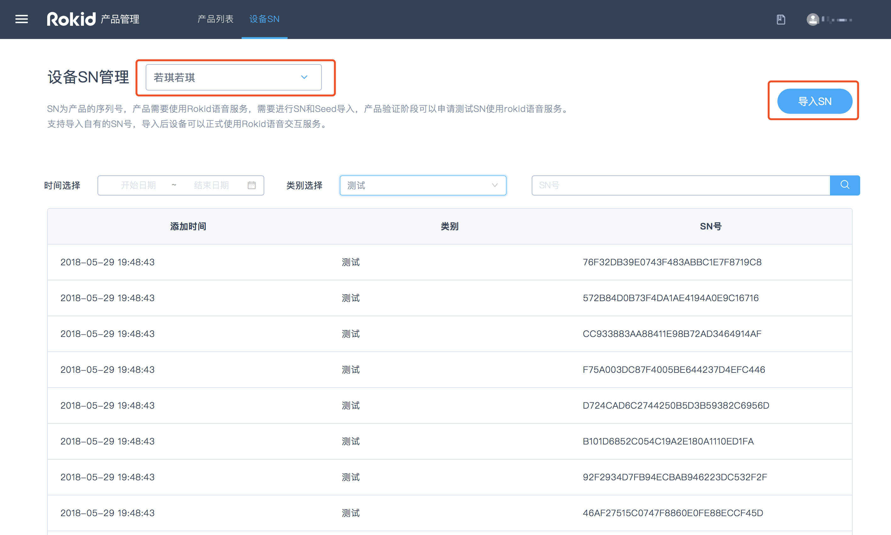
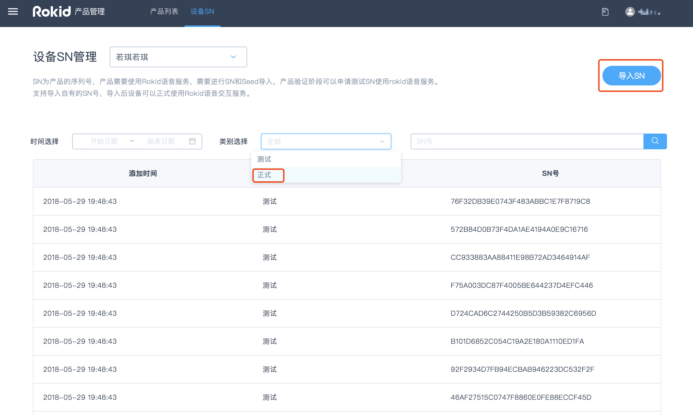

##获取测试SN和导入SN

###获取测试SN

####什么是SN和测试SN

SN（同device id）为设备的序列号，设备的唯一标识项。用于进行Rokid设备认证和Rokid平台服务认证的基础参数。测试SN，主要用于测试期间使用Rokid设备认证和获取平台服务。

####SN和typeID的区别

typeID是同一类型硬件产品的共有id，而SN则为该类型产品下单个设备的唯一id。技能授权仅与typeID有关，与设备SN无关，用户提供typeID获取了技能授权后，该typeID下的所有设备均可使用这些技能。

> 如：Rokid Pebble的typeID为95XXXXXX，但每一台pebble都有自己的SN。

####获取测试SN的方式

测试SN和Seed不再人工提供，用户在https://developer.rokid.com/voice/ 注册后，创建产品，进行自动生成。可在线进行查看和获取，具体有如下两种获取方式：

#####方式1

进行SDK下载时点击获取测试SN，如下图所示：

#####方式2

产品管理页面顶部设备SN，筛选对应产品即可看到测试SN，如下图所示：

若想要申请更多的测试SN，请联系商务（商务邮箱：rokidopen@rokid.com）。

###导入正式SN

测试完成后，若想正式使用Rokid服务，需要导入正式SN。

正式SN需要联系商务（商务邮箱：rokidopen@rokid.com）签订合同后才能获取导入资格。**邮件内容请写明：公司名称、联系方式、申请导入SN数量。**商务授权后即可导入正式SN。导入正式SN后，Rokid开放平台即对这批SN设备进行授权，这批设备即可正式使用Rokid语音交互服务。

####具体操作：

进入【设备SN】页面，然后点击【导入SN】，并按照指定模板导入即可。如下图所示：

导入完成后，页面会提示导入成功。10分钟后，该批SN即可使用平台的语音服务。客户可以在页面的【类别选择】中选择【正式】类别查看自己导入的SN号。

**注意：**若导入的SN号有重复，系统会自动对其进行去重，重复的SN号不计算在总的SN数量里。
