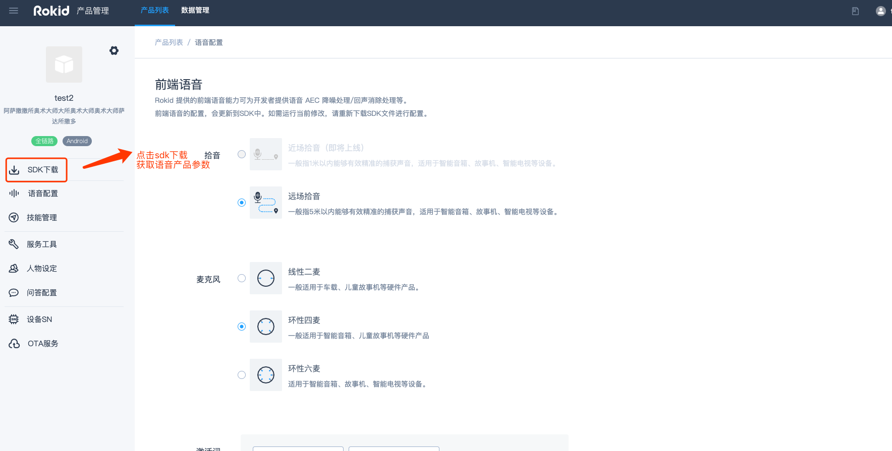
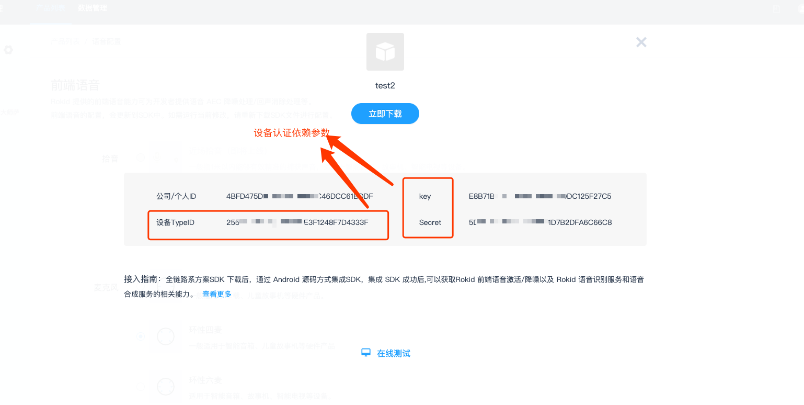

## 说明

本文档适用在进行若琪对接过程中设备认证相关参数获取方式

### 功能操作路径

登陆[Rokid开放平台](https://developer.rokid.com/#/)，选择【控制台】-【语音整体方案】-【基础服务能力配置】-【立即接入】

  
### 填写基本信息-点击完成

### 进入语音产品详情页面

### 点击sdk下载

### 获取语音产品对应配置参数

