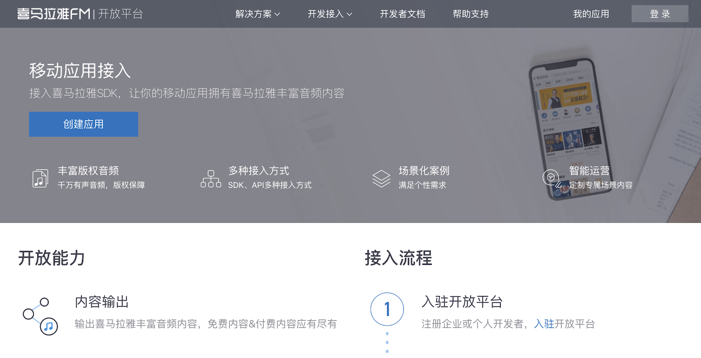
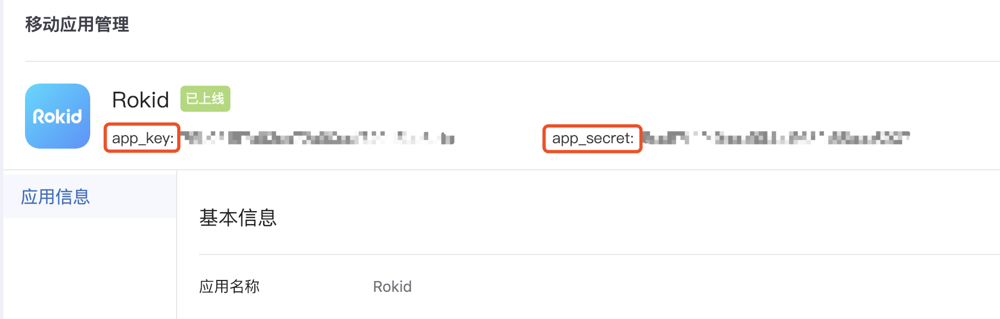
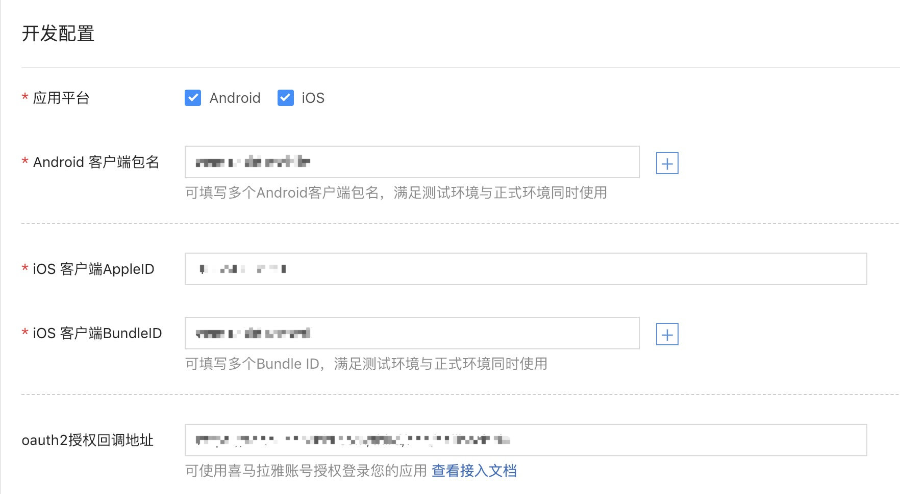

## 喜马拉雅 Skill 接入流程

本文旨在介绍喜马拉雅技能的接入流程，方便B端厂商快速接入喜马拉雅优质的资源内容。

* [一、喜马拉雅skill介绍](#一、喜马拉雅skill介绍)
* [二、喜马拉雅skill接入方式](#二、喜马拉雅skill接入方式介绍)
* [三、喜马拉雅skill接入流程](#三、喜马拉雅skill接入流程)

  
### 一、喜马拉雅skill介绍

#### 1.1 喜马拉雅skill内容介绍

<table><tbody>
<tr style="font-weight:bold">  <td style="width: 180px">技能名称</td>  <td>头部内容</td>  <td style="width: 180px">内容数量</td></tr>
<tr>  <td>喜马拉雅</td>  <td>冬吴同学会、吴晓波频道、秦朔朋友圈、盗墓笔记、国宝档案、德云社相声、单田芳评书、国家宝藏、吐槽大会、超品相师、段子来了、波波有理、首席医官、朗读者、卓老板聊科技、十点读书、糗事播报、涂磊、最强兵王、5分钟心理学、写信告诉我、明朝那些事</td>  <td>专辑 800W，声音1亿条</td></tr>

<tr>  <td>喜马拉雅儿童故事</td>  <td>宝宝巴士国学儿歌、英文儿歌、蓝迪儿歌、不同年龄段的儿歌，包括金色童年、拔萝卜、小兔子乖乖、小老鼠上灯台等经典儿歌。更有塑造儿童习惯、例如刷牙、安全过马路、按时吃饭等儿歌。</td>  <td>故事加儿歌专辑 60W，声音1000W+</td></tr>

<tr>  <td>喜马拉雅儿歌</td>  <td>晚安妈妈睡前故事、米小圈上学记、蜜桃姐姐讲故事、小马宝莉、海底小纵队、钱儿爸、钱儿妈、牛津阅读树、新东方多纳英语、托马斯和他的朋友们、经典绘本故事、十万个为什么全集、格林童话、一千零一夜、迪士尼经典故事、凯迪克大奖作品等</td>  <td>故事加儿歌 60W，声音1000W+</td></tr>
</tbody></table>

#### 1.2 喜马拉雅skill功能列表

<table>
    <tr>
        <td>模块</td> 
        <td>定义</td> 
        <td>例子</td> 
   </tr>
    <tr>
        <td rowspan="20">点播</td>    
        <td >播放某个分类下的专辑</td>  
        <td>我想听有声书</td>
    </tr>
    <tr>
        <td >播放某个子分类下的专辑</td> 
        <td >我想听鬼故事</td>  
    </tr>
     <tr>
        <td >播放特定的专辑</td> 
        <td >我想听晓说2017</td>  
    </tr>
     <tr>
        <td >正序播放特定专辑的某个声音</td> 
        <td >我想听罗辑思维第五集</td> 
    </tr>
     <tr>
        <td >倒叙播放某个专辑的某个声音</td> 
        <td >我要听罗辑思维最新一集</td> 
    </tr>
     <tr>
        <td >播放某条特定的声音</td> 
        <td >我想听鼹鼠的春天</td> 
    </tr>
     <tr>
        <td >从上次收听的节目继续播放</td> 
        <td >继续播放喜马拉雅</td> 
    </tr>
     <tr>
        <td >从订阅列表中，继续播放最近收听的专辑</td> 
        <td >播放我订阅的节目</td> 
    </tr>
     <tr>
        <td >从购买列表中，继续播放最近收听的专辑</td> 
        <td >播放我购买的节目</td> 
    </tr>
     <tr>
        <td >播放有特定人物标签的专辑</td> 
        <td >我想听高晓松</td> 
    </tr>
     <tr>
        <td >播放特定分类下特定元数据下的专辑</td> 
        <td >我想听单田芳的评书</td> 
    </tr>
     <tr>
        <td >播放特定人物标签下的特定专辑</td> 
        <td >我想听郭德纲的济公传</td> 
    </tr>
     <tr>
        <td >播放某个子分类下的特定专辑</td> 
        <td >播放京剧战长沙</td> 
    </tr>
     <tr>
        <td >播放特定分类下特定人物标签的专辑</td> 
        <td >我想听单田芳的评书</td> 
    </tr>
     <tr>
        <td >播放某个子分类下的特定专辑</td> 
        <td >播放京剧战长沙</td> 
    </tr>
     <tr>
        <td >播放某个子分类下的特定声音</td> 
        <td >放儿歌世上只有妈妈好</td> 
    </tr>
     <tr>
        <td >正序播放某个人物的某个专辑第 X 集</td> 
        <td >我想听梁冬的冬吴同学会第5集</td> 
    </tr>
     <tr>
        <td >倒叙播放某个人物的某个专辑第 X 集</td> 
        <td >我想听梁冬的冬吴同学会最新一集</td> 
    </tr>
     <tr>
        <td >播放人物标签和元数据对应专辑</td> 
        <td >我要听郭德纲相声</td> 
    </tr>
     <tr>
        <td >播放专辑下特定声音</td> 
        <td >我要听爱探险的朵拉卡车大救援</td> 
    </tr>
    <tr>
        <td rowspan="2">推荐</td>    
        <td >播放根据用户喜好推荐的专辑内容</td>  
        <td>随便播个节目</td>
    </tr>
    <tr>
        <td >不喜欢某个专辑，并换一个播放</td> 
        <td >我不喜欢这个节目</td>  
    </tr>
     <tr>
        <td rowspan="2">订阅</td>    
        <td >订阅专辑</td>  
        <td>订阅这个专辑</td>
    </tr>
     <tr>
        <td >取消订阅专辑</td> 
        <td >取消订阅</td> 
    </tr>
     <tr>
        <td rowspan="2">喜欢</td>    
        <td >喜欢某个声音</td>  
        <td>喜欢</td>
    </tr>
     <tr>
        <td >取消喜欢某个声音</td> 
        <td >取消喜欢</td> 
    </tr>
     <tr>
        <td rowspan="9">控制</td>    
        <td >上一首</td>  
        <td>上一首</td>
    </tr>
    <tr>
        <td >下一首</td> 
        <td >下一首</td>  
    </tr>
     <tr>
        <td >换一个</td> 
        <td >换一个</td>  
    </tr>
     <tr>
        <td >暂停</td> 
        <td >暂停</td> 
    </tr>
     <tr>
        <td >取消播放</td> 
        <td >我不听了</td> 
    </tr>
     <tr>
        <td >继续播放</td> 
        <td >继续播放</td> 
    </tr>
     <tr>
        <td >循环播放</td> 
        <td >单曲循环</td> 
    </tr>
     <tr>
        <td >取消循环</td> 
        <td >取消循环</td> 
    </tr>
     <tr>
        <td >从头播放当前声音</td> 
        <td >从头播放</td>  
    </tr>
         <tr>
        <td rowspan="2">帮助</td>    
        <td >引导</td>  
        <td>我不知道听什么节目了</td>
     </tr>
     <tr>
        <td >查询当前专辑信息</td> 
        <td >现在放的是什么节目？</td> 
    </tr>
</table>

### 二、喜马拉雅skill接入方式介绍

需要合作方和若琪商务、喜马拉雅商务确定合作，确定商务协议，支持以下两种接入类型，厂商选择其一，推荐采用第二种方式。

#### 2.1 合作方 App 不需要接入喜马拉雅账号、若琪账号

只能播放喜马拉雅免费内容，喜马拉雅账号下内容和断点续播功能（订阅、已购、播放历史等）无法同步。

需要进行的步骤:

1.喜马拉雅开放平台创建应用：[详细见3.1描述](#3.1喜马拉雅开放平台创建应用)

2.若琪开放平台授权喜马拉雅相关 skill：[详细见3.2描述](#3.2若琪开放平台授权喜马拉雅相关skill) 

3.移动端 App 内容展示/点播：[详细见3.3描述](#3.3移动端App内容展示/点播)  

 
#### 2.2 合作方 App 需要接入喜马拉雅账号&若琪账号（推荐使用）

点播和付费的内容均可以播放，用户可以选择登录喜马拉雅账号，登录后可以获取喜马拉雅账号下内容和断点续播功能（订阅、已购、播放历史等）。
需要进行的步骤:（比第一种接入类型多了喜马拉雅账号oauth流程）

1.喜马拉雅开放平台创建应用：[详细见3.1描述](#3.1喜马拉雅开放平台创建应用)  

2.若琪开放平台授权喜马拉雅相关 skill：[详细见3.2描述](#3.2若琪开放平台授权喜马拉雅相关skill)  

3.移动端 App 内容展示/点播：[详细见3.3描述](#3.3移动端App内容展示/点播)  

4.喜马拉雅账号oauth流程：[详细见3.4描述](#3.4喜马拉雅账号Oauth流程（合作方App接入喜马拉雅账号时需要）)

### 三、喜马拉雅skill接入流程

#### 3.1 喜马拉雅开放平台创建应用

1）合作方需要在[喜马拉雅开放平台](https://open.ximalaya.com) 创建移动应用。

  

2）在喜马拉雅开放平台-应用管理-移动应用-应用信息处获取App Key 和 App Secret，用于喜马拉雅账号 oauth 和 获取内容资源。
   

#### 3.2 若琪开放平台授权喜马拉雅相关 skill

联系对应的Rokid商务，操作技能授权，并将在喜马拉雅开放平台创建的应用 App Key 和 App Secret 给到对接的Rokid商务，由 Rokid 生成 oauth 回调地址，合作方在喜马拉雅开放平台填入回调地址。
   

#### 3.3 移动端 App 内容展示/点播

如果需要支持在移动APP上进行内容展示和点播，有以下2种方式接入，选择其中之一即可：

1）公版APP方式：

a.在开放平台创建一个APP即可：[Rokid开放平台APP配置](https://developer.rokid.com/docs/5-enableVoice/rokid-vsvy-sdk-docs/rookie-guide/gongban.html)

b.提供在喜马拉雅申请的 App Key、App Secret和厂商的设备类型ID，联系Rokid商务进行操作，才可在APP上显示喜马拉雅内容

2）SDK方式：

a.接入我们的App SDK：[Rokid Mobile SDK接入文档](https://developer.rokid.com/docs/5-enableVoice/rokid-vsvy-sdk-docs/mobliesdk/SDK.html)，需要研发人员进行开发；

b.提供在喜马拉雅申请的key和厂商的设备类型ID，联系Rokid对接的商务进行操作，才可在APP上显示喜马拉雅内容，才可在APP上显示喜马拉雅内容

#### 3.4 喜马拉雅账号 Oauth 流程（合作方 App 接入喜马拉雅账号时需要）

接入喜马拉雅账号登录后，则合作方用户可关联其已有喜马拉雅账号，收听订阅专辑、已购专辑，同步账号下收听历史。

1）合作方 App 端接入[喜马拉雅开放平台 SDK](https://open.ximalaya.com/doc/mobile-sdk)

2）然后按照以下文档开发：

IOS：[IOS端喜马拉雅账号授权接入文档](https://rokid.github.io/mobile-sdk-ios-docs/res/skill/media_thrid_xmly.html)

Android：[Android端喜马拉雅账号授权接入文档](https://rokid.github.io/mobile-sdk-android-docs/res/skill/media_thrid_xmly.html)

