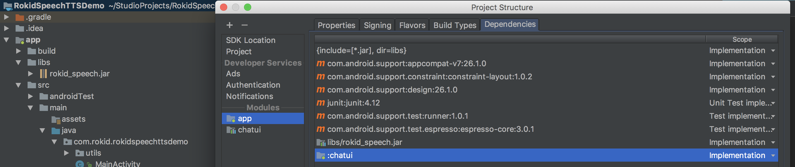
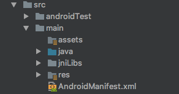

### 集成前准备

#### 获取SDK

 * 请通过 [Rokid SDK下载网站](https://developer-dev.rokid.com/tob) , 根据网站提示进行配置,生成 SDK 后下载

#### 复制文件

将```java-libraries```文件夹下的```rokid_speech.jar```复制到 Android 工程下的 ```app/libs``` 文件夹中，并设置为工程的依赖库



将```shared-libraries```文件夹下的全部文件包含文件夹复制到 Android 工程下的```app/src/main/jniLibs``` 文件夹中



#### 添加权限

```xml
    <!--网络访问权限-->
    <uses-permission android:name="android.permission.INTERNET" />
```


