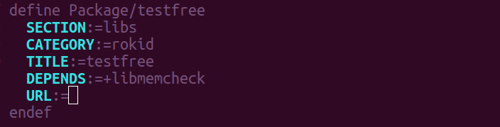
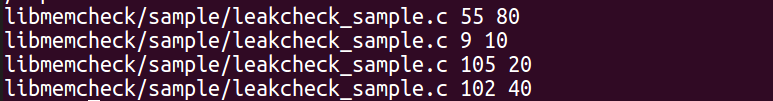

## libmemcheck功能简介
- libmemcheck 是辅助检查内存泄漏地工具。
- 使用list记录好malloc,realloc, calloc 申请的地址和大小，并且记录申请内存在源代码的行数和文件名字。

## API访问说明

- 申请内存时候调用malloc函数 ， 函数原型
    ```
    void *malloc(size_t t)
    ```

- 释放内存时候调用free函数
    ```
    void free(void *p)
    ```
- 调用函数realloc, 函数原型是
    ```
    void *realloc(void *ptr, size_t t)
    ```
- 调用函数calloc, 函数原型是
    ```
    void *calloc(size_t numb, size_t t)
    ```
- 调用new申请内存, 函数原型是
	```
	void* operator new(size_t num)
	```

- 调用new[]申请内存，函数原型是
	```
	void* operator new[](size_t num)
	```

- 调用delete, 进行内存的释放，函数的原型是
	```
	void operator delete(void *p)
	```
- 调用delete[], 进行内存的释放，函数的原型是
	```
	void operator delete[](void *p)
	```

## 使用说明
- 在调用到 malloc , calloc, realloc 的地方,添加头文件 #include "libmemcheck/rk_leak_check.h"
- 在调用到 new, new[], delete, delete[]地地方，添加头文件 #include "libmemcheck/rk_new_proxy.h"
- Makefile 文件中添加 libmemcheck 依赖
- CmakeList.txt 中添加 libmemcheck 依赖
- 添加库依赖效果:
    

## 查看结果

- 在目录下自动生成/tmp/pid ，其中pid为运行进程号。
- 每一行代表含义，文件名，文件调用代码行数，申请的内存大小。
- 文件内容动态的改变。
- 运行结果如图:
    


## 测试代码以及实例

- sample目录下的测试文件leakcheck_sample.c
- 测试方法，直接运行bin文件
- make package/libmemcheck/claen
- make package/libmemcheck/install V=s
- ./testmemcheck
