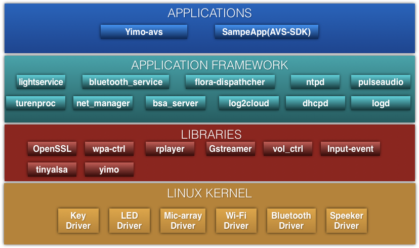

# 方案简介
YodaOS 是Rokid推出的人工智能语音操作系统，为进行智能语音开发开发者以及相关的商业公司提供全面智能语音开发环境。YodaOS的AVS方案是将Rokid公司在芯片、算法以及人工人能语音方面的积累和亚马逊公司智能语音云技术结合，在YodaOS系统基础上为客户提供一站式、快速的完整智能语音解决方案，客户可以在Rokid方案基础上快速针对国外市场推出自己的智能语音产品。Rokid 的Yoda OS 开源的特性，方便用户可以根据自己的实际需进行深度定制开发。 这篇文档详细介绍Yoda OS AVS方案的功能和如何进行深度定制开发。目前YODAOS AVS方案只支持Rokid的K18平台的DEV 3.0版本硬件。如果后续有更新支持其他硬件平台，请关注更新说明。

## 系统架构
Yoda OS AVS 方案的系统架构如下图：


## 支持的AVS SDK版本和能力集
当前支持avs sdk版本为 1.8.1, avs sdk 的下载地址 [avs sdk](https://github.com/alexa/avs-device-sdk)

支持的avs 的能力集如下：

能力集名称 | 版本 | 是否支持 | 是否必须支持
---|--- | --- | ---
Alerts☩ | 1.0 | Yes | Yes
AudioActivityTracker	 | 1.0 |  No | Required for Focus Management
AudioPlayer | 1.0 | Yes | Yes
Bluetooth☩ | 1.0 | No |  Optional
DoNotDisturb | 1.0 | No | 	Optional
EqualizerController	 | 1.0  | No | Optional
InputController		 | 1.0  | No | Optional
InteractionModel	 | 1.0  | No | Optional
Notifications   | 1.0  | Yes | Yes
Settings	 | 1.0  | Yes | Yes
SpeechRecognizer	 | 1.0  | Yes | Yes
SpeechSynthesizer	 | 1.0  | Yes | Yes
System | 1.0  | Yes |  Yes 
TemplateRuntime☩ | 1.0  | No | Optional
VisualActivityTracker	 | 1.0  | No | Required for Focus Management


##  K18说明

###  芯片框图

- 支持2/4/6/8路麦克风阵列
- 集成8通道ADC/I2S/PDM音频输入接口
- 集成DAC/I2S音频输出接口，支持内部audio codec输出和外接 audio codec输出
- 采用单MCU和单Cortex-A7的异步处理器架构，便于实现低功耗离线语音激活功能
- 内置 DSP，支持降噪、AEC、Beam-forming、去混响等算法
- 内置 NPU 和 SNPU, 主 NPU 由 Cortex-A7 控制，SNPU 由 MCU 控制
- 内置 BT1120 接口，支持 YUV 格式的 camera 数据输入
- 内置 SPI/I2C/USB/UART/PWM/SDIO 等 connectivity 接口，支持集成 WIFI/BT/LED 等外围器件
- 内存配置:128MB SPI NAND Flash+内置 128MB DDR

### 硬件开发板说明
Kamino18 Dev 平台是面向智能语音应用而设计的硬件参考方案，分为主板和调试子板两部分。如下图所示：


1. Lineout   立体声耳机输出口
2. SPK  Speaker 3.2w 4 欧姆
3. Analog_MIC  支持 6 路模拟
4. BOOT  升级按键
5. Debug FPC  连接 Debug 板
6. Camera  2M Camera(OV2640)
7. WIFI ANT 板载陶瓷天线，可外接天线需要手工选贴电阻
8. TYPE_C 内含 ADB debug,CK,ARM,调试串口(TTL 电平)
9. UART_SW SW 连接器，SW拔到左侧选择CK调试口,SW拔到右侧选择ARM调试口.
10. LED 12PCS RGB LED
11. MIC 4PCS PDM MIC

调试子板：


1. IR 红外接收
2. USB HOST 可以外接USB设备
3. DEBUG  USB转串口调试口，USB线不提供电源
4. UPGRADE（BOOT） 按住按键进行烧写镜像包
5. PWR（NC） 此按键为预留（在YODAOS AVS方案里面是用来按键唤醒alexa，参考按键唤醒功能）
6. VOL— 音量减
7. VOL+ 音量加
8. MUTE 麦克风静音
9. RST  系统复位
10. GPIO 外接GPIO 型号定义参见原理图

USB连线：


- USB1 power supply and ADB,

- USB2 串口 Debug,一端接 Debug 一端接 PC,需要在 PC 端按装 FT232 驱动。UART SW Left for CK Debug ,Right for ARM Debug.USB2 不能给开发板提供电源。
  说明：

- 主板上有4个PDM 接口的MEMS MIC, 12个RGB 3色LED;

- 主板上的 TYPEC 口， 连接信号包含 USB 信号，CK UART 信号，ARM UART 信号，BOOT_KEY信号。按下BOOT_KEY，可用于烧写镜像。也可以通过标准 TPYEC 线连接电脑用于ADB调试和供电，建议最好用适配器给开发板供电，因 AUDIO SPK 功率比较大;如果音量调节比较小可以用 USB 供电。

- 调试子板上另一个 TYPEC 口，只提供 USB 信号不供电。通过标准 TYPEC 线连 接 PC;

- 用户刷好系统后，可以在电脑端通过adb的方式登陆调试串口。

  ```shell
  $adb shell --- 登陆设备
  $logread -f --- 刷新日志
  ```
### 购买
可以到rokid的官方购买渠道购买。
[官方渠道](https://detail.youzan.com/show/goods?alias=2g1gpqlb5vr8c&redirect_count=1&sf=wx_sm&is_share=1)

## Rokid 认证说明
当你拿到开发板后， 需要到我们开发者网站注册账号，申请设备类型和序列号。如果没有申请，就不能正常使用YODAOS AVS的功能。
参考链接[设备SN号](https://developer.rokid.com/docs/5-enableVoice/rokid-vsvy-sdk-docs/rookie-guide/rookie-guide-end.html?q=) 查看创建配置产品和设备SN号导入和管理。

**SN号和Seed号烧写**
为了能够正常使用YODAOS AVS功能，需要正常烧写警告ROKID的授权的SN和Seed号：
```shell
 $factory 0 0
 ---进入ftm模式，系统会重启，后再执行下面的步骤
 $factory 9 1 xxx 
 --- 写入seed，xxx是具体seed number
 $factory 9 3 xxx
 --- 写入sn，xxx是具体 sn number
 $factory 9 5 xxx
 --- 写入devicetypeid, xxx是具体devicetypeid number
 $factory 9 7 xxx 
 --- 写入factory_date, xxx是具体factory_date number 
 $factory 0 3 
 --- 重启并进入正常的模式
```
上面步骤中，第2～5步，无所谓顺序，也可以只执行某几条。

## 源码获取、编译与目录组织结构
### 源码获取
目前Yoda OS 的代码没有上传到github， 需要申请请联系邮箱：

### 编译说明
安装编译工具包
Ubuntu 16.04
```shell
sudo apt-get install build-essential subversion libncurses5-dev zlib1g-dev gawk
gcc-multilib flex git-core gettext libssl-dev unzip texinfo device-tree-compiler
dosfstools libusb
```
CentOS 7
```shell
yum install -y unzip bzip2 dosfstools wget gcc gcc-c++ git ncurses-devel zlib-static
openssl-devel svn patch perl-Module-Install.noarch perl-Thread-Queue
```
CentOS7 device-tree-compiler
```shell
wget http://www.rpmfind.net/linux/epel/6/x86_64/Packages/d/dtc-1.4.0-1.el6.x86_64.rpm
rpm -i dtc-1.4.0-1.el6.x86_64.rpm
```
1. 方法一 手动拷贝
```shell
cd openwrt
cp ../products/rokid/universal_avs/configs/yodaos_k18_universal_avs_defconfig .config
make defconfig
make
```
如果要查看编译信息，请加V=s参数。如果要加快编译速度，请加-j参数，例如-j32.

2. 方法二
  迁出源码后，在源码的根目录下执行：
```shell
$source envsetup.sh
```
执行结果：
```shell
You're building on openwrt
Lunch menu...pick a combo:

[0] yodaos_k18_universal_avs_ota
[1] yodaos_k18_universal_avs
[2] leo_k18_universal_yodaos_display_ota
[3] leo_k18_universal_node_ota
[4] leo_k18_universal_yodaos_display
[5] leo_k18_universal_node

Which would you like? [] 
```
- 0 -- 是编译avs升级包，是用来升级
- 1 -- 是编译刷机镜像
- 其他和AVS没有关系
我们这里选择1
```shell
Which would you like? [] 1   
yodaos_k18_universal_avs

You are building on Linux
Lunch menu... pick a root filesystem:
1. ubifs(root filesystem is read wirte)
2. squashfs(root filesystem is read only)
Which would you like? [1]

You are building on Linux
Lunch menu... pick a image style:
1. debug(root filesystem bin is not striped)
2. release(root filesystem bin is striped)
Which would you like? [1]
/home/qiuren.fan/Yimo/openwrt
~/Yimo/openwrt ~/Yimo
===========================================
```
结束后，运行编译命令：
```shell
$make V=s -j32
```
编译结束后，在openwrt/bin目录下会生成升级包。
3. 方法三 自动编译脚本用于发布镜像
```shell
./build.sh -p yodaos_k18_universal_avs -j20 -r
```

### Linux下烧写

Linux下的烧写流程如下：
```shell
$ cd openwrt/bin/yodaos-k18-universal-avs-glibc
$./download.sh all
```
根据提示按住调试板上的BOOT_KEY，然后连接USB线到PC上，等地啊下载完成，重启设备。

windows下烧写参考如下链接[Windows烧写工具使用](https://developer.rokid.com/docs/7-bspguide/jing_xiang_shao_xie/windowsshao_xie_gong_ju_shi_yong.html)

## 源码目录组织结构
一级目录结构如下:
```shell
├── 3rd
├── build.sh -> /home/qiuren.fan/Yimo/products/rokid/common/build.sh
├── envsetup.sh -> /home/qiuren.fan/Yimo/products/rokid/common/envsetup.sh
├── frameworks
├── hardware
├── kernel
├── Makefile -> /home/qiuren.fan/Yimo/products/rokid/common/Makefile
├── openwrt
├── products
├── toolchains
├── uboot
└── vendor
```
- 3rd: 第三方软件包
- build.sh: ci 编译脚本
- envsetup.sh: 本地编译脚本
- frameworks: 应用框架，native服务、命令、库，和对第三方的抽象
- hardware: HAL(hardware abstract layer)包括主芯片和外设的硬件抽象
- kernel：linux内核
- Makefile: 外部的makefile
- openwrt:openwrt 目录
- products: 产品相关文件目录
- toolchains:编译工具链
- tools: 系统工具
- uboot: uboot
- vendor: 第三方厂家文件

## 开发AVS SDK之前的准备

首先你需要到亚马逊官方注册一个开发者账号，创建自己的设备类型，创建安全配置文件。参考链接：

[Register an AVS Product and Create a Security Profile](https://github.com/alexa/avs-device-sdk/wiki/Create-Security-Profile)

创建好安全配置文件后，下载下来。放在源代码目录：

`frameworks/native/avs-sdk/avs-device-sdk/avs-device-sdk-1.11/tools/Install`

运行下面的脚本：

```shell
$./genConfig.sh config.json  00000006 /data/avs ../../../avs-device-sdk-1.11/ AlexaClientSDKConfig.json 
```

然后将文件拷贝到目录：

`openwrt/package/rokid/avs-sdk`

或者参考openwrt/package/rokid/avs-sdk 目录下的AlexaClientSDKConfig.json文件， 将文件中的

```shell
  9     "deviceInfo":{
 10         // Unique device serial number. e.g. 123456
 11         "deviceSerialNumber":"250b420093f634aba982e0d82101bc78",
 12         // The Client ID of the Product from developer.amazon.com
 13         "clientId":"amzn1.application-oa2-client.335ce66444ed4657bb460ae67d8885a2",
 14         // Product ID from developer.amazon.com
 15         "productId":"RokidAlexa"
 16     },

```

productID 改成自己注册的设备ID。

用相同的帐哈登陆[AlexaApp](https://pitangui.amazon.com/spa/index.html#skills/dp/B07M6MKJXB/?ref=skill_dsk_staffpick_gw_2)网页版本，在这里可以设置认证后的设备、添加技能等。